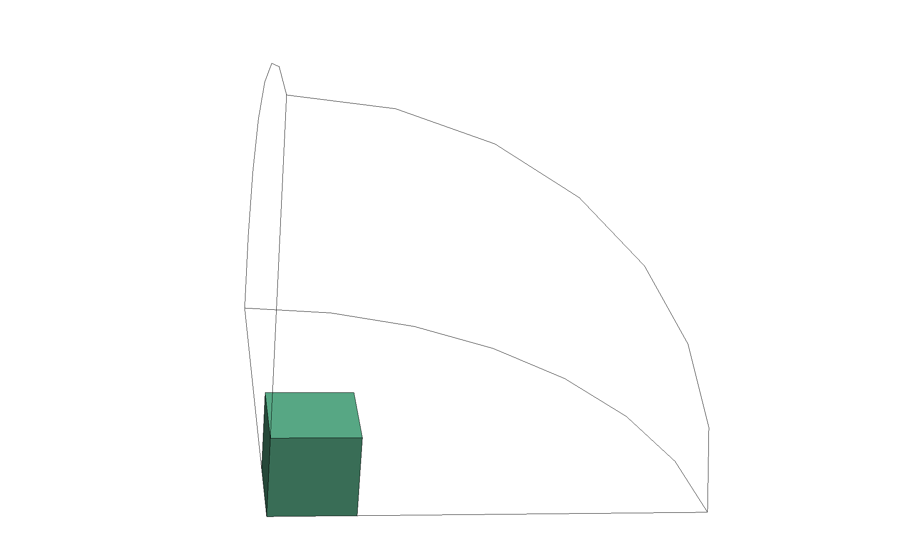

# Berger 2017: High-Temperature Superconductor Cube

We model a high-temperature superconductor (HTS) cube exposed to a sinusoidal
external magnetic field, and compare the instantaneous AC loss to the
community-validated reference of Berger et al. (2017).

<div align="center">
    
    <br/>
    <br/>
    <em>Figure 1: A superconducting cube at the centre of a spherical air domain. The case exploits the symmetry of the applied field to model the positive 1/8-octant.</em>
</div>
<br/>


## Introduction

The Berger 2017 benchmark [[1]](#Berger2017) is a community-validated 3-D
AC-loss test for high-temperature superconductors. Five independent teams
from CNRS, Polytechnique Montréal, Universidad Nacional Autónoma de México,
the University of Houston and Grenoble Alpes solved the same problem with
six different formulations and three different numerical methods (FEM
$`\vec{H}`$-formulation, FEM $`\vec{A}`$-formulation, FVM). The reported AC
losses agree across all six implementations within $`\sim 10\%`$, which
makes the case a strong validation target for any new HTS solver.

The physical setup is a uniform sinusoidal external magnetic field applied
to a bulk Bi-2223 HTS cube. The cube partially screens the applied field
through shielding currents whose constitutive law is the power-law $`E\!-\!J`$
relation. The quantity of interest is the time evolution of the
instantaneous dissipation $`p_{\mathrm{AC}}(t)`$ integrated over the cube.


## Setup

### Power-law $`E\!-\!J`$ characteristic

The electrical resistivity of the superconductor is modelled by the
standard HTS power law (Ref. [[1]](#Berger2017), Eq. 1):
```math
\vec{E} = \frac{E_c}{J_c} \left(\frac{|\vec{J}|}{J_c}\right)^{n-1} \vec{J} \quad .
```

For the $`\vec{A}`$-formulation we need the inverse relation
$`\sigma(|\vec{E}|)`$. To avoid the $`\sigma \to \infty`$ singularity as
$`|\vec{E}| \to 0`$, we use the regularised form (Ref. [[1]](#Berger2017),
Eq. 5):
```math
\sigma(\vec{E}) =
\left[
   \frac{E_c}{J_c} \left(\frac{|\vec{E}|}{E_c}\right)^{(n-1)/n}
   + \rho_0
\right]^{-1}
\quad \text{with } \rho_0 = 10^{-14}\,\Omega\cdot\mathrm{m} \quad .
```

For the bilinear form, the Newton tangent
$`\sigma_J = \partial[\sigma(|\vec{E}|)\,\vec{E}]/\partial \vec{E}`$ is used:
```math
\sigma_J = \sigma\,I
\;+\;
\frac{\partial \sigma}{\partial |\vec{E}|}\,\frac{1}{|\vec{E}|}\,\vec{E} \otimes \vec{E} \quad ,
```
which gives quadratic local convergence on the steep $`n=25`$ nonlinearity
once the iteration is on the saturated branch. The constitutive scalar
$`\sigma`$ is used to compute the current density and the Ohmic-heating
density $`\sigma|\vec{E}|^2`$ — using $`\sigma_J`$ there would contaminate
the physical observables with the rank-1 tangent correction.

### Material parameters

The parameters are representative of cylindrical Bi-2223 samples
characterised experimentally with $`E_c = 1\,\mu\mathrm{V}/\mathrm{cm}`$
(Ref. [[1]](#Berger2017), §II.B):

| Symbol     | Value                              | Description               |
| ---------- | ---------------------------------- | ------------------------- |
| $`J_c`$    | $`2.5 \times 10^6\,\mathrm{A/m^2}`$ | Critical current density  |
| $`E_c`$    | $`1 \times 10^{-4}\,\mathrm{V/m}`$  | Critical electric field   |
| $`n`$      | $`25`$                             | Power-law exponent        |
| $`\rho_0`$ | $`10^{-14}\,\Omega\cdot\mathrm{m}`$ | Resistivity floor         |

### Geometry and symmetry

The HTS cube has edge length $`d = 10\,\mathrm{mm}`$ and is surrounded by
an air domain of radius $`R_{\mathrm{air}} = 25\,\mathrm{mm}`$ (a sphere
clipped to a positive octant). The applied field is uniform and points
along the $`y`$-axis, which gives a 1/8-symmetric geometry:

- $`y = 0`$: $`\vec{B}`$-normal symmetry plane — Tangential-$`\vec{A}`$=0 essential BC.
- $`x = 0`$ and $`z = 0`$: $`\vec{B}`$-tangential symmetry planes — same
  Tangential-$`\vec{H}`$ applied-field BC as the outer sphere.

The single-octant integrated Ohmic heating is multiplied by 8 to recover
the full-cube AC loss.

### Applied field

A uniform sinusoidal field is applied along $`y`$:
```math
\vec{B}_a(t) = B_{\max}\,\sin(2\pi f t)\,\hat{\vec{y}} \quad ,
```
with $`f = 50\,\mathrm{Hz}`$ and $`B_{\max} = 20\,\mathrm{mT}`$. The
full-penetration field for this geometry is
$`B_p = \mu_0 J_c d / 2 \approx 15.7\,\mathrm{mT}`$ (Ref.
[[1]](#Berger2017), §II.C), so $`B_{\max} > B_p`$ places the case in the
**full-penetration regime**: the flux front reaches the cube centre during
each half-cycle, the shielded core disappears, and $`|\vec{J}| = J_c`$ is
supported throughout the entire cross-section (sign determined by the
local history of the field reversal). This is the regime that exercises
the bulk of the conductor and is the most demanding AC-loss reference for
HTS solvers.

We set up an unsteady simulation with the [Time-Domain Magnetic
Model](https://raiden-numerics.github.io/mufem-doc/models/electromagnetics/time_domain_magnetic/model.html).
A Newton iteration with a three-point quadratic line search stabilises the
$`n=25`$ power-law nonlinearity.


## Results

The instantaneous AC-loss curve is compared against the Berger (2017)
reference for the 20 mT, $`n = 25`$ full-penetration case
([[1]](#Berger2017) Fig. 2(b), digitised in
`data/AC_Losses_B20mT.csv`).

Two loss peaks per period, one per half-cycle, located at the
zero-crossings of $`B_a(t)`$ where $`|\partial_t B_a|`$ — and hence the
induced $`|\vec{E}|`$ in the conductor — is maximal (Ref.
[[1]](#Berger2017), §IV.A). The reference curve reaches a peak of
$`\approx 30\,\mathrm{mW}`$ (full-cube instantaneous loss); for the
1/8-symmetric model the integrated value is multiplied by $`8`$ before
plotting against the reference.


## References

<a id="Berger2017"></a> [1] Berger, K. *et al.*, "Benchmark on the 3D
numerical modeling of a superconducting bulk", HAL preprint
hal-01548728v4, 2017. https://hal.science/hal-01548728
