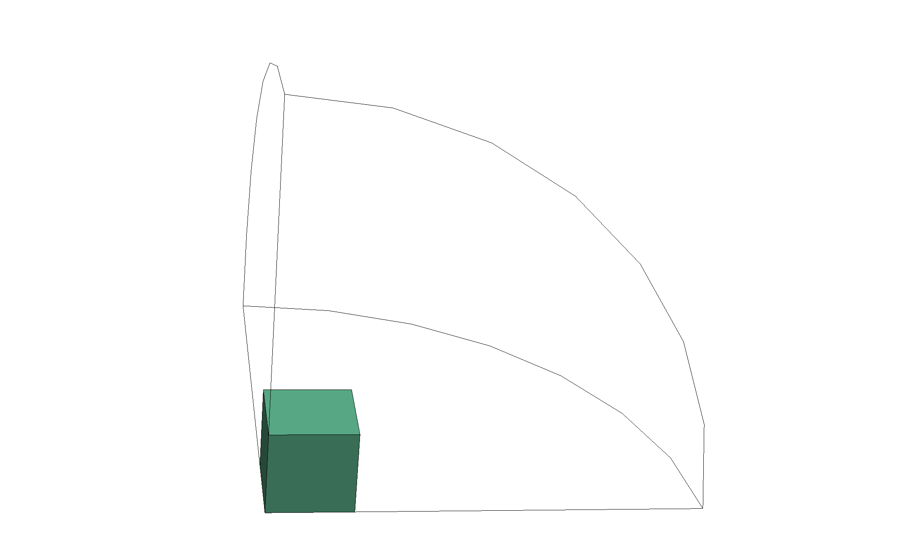
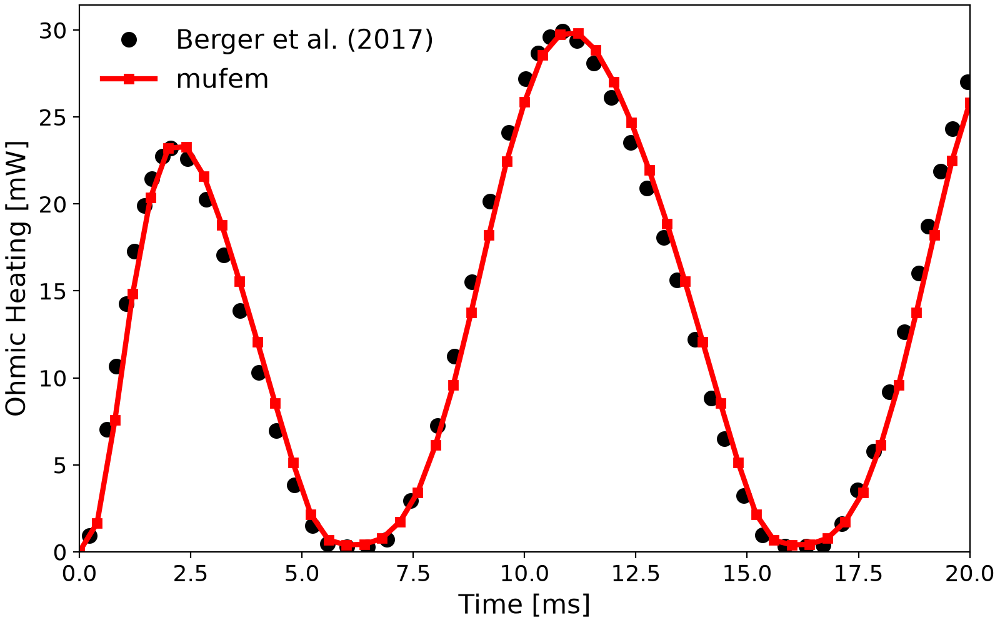

# Berger 2017: High-Temperature Superconductor Cube

We model a high-temperature superconductor (HTS) cube exposed to a sinusoidal
external magnetic field, and compare the instantaneous AC loss to the
community-validated reference of Berger et al. (2017).

<div align="center">
    
    <br/>
    <br/>
    <em>Figure 1: A superconducting cube at the centre of a spherical air domain. The case exploits the symmetry of the applied field to model the positive 1/8-octant.</em>
</div>
<br/>


## Introduction

The Berger 2017 benchmark [[1]](#Berger2017) is a community-validated 3-D
AC-loss test for high-temperature superconductors. Five independent teams
from CNRS, Polytechnique Montréal, Universidad Nacional Autónoma de México,
the University of Houston and Grenoble Alpes solved the same problem with
six different formulations and three different numerical methods (FEM
$`\vec{H}`$-formulation, FEM $`\vec{A}`$-formulation, FVM). The reported AC
losses agree across all six implementations within $`\sim 10\%`$, which
makes the case a strong validation target for any new HTS solver.

The physical setup is a uniform sinusoidal external magnetic field applied
to a bulk Bi-2223 HTS cube. The cube partially screens the applied field
through shielding currents whose constitutive law is the power-law $`E\!-\!J`$
relation. The quantity of interest is the time evolution of the
instantaneous dissipation $`p_{\mathrm{AC}}(t)`$ integrated over the cube.


## Setup

### Power-law $`E\!-\!J`$ characteristic

The electrical resistivity of the superconductor is modelled by the
standard HTS power law (Ref. [[1]](#Berger2017), Eq. 1):
```math
\vec{E} = \frac{E_c}{J_c} \left(\frac{|\vec{J}|}{J_c}\right)^{n-1} \vec{J} \quad .
```

For the $`\vec{A}`$-formulation we need the inverse relation
$`\sigma(|\vec{E}|)`$. To avoid the $`\sigma \to \infty`$ singularity as
$`|\vec{E}| \to 0`$, we use the regularised form (Ref. [[1]](#Berger2017),
Eq. 8):
```math
\sigma(\vec{E}) =
\left[
   \frac{E_c}{J_c} \left(\frac{|\vec{E}|}{E_c}\right)^{(n-1)/n}
   + \rho_0
\right]^{-1} \quad ,
```

where [1] uses the resistivity floor $`\rho_0 = 10^{-14}\,\Omega\cdot\mathrm{m}`$. mufem's
superconductor material applies its own, smaller built-in floor, so the case sets only $`J_c`$,
$`E_c`$ and $`n`$.

### Material parameters

The parameters are representative of cylindrical Bi-2223 samples
characterised experimentally with $`E_c = 1\,\mu\mathrm{V}/\mathrm{cm}`$
(Ref. [[1]](#Berger2017), §II.B):

| Symbol     | Value                              | Description               |
| ---------- | ---------------------------------- | ------------------------- |
| $`J_c`$    | $`2.5 \times 10^6\,\mathrm{A/m^2}`$ | Critical current density  |
| $`E_c`$    | $`1 \times 10^{-4}\,\mathrm{V/m}`$  | Critical electric field   |
| $`n`$      | $`25`$                             | Power-law exponent        |

### Geometry and symmetry

The HTS cube has edge length $`d = 10\,\mathrm{mm}`$ and is surrounded by
an air domain of radius $`R_{\mathrm{air}} = 100\,\mathrm{mm}`$ (a sphere
clipped to a positive octant), of the size of the 100 mm air box of [1]; the
perturbation of the field by the cube is then negligible at the outer
boundary. The applied field is uniform and points along the $`y`$-axis
([1] uses the $`z`$-axis, which is equivalent by symmetry), which gives a
1/8-symmetric geometry:

- $`x = 0`$ and $`z = 0`$ (`Cube/Air::TangentialFlux::X/Z`): $`\vec{B}`$ lies in
  these planes ($`\vec{B}\cdot\vec{n} = 0`$), imposed by the Tangential Magnetic
  Flux condition ($`\vec{n}\times\vec{A} = 0`$).
- $`y = 0`$ (`Cube/Air::NormalField`): $`\vec{B}`$ is normal to the plane; this is
  the natural boundary condition, so no condition is set there.
- The outer sphere (`Air::Outer`) carries the applied field as a Tangential
  Magnetic Field condition.

The single-octant integrated Ohmic heating is multiplied by 8 to recover
the full-cube AC loss.

### Applied field

A uniform sinusoidal field is applied along $`y`$:
```math
\vec{B}_a(t) = B_{\max}\,\sin(2\pi f t)\,\hat{\vec{y}} \quad ,
```
with $`f = 50\,\mathrm{Hz}`$ and $`B_{\max} = 20\,\mathrm{mT}`$. The
full-penetration field for this geometry is
$`B_p = \mu_0 J_c d / 2 \approx 15.7\,\mathrm{mT}`$ (Ref.
[[1]](#Berger2017), §II.C), so $`B_{\max} > B_p`$ places the case in the
**full-penetration regime**: the flux front reaches the cube centre during
each half-cycle, the shielded core disappears, and $`|\vec{J}| = J_c`$ is
supported throughout the entire cross-section (sign determined by the
local history of the field reversal). This is the regime that exercises
the bulk of the conductor and is the most demanding AC-loss reference for
HTS solvers.

We set up an unsteady simulation with the [Time-Domain Magnetic
Model](https://raiden-numerics.github.io/mufem-doc/models/electromagnetics/time_domain_magnetic/model.html)
(first-order elements) over one period, with 50 time steps of
$`0.4\,\mathrm{ms}`$ and up to 10 nonlinear iterations each, starting from a
zero field. A Newton iteration with a three-point quadratic line search
stabilises the $`n=25`$ power-law nonlinearity.

The geometry is built with netgen in the `build_geometry` method of
[case.py](case.py) (mesh size $`0.5\,\mathrm{mm}`$ in the cube) and meshed in
`generate_mesh`; both run only when the mesh is regenerated with
`pymufem case.py --rebuild-mesh`. The case itself is run with `pymufem case.py`.


## Results

The instantaneous AC-loss curve is compared against the Berger (2017)
reference for the 20 mT, $`n = 25`$ full-penetration case
([[1]](#Berger2017) Fig. 2(b), digitised in
`data/AC_Losses_B20mT.csv`).

Two loss peaks per period, one per half-cycle, located at the
zero-crossings of $`B_a(t)`$ where $`|\partial_t B_a|`$ — and hence the
induced $`|\vec{E}|`$ in the conductor — is maximal (Ref.
[[1]](#Berger2017), §IV.A). The reference curve reaches a peak of
$`\approx 30\,\mathrm{mW}`$ (full-cube instantaneous loss); for the
1/8-symmetric model the integrated value is multiplied by $`8`$ before
plotting against the reference.

The case checks the peak full-cube loss against $`29.83\,\mathrm{mW}`$
(1 % tolerance; Fig. 2(b) of [1] peaks at $`\approx 29.9\,\mathrm{mW}`$) and
the steady-state average loss over the second half-period,
```math
P = \frac{2}{T} \int_{T/2}^{T} p_{\mathrm{AC}}(t)\, dt \quad ,
```
against $`13.009\,\mathrm{mW}`$, the value of model (B.3) in Table III of [1]
(12 % tolerance; the six models of [1] spread from $`13.01`$ to
$`14.34\,\mathrm{mW}`$). mufem gives $`P \approx 14.3\,\mathrm{mW}`$.

The magnetic flux density and the current density are exported to
`VisualizationOutput/` for ParaView.

<div align="center">
    
    <br/>
    <br/>
    <em>Figure 2: Instantaneous AC loss over one period compared against the Berger (2017) reference for the 20 mT, n = 25 full-penetration case.</em>
</div>
<br/>


## References

<a id="Berger2017"></a> [1] Berger, K. *et al.*, "Benchmark on the 3D
numerical modeling of a superconducting bulk", HAL preprint
hal-01548728v4, 2017. https://hal.science/hal-01548728
