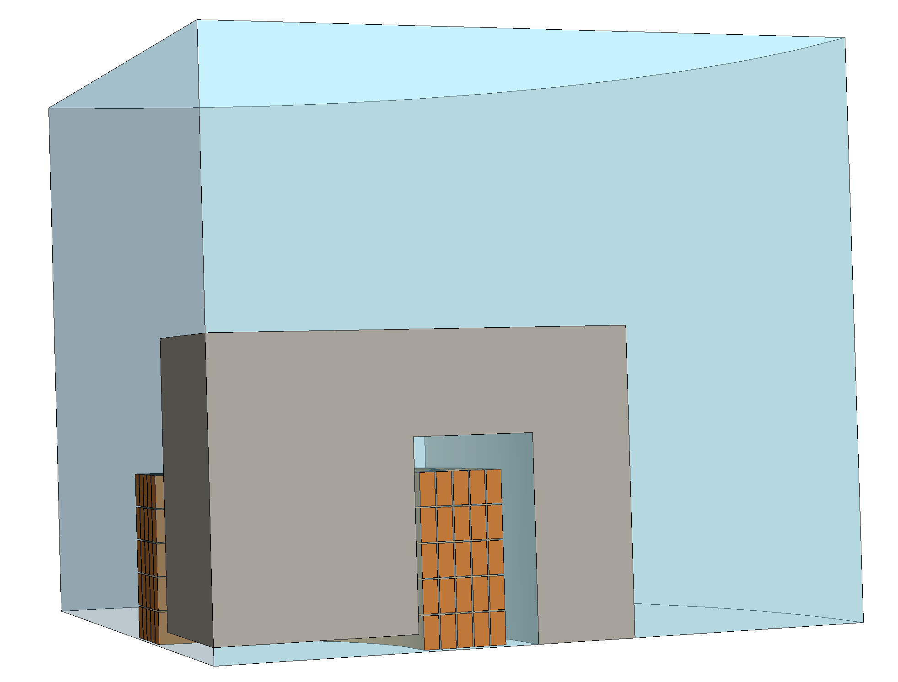
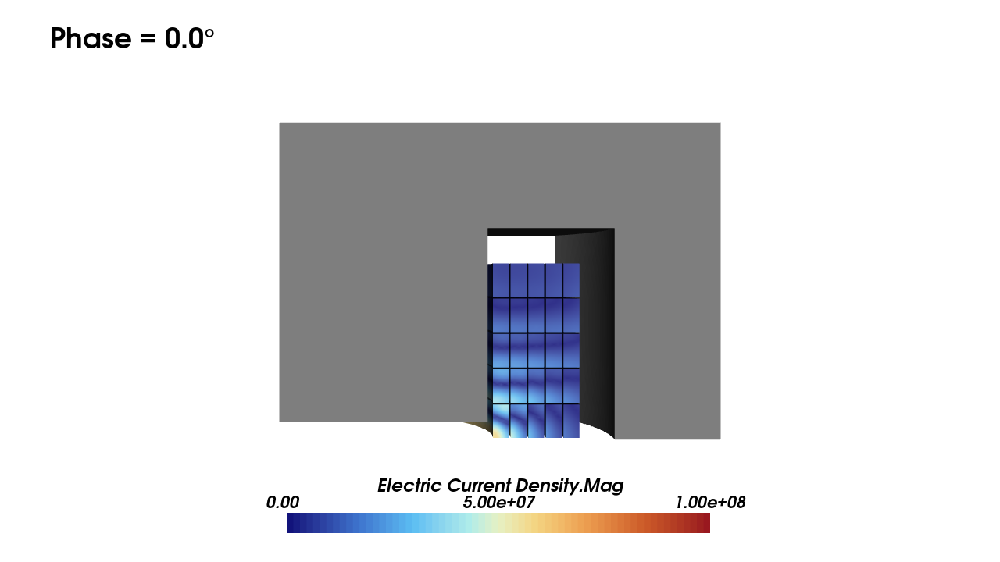
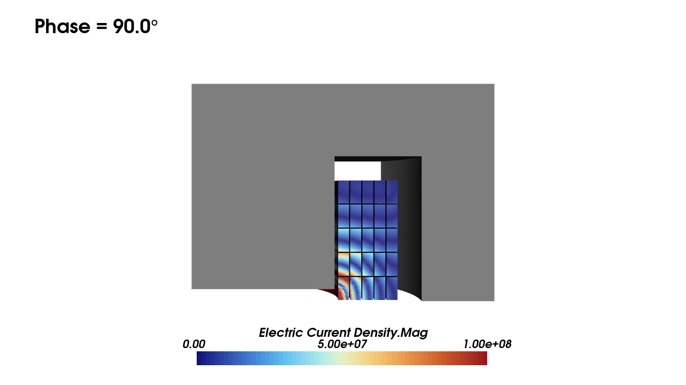
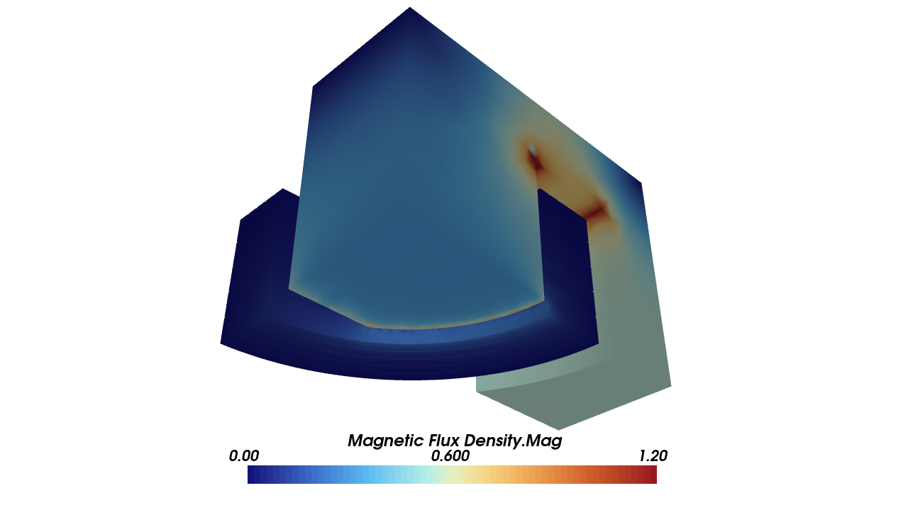
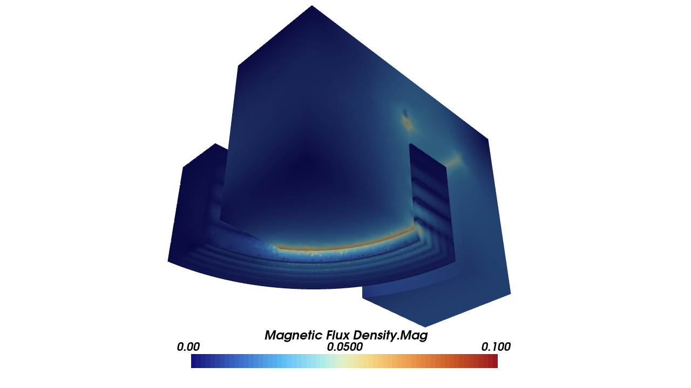
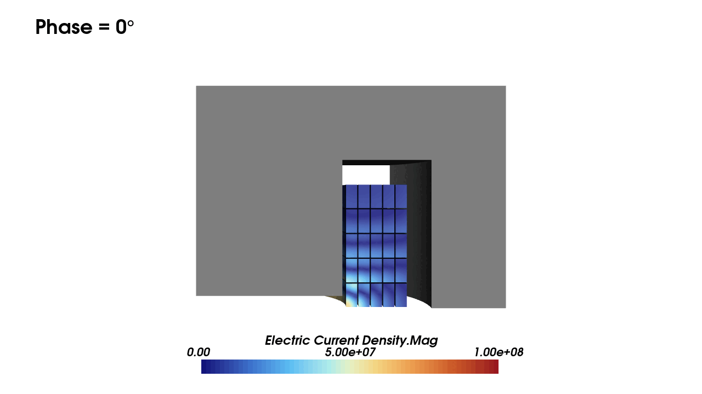

# Biro 1993: 3D Iron Core Current Driven Conductors

We are testing the current-driven solid coils following the example shown in [1], Section IV. We validate by comparing the
Ohmic loss within each individual conductor to the reference.

<em>The geometry of the setup. A core and 25 solid coils. Due to symmetry only 1/8th of the geometry is modelled.</em>

  

## Introduction

The core has a permeability of $`\mu_r=1000`$ (with no eddy currents) and the conductors have a
conductivity of $`\sigma=5.6 \times 10^7`$. In each turn a peak current of $`I=10 \rm{A}`$, phase
$`\phi=0 ^\circ`$ and frequency $`f = 5 \rm{kHz}`$ is imposed.

We compare the Ohmic heating generated inside each conductor with the values provides in [1] (Table I) for
3D with air gap.

Each copper conductor is setup as a solid coil (conductor) - thus eddy currents are resolved and we have
a strong skin effect.

## Setup

We use 2nd order accuracy to ensure smooth curves. Note that we impose the current inside the coil through a
**source** constraint.

## Results

* **Ohmic loss**

  The total Ohmic loss in each conductor is calculated and compared with the reference.

    | Coil | Reference | Obtained | Abs Error | Rel Error (%) |
    | ---- | --------- | -------- | --------- | ------------- |
    | 1    | 0.0618    | 0.06065  | 0.00115   | 1.86          |
    | 2    | 0.0557    | 0.05784  | 0.00214   | 3.84          |
    | 3    | 0.0501    | 0.05641  | 0.00631   | 12.60         |
    | 4    | 0.0481    | 0.05770  | 0.00960   | 19.95         |
    | 5    | 0.0521    | 0.06315  | 0.01105   | 21.21         |
    | 6    | 0.2880    | 0.24181  | 0.04619   | 16.04         |
    | 7    | 0.2331    | 0.19838  | 0.03472   | 14.89         |
    | 8    | 0.1726    | 0.15510  | 0.01750   | 10.13         |
    | 9    | 0.1255    | 0.12145  | 0.00405   | 3.23          |
    | 10   | 0.1021    | 0.10355  | 0.00145   | 1.42          |
    | 11   | 0.9296    | 0.79331  | 0.13629   | 14.66         |
    | 12   | 0.6964    | 0.58249  | 0.11391   | 16.36         |
    | 13   | 0.4556    | 0.38828  | 0.06732   | 14.78         |
    | 14   | 0.2802    | 0.24850  | 0.03170   | 11.31         |
    | 15   | 0.1854    | 0.16718  | 0.01822   | 9.83          |
    | 16   | 2.6304    | 2.52058  | 0.10982   | 4.18          |
    | 17   | 1.6056    | 1.37070  | 0.23490   | 14.63         |
    | 18   | 0.8140    | 0.67932  | 0.13468   | 16.55         |
    | 19   | 0.3918    | 0.33813  | 0.05367   | 13.70         |
    | 20   | 0.2046    | 0.18133  | 0.02327   | 11.38         |
    | 21   | 4.9960    | 6.53741  | 1.54141   | 30.83         |
    | 22   | 1.9424    | 1.67948  | 0.26292   | 13.54         |
    | 23   | 0.7424    | 0.61571  | 0.12669   | 17.06         |
    | 24   | 0.2920    | 0.25992  | 0.03208   | 10.99         |
    | 25   | 0.1166    | 0.11824  | 0.00164   | 1.41          |

    We find some deviation around 10%. However, the size of the gap is an uncertainty which need to be quantified (does a smaller gap improve the results).

## Scenes

* **Electric Current Density**

  | Electric Current Density ($`\phi=0`$) | Electric Current Density ($`\phi=90`$) |
  | ---- | ---- |
  |  |  |

  Strong eddy currents are created at the surface of each conductor.

* **Magnetic Flux Density**

  | Magnetic Flux Density ($`\phi=0`$) | Magnetic Flux Density ($`\phi=90`$) |
  | ---- | ---- |
  |  |  |

## Animation

## References

[1] O. Biro, K. Preis, W. Renhart, G. Vrisk and K.R. Richter, Computation of 3D current driven skin effect problems using a current vector potential, IEEE Transactions on Magnetics, 29, 2, pp. 1325-1328, (1993).
