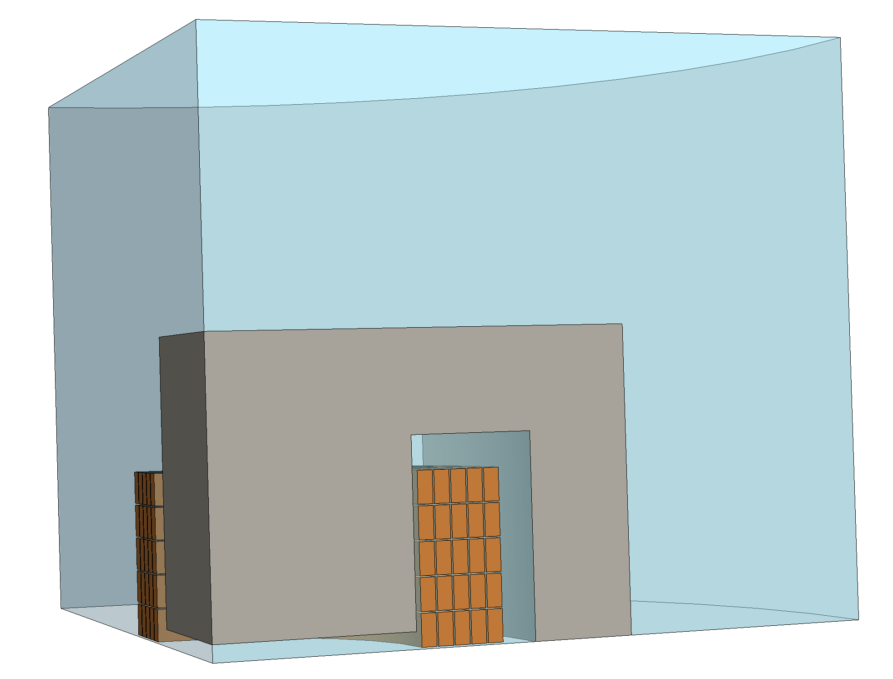
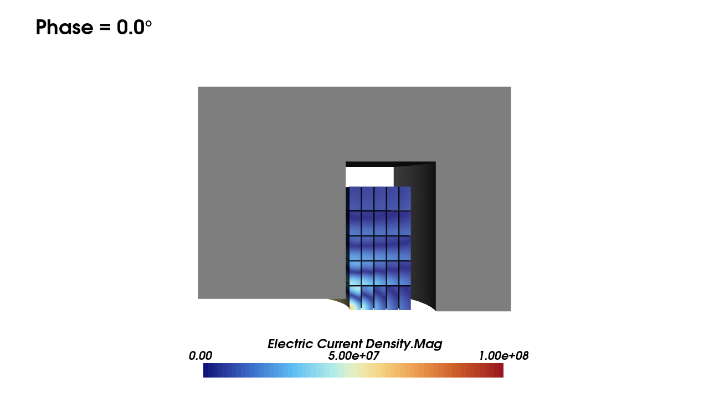
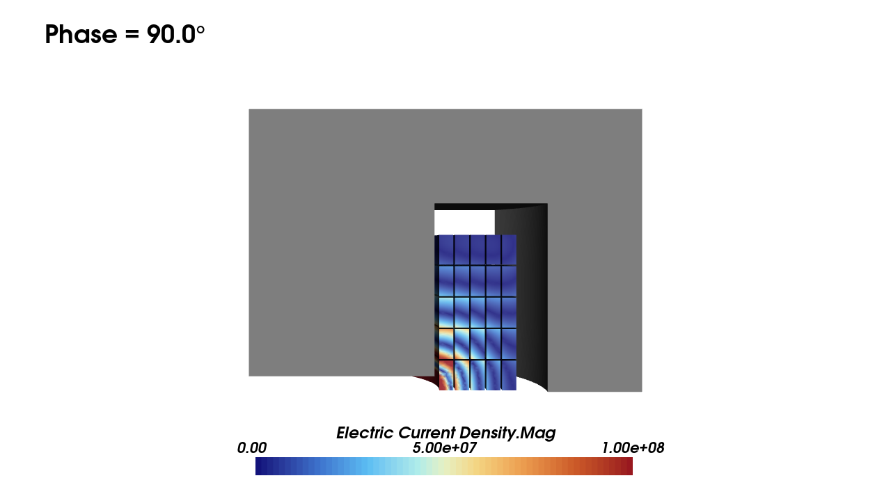
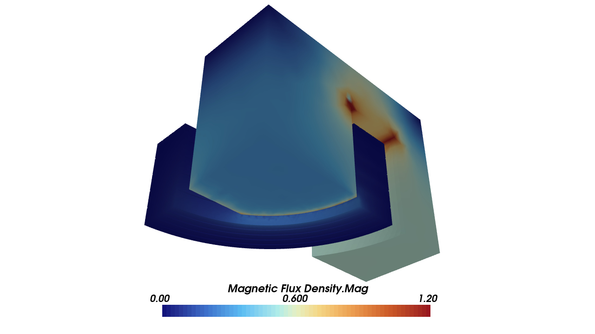
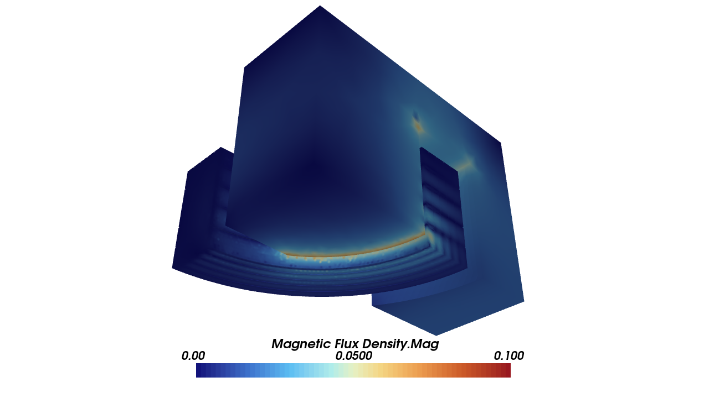
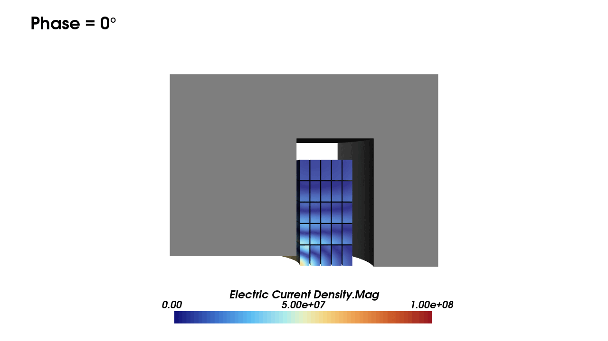

# Biro 1993: 3D Iron Core Current Driven Conductors

## Introduction

We are testing the current-driven solid coils following the example shown in [1], Section V. We validate by comparing the
Ohmic heating within each individual conductor to the reference.

We compare the Ohmic heating generated inside each conductor with the values provided in [1] (Table I) for
3D with air gap ([Ohmic_Loss.csv](data/Ohmic_Loss.csv) contains all columns of the table).

<em>The geometry of the setup: a core and 25 solid coils. As in [1], one quarter of the device is modeled.</em>

  

## Setup

The core has a permeability of $`\mu_r=1000`$ (with no eddy currents), and the conductors have a
conductivity of $`\sigma=5.6 \times 10^7 \, \mathrm{S/m}`$. In each turn, a peak current of $`I=10 \, \mathrm{A}`$, phase
$`\phi=0^\circ`$, and frequency $`f = 5 \, \mathrm{kHz}`$ is imposed.

Each copper conductor is set up as a solid coil (conductor) - thus eddy currents are resolved and we have
a strong skin effect.

We model the quarter of the device shown in Fig. 4 of [1]: the core (with a cylindrical middle limb of radius
11.8 mm and a 1 mm air gap at its bottom) and the 25 turns of $`1 \times 2\,\mathrm{mm}`$ at radii 12 to 17 mm.
The turns are separated by 0.1 mm gaps (each conductor is $`0.9 \times 1.9\,\mathrm{mm}`$), which keeps the
distance between the limb and the first turns at the 0.3 mm of [1]. The planes $`x = 0`$ and $`y = 0`$ and the
outer air boundary carry a Tangential Magnetic Flux condition; the plane $`z = 0`$ is left natural.

We use second-order elements. Note that we impose the current inside the coil through a
**source** constraint; each turn is a solid coil whose quarter is driven between its faces on the $`x = 0`$ and
$`y = 0`$ planes, and the losses of the quarter are multiplied by 4.

The geometry is built with netgen in the `build_geometry` method of [case.py](case.py) and meshed in
`generate_mesh`; both run only when the mesh is regenerated with `pymufem case.py --rebuild-mesh`.

## Running

Run the case with `pymufem case.py`; it prints the loss of each turn against the reference (the table of the Results section).

## Results

* **Ohmic heating**

  The total Ohmic heating in each conductor is calculated and compared with the reference.

    | Coil | Loss mufem [W] | Loss Biro 1993 [W] | Deviation [%] |
    | ---- | -------------- | ------------------ | ------------- |
    | 1 | 0.06079 | 0.0618 | -1.6 |
    | 2 | 0.05725 | 0.0557 | +2.8 |
    | 3 | 0.05494 | 0.0501 | +9.7 |
    | 4 | 0.05550 | 0.0481 | +15.4 |
    | 5 | 0.06067 | 0.0521 | +16.4 |
    | 6 | 0.26373 | 0.2880 | -8.4 |
    | 7 | 0.21589 | 0.2331 | -7.4 |
    | 8 | 0.16626 | 0.1726 | -3.7 |
    | 9 | 0.12789 | 0.1255 | +1.9 |
    | 10 | 0.10677 | 0.1021 | +4.6 |
    | 11 | 0.87791 | 0.9296 | -5.6 |
    | 12 | 0.64639 | 0.6964 | -7.2 |
    | 13 | 0.42718 | 0.4556 | -6.2 |
    | 14 | 0.27094 | 0.2802 | -3.3 |
    | 15 | 0.17937 | 0.1854 | -3.3 |
    | 16 | 2.79468 | 2.6304 | +6.2 |
    | 17 | 1.51576 | 1.6056 | -5.6 |
    | 18 | 0.74613 | 0.8140 | -8.3 |
    | 19 | 0.36845 | 0.3918 | -6.0 |
    | 20 | 0.19528 | 0.2046 | -4.6 |
    | 21 | 7.27032 | 4.9960 | +45.5 |
    | 22 | 1.83208 | 1.9424 | -5.7 |
    | 23 | 0.65902 | 0.7424 | -11.2 |
    | 24 | 0.27364 | 0.2920 | -6.3 |
    | 25 | 0.12217 | 0.1166 | +4.8 |
    | Total | 19.349 | 17.472 | +10.7 |

    Most conductors deviate by around 10% or less (median 6%). Conductor 21, next to the air gap, deviates by
    about 45%; its value is close to the axisymmetric (2D) result of [1], 7.09 W. Its loss is caused by the
    leakage field at the air gap and is very sensitive to the geometry there: moving the limb surface by only
    0.1 mm (radius 11.7 mm instead of 11.8 mm) changes it by 13% and the total loss by 7%. The coarse model of
    [1] (5,824 hexahedra) is unlikely to resolve this region accurately.

    The case checks the total loss against Table I and the total loss of the other 24
    conductors (-3% deviation).

## Scenes

The magnetic flux density and the electric current density (real and imaginary parts) are exported to
`VisualizationOutput/`; the scenes and the animation below are rendered from them in ParaView.

* **Electric Current Density**

  | Electric Current Density ($`\phi=0`$) | Electric Current Density ($`\phi=90`$) |
  | ---- | ---- |
  |  |  |

  Strong eddy currents are created at the surface of each conductor.

* **Magnetic Flux Density**

  | Magnetic Flux Density ($`\phi=0`$) | Magnetic Flux Density ($`\phi=90`$) |
  | ---- | ---- |
  |  |  |

* **Animation**

  

## References

[1] O. Biro, K. Preis, W. Renhart, G. Vrisk and K. R. Richter (1993). *Computation of 3D current driven skin effect problems using a current vector potential*. IEEE Transactions on Magnetics, 29(2), 1325–1328.
