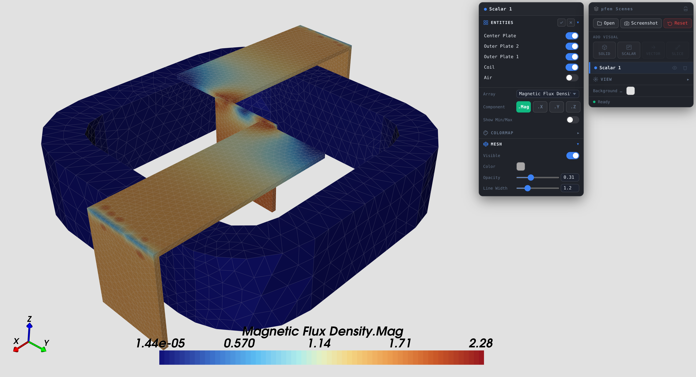
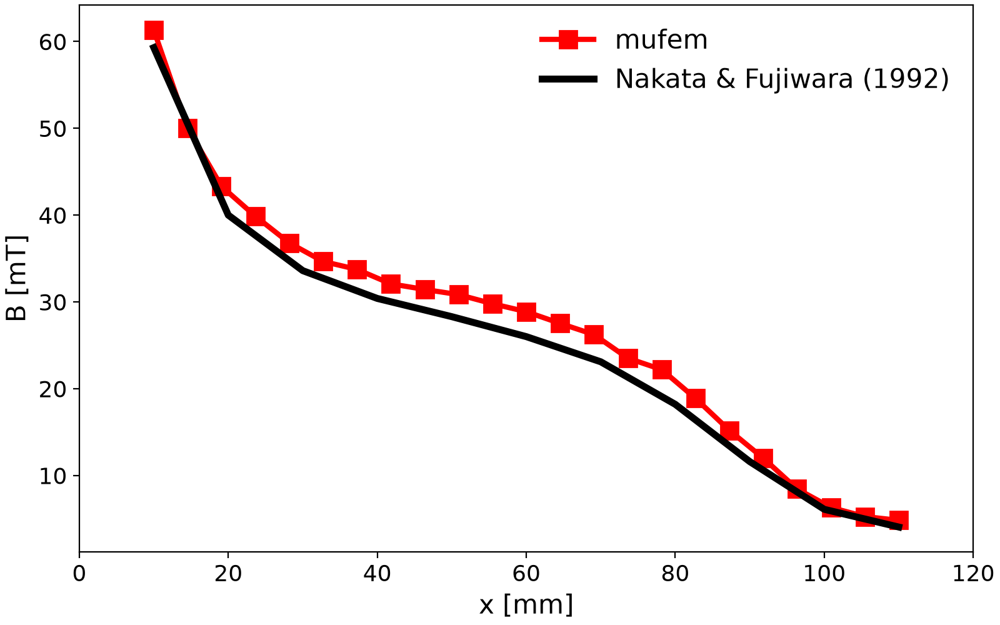

# Compumag Team 13: 3-D Non-Linear Magnetostatic Model

## Introduction

Problem 13 of the Compumag TEAM benchmark suite [1] is a nonlinear
magnetostatic case: an exciting coil sits between two steel channels, with
a steel plate inserted between them. The applied coil ampere-turns are
large enough to drive the steel into saturation. The benchmark validates
the prediction of magnetic flux density on probe lines passing through the
air gaps and through the saturated regions [2, 3].

<em>Geometry of the benchmark: a stranded coil between two steel channels and a centre plate. One symmetry plane is exploited.</em>

  

The strong nonlinearity comes from the $`B(H)`$ curve assigned to the steel
parts, which contains a sharp Rayleigh region followed by deep saturation:

| BH Curve                      | Rayleigh region (zoomed)            |
| ----------------------------- | ----------------------------------- |
|  |  |

## Setup

* *Magnetostatic* model, second-order accurate.
* Symmetry plane reduces the model to half of the geometry.
* The steel uses a non-linear $`B(H)`$ from `data/bh_table.csv`; eddy
  currents are not relevant in this static case.
* Stranded coil driven by a prescribed current; ampere-turns chosen to
  drive the steel into saturation.
* A Newton line search on the variational functional is enabled for
  iterations 1-6 to stabilise the iterates through the saturation knee.

## Validation

We compare the magnetic flux density along a line in air (between the
plate and channels) against the values reported by Nakata and co-workers
[2, 3].

## Results

* **Scenes**

  *Click on the image to view the interactive 3D result*
  

* **Magnetic Flux Density in the Air**

  

## References

[1] Compumag, "Problem 13 - 3-D Non-Linear Magnetostatic Model",
    https://www.compumag.org/wp/wp-content/uploads/2018/06/problem13.pdf

[2] Nakata, T., Takahashi, N. and Fujiwara, K., 1995. Summary of results
    for TEAM workshop problem 13 (3-D nonlinear magnetostatic model).
    *COMPEL*, 14(2/3), pp.91-101.

[3] Nakata, T. and Fujiwara, K., 1992. Summary of results for benchmark
    problem 13 (3-D nonlinear magnetostatic model).
    *COMPEL*, 11(3), pp.345-369.
