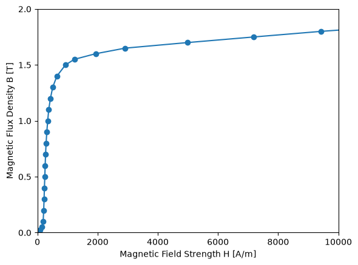
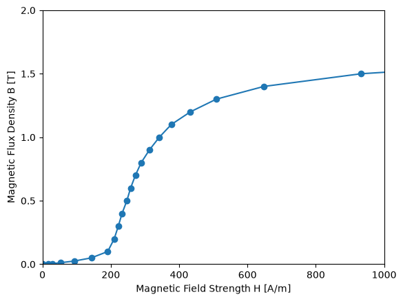
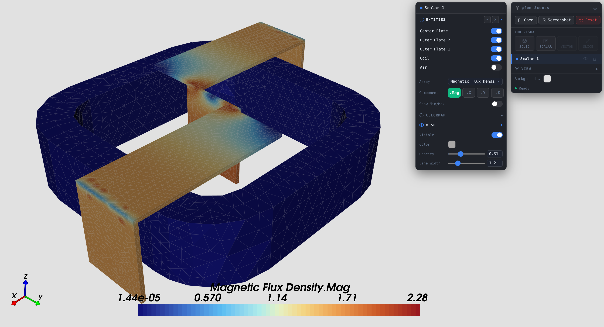
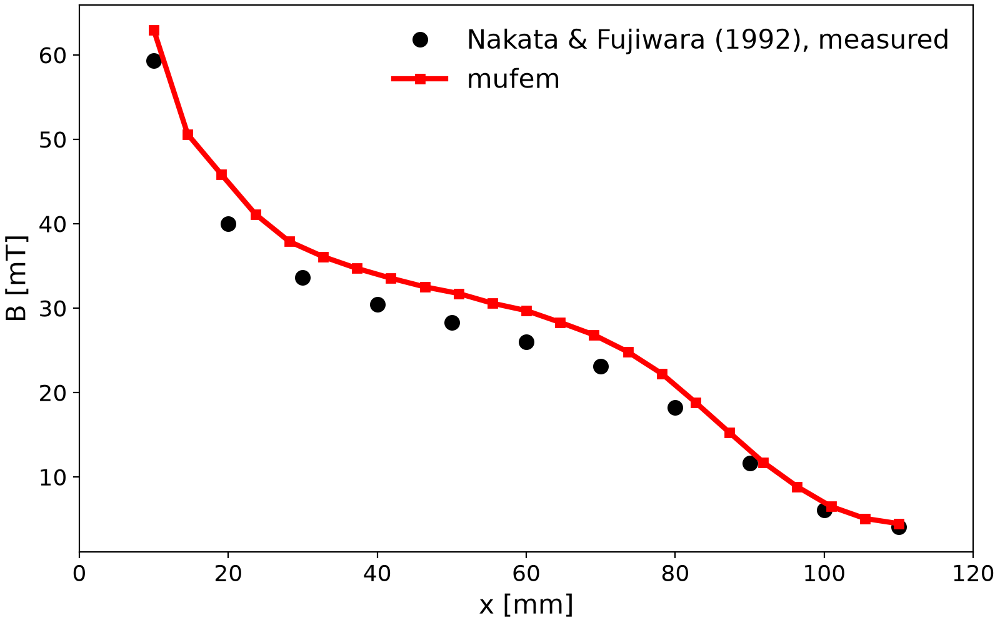

# Compumag Team 13: 3-D Non-Linear Magnetostatic Model

## Introduction

Problem 13 of the Compumag TEAM benchmark suite [1] is a nonlinear
magnetostatic case: an exciting coil sits between two steel channels, with
a steel plate inserted between them. The applied coil ampere-turns are
large enough to drive the steel into saturation. The benchmark validates
the prediction of magnetic flux density on probe lines passing through the
air gaps and through the saturated regions [2, 3].

<em>Geometry of the benchmark: a stranded coil between two steel channels and a centre plate. One symmetry plane is exploited.</em>

  

The strong nonlinearity comes from the $`B(H)`$ curve assigned to the steel
parts, which contains a sharp Rayleigh region followed by deep saturation:

| BH Curve                      | Rayleigh region (zoomed)            |
| ----------------------------- | ----------------------------------- |
|  |  |

## Setup

* The geometry follows Fig. 1 of [1]: a 3.2 mm centre plate, two steel
  channels (120 mm inside plus the 3.2 mm leg, 50 mm wide) at 0.5 mm from it,
  and a coil of $`200 \times 200`$ mm with rounded corners (R25/R50), 25 mm wide
  and 100 mm high.
* The plane $`z = 0`$ is a symmetry plane, so the upper half of the geometry is
  modelled (the 1/2 region of Fig. 2(b) of [1]); the outer boundaries of the air
  carry a Tangential Magnetic Flux condition.
* Time-Domain Magnetic model run to a steady state (12 nonlinear iterations),
  second-order accurate; eddy currents are not relevant in this static case.
* The steel uses the $`B(H)`$ curve of Fig. 3 of [1] (Table 2 of [3]) up to
  1.8 T, extended above 1.8 T with Eq. (1) of [1] ([bh_table.csv](data/bh_table.csv),
  plotted by [plot_bh_table.py](data/plot_bh_table.py)).
* The stranded coil is driven with 3000 AT: 500 turns of 3 A in the cross-section
  of the half coil, i.e. the same current density as 3000 AT in the full coil.
* A Newton line search on the variational functional is enabled for
  iterations 0-6 to stabilise the iterates through the saturation knee.

The geometry is built with netgen in the `build_geometry` method of
[case.py](case.py) and meshed in `generate_mesh`; both run only when the mesh is
regenerated with `pymufem case.py --rebuild-mesh`. The case itself is run with
`pymufem case.py`.

## Validation

We compare the magnitude of the magnetic flux density along the line
$`10 \le x \le 110`$ mm, $`y = 20`$ mm, $`z = 55`$ mm in the air (between the
plate and the channel) with the values measured with a Hall probe at 3000 AT
(Table 7 of [3], [Table7_FluxDensity.csv](data/Table7_FluxDensity.csv)).

mufem is 6-15 % above the measurement along the line (12 % on average). The
codes of the workshop based on the magnetic vector potential deviate similarly
in the air (Fig. 9 of [3]), while the codes using the integral equation method
are the most accurate there. The case checks the mean ratio of the computed to
the measured $`|B|`$ over the eleven measured points (15 % tolerance).

## Results

* **Scenes**

  The magnetic flux density and the current density are exported to
  `VisualizationOutput/`; the scene below was rendered from them.
  *Click on the image to view the interactive 3D result*
  

* **Magnetic Flux Density in the Air**

  

## References

[1] Compumag, "Problem 13 - 3-D Non-Linear Magnetostatic Model",
    https://www.compumag.org/wp/wp-content/uploads/2018/06/problem13.pdf

[2] Nakata, T., Takahashi, N. and Fujiwara, K., 1995. Summary of results
    for TEAM workshop problem 13 (3-D nonlinear magnetostatic model).
    *COMPEL*, 14(2/3), pp.91-101.

[3] Nakata, T. and Fujiwara, K., 1992. Summary of results for benchmark
    problem 13 (3-D nonlinear magnetostatic model).
    *COMPEL*, 11(3), pp.345-369.
