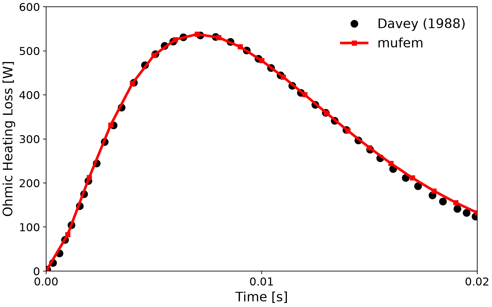

# Compumag Team 1b: The FELIX Short Cylinder

## Introduction

The *FELIX Short Cylinder* (Problem 1b of the Compumag TEAM benchmark suite [[1]](#CompumagCase)) is one of the founding eddy-current benchmarks, dating back to the Argonne National Lab *Fusion ELectromagnetic Induction eXperiment* (FELIX). It validates a code's ability to predict the time evolution of eddy currents, Ohmic losses, and stored magnetic energy in a conducting cylinder placed in a decaying transverse magnetic field [[2]](#Davey1988).

<div align="center">
    
    <br/>
    <br/>
    <em>Figure 1: The geometry of the benchmark: an aluminium short cylinder in air.</em>
</div>
<br/>


## Setup

The setup is a conductive aluminium cylinder in air, immersed in a uniform external magnetic field in the $`y`$-direction which decays exponentially in time according to
```math
B_y(t) = B_0\, e^{-t/\tau} \quad,
```
where $`t=0`$ marks the moment at which the field has fully penetrated the cylinder. The decay constant is $`\tau = 0.0069 \, \rm{s}`$ and the initial flux density is $`B_0 = 0.1 \, \rm{T}`$. The aluminium has resistivity $`\rho = \sigma^{-1} = 3.94 \times 10^{-8} \, \Omega \cdot \rm{m}`$.

We solve the time-domain quasi-static Maxwell equations using the *electric formulation*
```math
\int_\Omega \mathrm{curl}\, \nu\, \mathrm{curl}\, \vec{A}
 + \int_{\Omega_c} \sigma \frac{\partial \vec{A}}{\partial t}
 - \int_\Gamma \vec{H}_0 \times \vec{n} = 0 \quad,
```
where $`\vec{A}`$ is the magnetic vector potential, $`\nu`$ is the magnetic reluctivity, $`\sigma`$ the electrical conductivity, and $`\vec{H}_0`$ the tangential-field Neumann condition. The unknown $`\vec{A}`$ is discretised in the *HCurl* space; the flux density follows as $`\vec{B} = \nabla \times \vec{A}`$ and the field as $`\vec{H} = \nu \vec{B}`$.

We use an [unsteady run](https://raiden-numerics.github.io/mufem-doc/models/electromagnetics/time_domain_magnetic/model.html) with a *Magnetostatic initialisation* to obtain the fully penetrated state at $`t=0`$, then march in time with backward Euler and three inner iterations per step (linearity makes the inner loop mostly a convergence check). The decaying field is imposed through a [Tangential Magnetic Field](https://raiden-numerics.github.io/mufem-doc/models/electromagnetics/time_domain_magnetic/conditions/tangential_magnetic_field_condition) condition of the form
```math
\vec{H}_0(t) =
\left(
    \begin{array}{c}
    0 \\
    \mu_0^{-1}\, B_y(t) \\
    0
    \end{array}
\right) \quad.
```

## Validation

We compare the Ohmic heating loss integrated over the cylinder against the reference results compiled by [Davey (1988)](#Davey1988). The Ohmic power density follows from
```math
\rho_\Omega \left[ \frac{\rm{W}}{\rm{m}^3} \right]
 = \vec{J} \cdot \vec{E}
 = \sigma \frac{\partial \vec{A}}{\partial t} \cdot
   \frac{\partial \vec{A}}{\partial t} \quad,
```
and the magnetic energy density from
```math
\rho_B \left[ \frac{\rm{J}}{\rm{m}^3} \right]
 = \int_0^B \vec{B} \cdot \vec{H}
 = \tfrac{1}{2}\, \mu_0\, \vec{H} \cdot \vec{H} \quad,
```
the latter being valid because all materials are linear and non-magnetic.

## Results

The quantity of interest is the *Ohmic Heating Loss* inside the cylinder over time.



The simulated loss tracks the reference closely, with minor deviation near the end of the transient.

At the final time step the "Electric Current Density" field is exported and visualized using ParaView using the [create_scene.py](create_scene.py) script.

<div align="center">
    
    <br/>
    <br/>
    Figure 2: Eddy currents inside the cylinder at the final time.
</div>
<br/>


## References

<a id="CompumagCase"></a> [1] Compumag, "Problem 1b — The FELIX Short Cylinder Experiment",
    https://www.compumag.org/wp/wp-content/uploads/2018/06/problem1b.pdf
    sha1: 7512924a5392dde68c236d7e3fbb7de861bbdd59

<a id="Davey1988"></a> [2] Davey, K., 1988. The FELIX Cylinder problem (International Eddy Current Workshop Problem 1).
    *COMPEL — The international journal for computation and mathematics in electrical and electronic engineering*,
    7(1/2), pp.11-27. doi: 10.1108/eb010036 sha1: d20a1f68646aed90bf2c99873933cb849fcd8dc8
