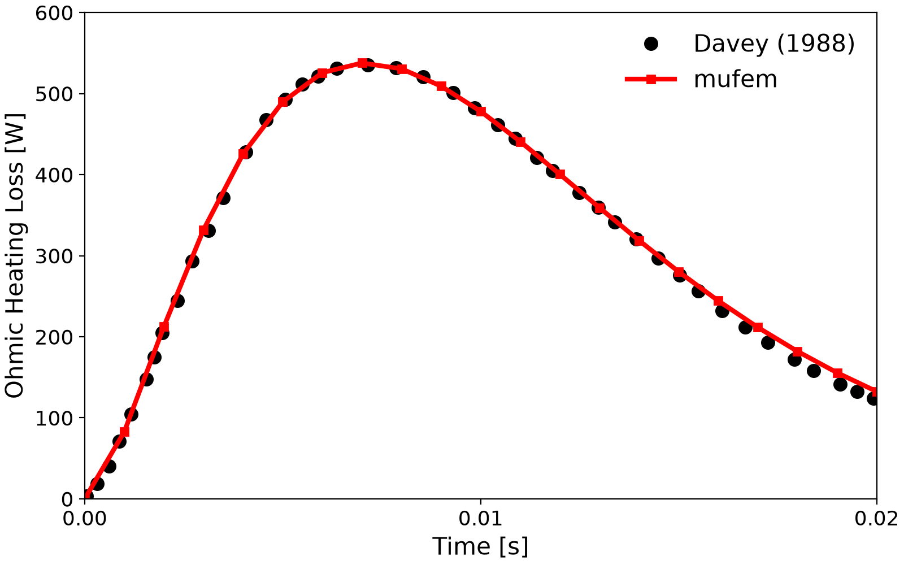
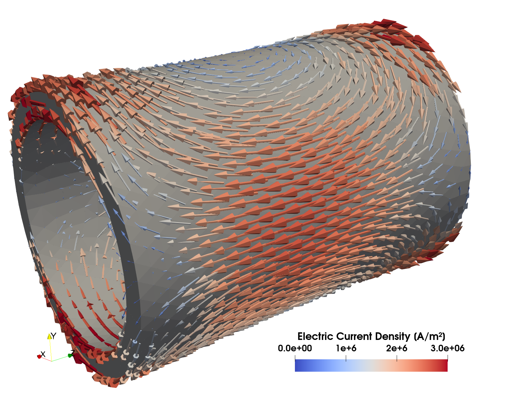

# Compumag Team 1b: The FELIX Short Cylinder

## Introduction

The *FELIX Short Cylinder* (Problem 1b of the Compumag TEAM benchmark suite [[1]](#CompumagCase)) is one of the founding eddy-current benchmarks, dating back to the Argonne National Lab *Fusion ELectromagnetic Induction eXperiment* (FELIX). It validates a code's ability to predict the time evolution of eddy currents, Ohmic losses, and stored magnetic energy in a conducting cylinder placed in a decaying transverse magnetic field [[2]](#Davey1988).

<div align="center">
    
    <br/>
    <br/>
    <em>Figure 1: The geometry of the benchmark: an aluminum short cylinder in air.</em>
</div>
<br/>


## Setup

The setup is a conductive aluminum cylinder in air, immersed in a uniform external magnetic field in the $`y`$-direction which decays exponentially in time according to
```math
B_y(t) = B_0\, e^{-t/\tau} \quad,
```
where $`t=0`$ marks the moment at which the field has fully penetrated the cylinder. The decay constant is $`\tau = 0.0069 \, \rm{s}`$ and the initial flux density is $`B_0 = 0.1 \, \rm{T}`$. The aluminum has resistivity $`\rho = \sigma^{-1} = 3.94 \times 10^{-8} \, \Omega \cdot \rm{m}`$.

We solve the time-domain quasi-static Maxwell equations using the *electric formulation*
```math
\int_\Omega \mathrm{curl}\, \nu\, \mathrm{curl}\, \vec{A}
 + \int_{\Omega_c} \sigma \frac{\partial \vec{A}}{\partial t}
 - \int_\Gamma \vec{H}_0 \times \vec{n} = 0 \quad,
```
where $`\vec{A}`$ is the magnetic vector potential, $`\nu`$ is the magnetic reluctivity, $`\sigma`$ the electrical conductivity, and $`\vec{H}_0`$ the tangential-field Neumann condition. The unknown $`\vec{A}`$ is discretized in the *HCurl* space; the flux density follows as $`\vec{B} = \nabla \times \vec{A}`$ and the field as $`\vec{H} = \nu \vec{B}`$.

We use an [unsteady run](https://raiden-numerics.github.io/mufem-doc/models/electromagnetics/time_domain_magnetic/model.html) with a *Magnetostatic initialization* to obtain the fully penetrated state at $`t=0`$, then march in time up to $`t = 20\,\mathrm{ms}`$ with time steps of $`1\,\mathrm{ms}`$ and three inner iterations per step (linearity makes the inner loop mostly a convergence check). The decaying field is imposed through a [Tangential Magnetic Field](https://raiden-numerics.github.io/mufem-doc/models/electromagnetics/time_domain_magnetic/conditions/tangential_magnetic_field_condition) condition of the form
```math
\vec{H}_0(t) =
\left(
    \begin{array}{c}
    0 \\
    \mu_0^{-1}\, B_y(t) \\
    0
    \end{array}
\right)
```
on the boundary of a cubic air box of $`0.4\,\mathrm{m}`$ edge length around the full cylinder (length $`0.2\,\mathrm{m}`$, inner and outer radii $`0.05715\,\mathrm{m}`$ and $`0.06985\,\mathrm{m}`$).

The geometry is built with netgen in the `build_geometry` method of [case.py](case.py) and meshed in `generate_mesh`; both run only when the mesh is regenerated with `pymufem case.py --rebuild-mesh`. The case itself is run with `pymufem case.py`.

## Validation

The results are compared with the solutions of the 1988 eddy current workshop compiled by [Davey (1988)](#Davey1988).

* **Power loss** in the cylinder, $`\int \rho J^2 \, dV`$, against Table 4 of [2] (eight codes) at $`t = 4`$, $`8`$ and $`10\,\mathrm{ms}`$:

  | Time | mufem | Table 4 of [2], range (median) |
  | ---- | ----- | ------------------------------ |
  | 4 ms | 425 W | 321 - 464 W (430.5 W) |
  | 8 ms | 530 W | 480 - 570 W (534.5 W) |
  | 10 ms | 478 W | 420 - 515 W (484 W) |

  The case checks the loss at these times against the medians (5 % tolerance). Table 4 is labeled as the loss in a quarter of the cylinder, but its values agree with the total loss of Fig. 8 of [2] and with the total loss computed here.

* **Induced magnetic field** at the center of the cylinder (the field $`B_y`$ minus the applied field), against the **measurement** of Table 3 of [2]:

  | Time | mufem | Measurement | Codes of [2] |
  | ---- | ----- | ----------- | ------------ |
  | 4 ms | 0.0322 T | 0.035 T | 0.030 - 0.039 T |
  | 8 ms | 0.0388 T | 0.042 T | 0.036 - 0.0495 T |
  | 10 ms | 0.0375 T | 0.0375 T | 0.034 - 0.049 T |

  The case checks these values against the measurement (10 % tolerance); like most codes of [2], mufem is 5-10 % below the measurement at 4 and 8 ms.

## Results

The power loss over time, compared with the curve of Fig. 8 of [2] (the EDDYCUFF solution of Kameari, [PowerLoss.csv](data/PowerLoss.csv)):



The magnetic flux density and the electric current density at the final time are exported to `VisualizationOutput/`; the scene below is rendered from them with ParaView by [create_scene.py](create_scene.py) (run with `pvpython create_scene.py` after the case).

<div align="center">
    
    <br/>
    <br/>
    Figure 2: Eddy currents inside the cylinder at the final time.
</div>
<br/>


## References

<a id="CompumagCase"></a> [1] Compumag, "Problem 1b — The FELIX Short Cylinder Experiment",
    https://www.compumag.org/wp/wp-content/uploads/2018/06/problem1b.pdf
    sha1: 7512924a5392dde68c236d7e3fbb7de861bbdd59

<a id="Davey1988"></a> [2] Davey, K., 1988. The FELIX Cylinder problem (International Eddy Current Workshop Problem 1).
    *COMPEL — The international journal for computation and mathematics in electrical and electronic engineering*,
    7(1/2), pp.11-27. doi: 10.1108/eb010036 sha1: d20a1f68646aed90bf2c99873933cb849fcd8dc8
