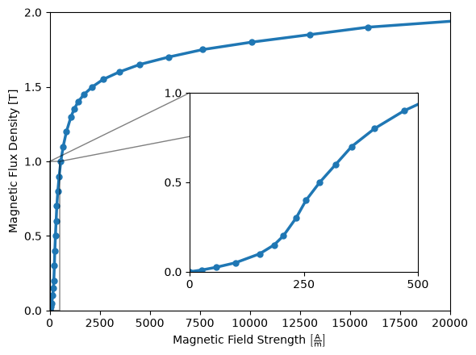
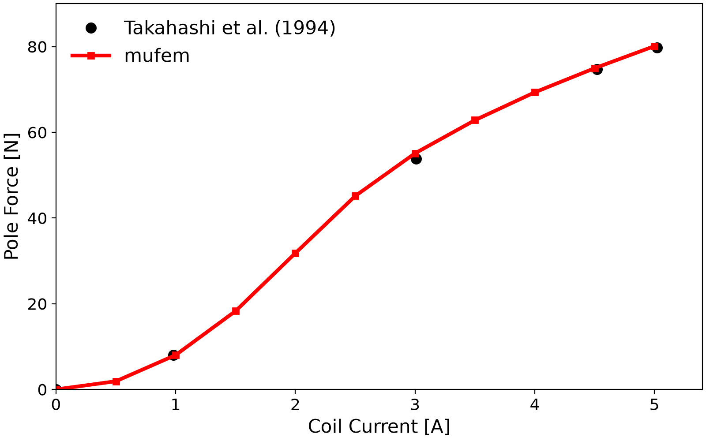

# Compumag Team 20: 3-D Static Force Problem

## Introduction

The problem [[1]](#[1]) is a non-linear magnetostatic case with a center pole and yoke made of ferromagnetic steel, and a stranded (wound) copper coil which is excited by a constant current. The geometry is shown in Figure 1.


<div align="center">

</div>
<div align="center">
    <br/>Figure 1: Geometry of the benchmark. An excitation coil surrounds a steel pole and yoke. Due to symmetry only one quarter of the geometry is modeled.
</div>
<br /><br />

When current is flowing through the coil, a magnetic field is generated which is channeled through the ferromagnetic material. This creates a force between the pole and the yoke which is measured. We are interested in the relation between the coil current and the resulting force on the pole. The force on the center pole and the flux density in the gap below it are compared to **experimental values** presented in [[2]](#[2]) and [[3]](#[3]).

## Setup


### Mesh

The geometry follows Fig. 1 of [[1]](#[1]) and is built with netgen in the `build_geometry` method of [case.py](case.py); `generate_mesh` meshes it (mesh size 1 mm on the pole and 2.5 mm on the yoke and coil) and saves it in the [mfem v13 format](https://mfem.org/mesh-format-v1.0/#mfem-mesh-v13) using named attributes for the volume bodies (Coil, Air, Yoke, and Pole) and boundaries. Both methods run only when the mesh is regenerated with `pymufem case.py --rebuild-mesh`.

<div align="center">

</div>
<div align="center">
Figure 2: The mesh used in the simulation visualized using <a href="https://glvis.org/">glvis</a>. While the mesh in the air body can be coarse, the yoke and pole require a finer mesh to ensure a good accuracy.</div>
</div>
<br /><br />

### Model

We use the [Time-Domain Magnetic Model](https://raiden-numerics.github.io/mufem-doc/models/electromagnetics/time_domain_magnetic/model.html) which solves for the magnetic field using finite-element discretization and following equation:
```math
\rm{curl}\, \mu^{-1} \rm{curl}\, \vec{A} = \vec{J} \quad,
```
where $`\vec{A} [\frac{\rm{Wb}}{\rm{m}}]`$ is the magnetic vector potential, 
$`\mu [\frac{\rm{H}}{\rm{m}}]`$ is the magnetic permeability, and $`\vec{J} [\frac{\rm{A}}{\rm{m}^2}]`$
is the electric current density. The magnetic flux density $`\vec{B} [T]`$ is then given by 
$`\vec{B} = \rm{curl}\, \vec{A}`$. The magnetic field $`\vec{H}[\frac{\rm{A}}{\rm{m}}]`$ can be 
obtained from $`\vec{H} = \mu^{-1} \vec{B}`$. Note that the electric current density is only non-zero
in the coil body and is required to be divergence free, i.e., $`\nabla \cdot \vec{J} = 0`$.

As for the boundary, by symmetry the magnetic flux needs to be tangential to the symmetry faces; thus we
assign a [Tangential Magnetic Flux Condition](https://raiden-numerics.github.io/mufem-doc/models/electromagnetics/time_domain_magnetic/conditions/tangential_magnetic_flux_condition) which ensures that
$`\vec{B} \cdot \vec{n} = 0`$. This is achieved by specifying the tangential components of 
$`\vec{A}`$ to zero, i.e. $`\vec{n} \times \vec{A} = 0`$. It is applied on the symmetry planes $`x = 0`$ and $`y = 0`$, including the end faces of the quarter coil (`Coil::In`, `Coil::Out`); the outer air boundary, a far-field boundary, is left free.

### Excitation

The electric current density in the right-hand side of the equation is provided by the [Excitation Coil Model](https://raiden-numerics.github.io/mufem-doc/models/electromagnetics/excitation_coil/model.html) which models the properties of the stranded coil. The electric current density inside the coil body can be calculated using
```math
\vec{J}= I \frac{n_t}{S_c} \vec{d} \quad,
```
where $`I [\rm{A}]`$ is the applied coil current, $`n_t`$ is the number of coil turns, and 
$`S_c[\rm{m}^2]`$ 
is the coil cross section and $`\vec{d}`$ is the coil path (please note that the actual calculation is 
more involved as we need to ensure that the electric current density is homogeneous along a coil cross 
section as well as support non-constant cross sections of the coil geometry). Here, we choose $`n_t=1000`$ 
and a coil current ranging from $`I=0\text{A}`$ to $`I=5\text{A}`$ in 11 steps, i.e. 0 to 5000 ampere-turns (the
experimental coil has 381 turns; only the ampere-turns matter).

### Reports

The force is calculated using the [Magnetic Force Report](https://raiden-numerics.github.io/mufem-doc/models/electromagnetics/time_domain_magnetic/reports/magnetic_force_report) which uses the Maxwell stress 
tensor $`\mathbb{T} [\rm{Pa}]`$ given by
```math
\mathbb{T} = \vec{B} \otimes \vec{H} - \frac{1}{2} \left( \vec{B} \cdot \vec{H} \right) \mathbb{I}   \quad.
```
The force $`\vec{F}[\rm{N}]`$ is then given by integrating over the surface $`S`$ of the center pole body with
```math
\vec{F} = \int_S \mathbb{T} \cdot \vec{n} \,\rm{d}S \quad,
```
where $`\vec{n}`$ is the normal along the surface. Note that only the z-component of $`\vec{F}`$ is relevant for the benchmark here.


### Materials

While the *coil* and *air* have vacuum permeability, the *Yoke* and *Pole* are iron materials with a strong non-linearity given by the B(H) curve with a Rayleigh region and saturation. Robustly capturing the Rayleigh region and saturation effects is numerically challenging. In the benchmark case, the tabulated [B-H curve](data/Table_1_BH_Curve.csv) of Table 1 of [[1]](#[1]) is used, also shown in Figure 3 (plotted by [plot_bh_table.py](data/plot_bh_table.py)).

<div style="display: flex; align-items: flex-start;">
    
    <div>
        <p><em>Figure 3: The B-H curve used in the problem.</em></p>
        <p>
            The BH curve shown represents the magnetic response of the ferromagnetic material. It exhibits two important regions:
        </p>
        <ul>
            <li>
                <strong>Rayleigh Region:</strong> The low-field regime (highlighted in the inset) where the magnetization increases quadratically with the applied field. This behavior is governed by the Rayleigh Law, attributed to domain wall motion and small reversible displacements.
            </li>
            <li>
                <strong>Saturation Region:</strong> At high fields, most magnetic domains align with the applied field, causing the curve to flatten as the material approaches saturation magnetization.
            </li>
        </ul>
        <p>
            The transition between these regions is characterized by the irreversible domain wall movements and progressive domain rotation.
        </p>
    </div>
</div>


## Running the case


We run the case using [case.py](case.py) with
```bash
pymufem case.py
```

Note that the `solve` method of [case.py](case.py) loops over an increasing value of the coil current:
```python
for coil_current in numpy.linspace(0.0, 5.0, 11):
    self.coil_drive_current.set_value(coil_current)

    self.runner.advance(5)

    self.pole_force.append((coil_current, -4.0 * self.pole_force_report.evaluate().z))
    self.gap_field.append(
        {name: report.evaluate().z for name, report in self.gap_field_reports.items()}
    )
```
It sets the current, runs five nonlinear iterations and stores the force on the pole (four times that of the
quarter model, attractive in $`-z`$) and $`B_z`$ in the gap. Finally, we generate a plot showing the dependency
of the force versus the coil current.

<div align="center">

</div>
<div align="center">
<em>Figure 4: The resulting force in relation to the applied coil current and compared with the experimental values of Fig. 2 of [3].</em>
</div>
<br /><br />


The results are presented in Figure 4, where we find a good match to the experimental and numerical values
reported in [[2]](#[2]) and [[3]](#[3]). Note that initially the force increases quadratically with an 
increase of current until around $`I=3`$ A, where the steel saturates.

The measurements of [[2]](#[2]) (Tables 4 and 6) for the four excitations of the benchmark:

| Ampere-turns | $`F_z`$ mufem / measured [N] | $`B_z`$ at P1 mufem / measured [T] | $`B_z`$ at P2 mufem / measured [T] |
| ------------ | ---------------------------- | ---------------------------------- | ---------------------------------- |
| 1000         | 8.04 / 8.1                   | 0.320 / 0.36                       | 0.221 / 0.24                       |
| 3000         | 55.2 / 54.4                  | 0.847 / 0.84                       | 0.581 / 0.63                       |
| 4500         | 75.1 / 75.0                  | 1.003 / 0.99                       | 0.686 / 0.72                       |
| 5000         | 80.2 / 80.1                  | 1.042 / 1.03                       | 0.710 / 0.74                       |

P1 = (0, 0, 25.75) mm is the mid-point and P2 = (12.5, 5, 25.75) mm the edge of the gap below the pole. The
case checks the force at all four excitations and $`B_z`$ at 5000 AT at P1 and P2;
at P2, where the flux density changes abruptly, [[2]](#[2]) also reports larger discrepancies between
calculations and measurement.

Finally, we save the fields at $`I=5`$ A for further evaluation with e.g. [mufem-scenes](https://raiden-numerics.github.io/mufem-scenes/) or [ParaView](https://www.paraview.org/).

<div align="center">

</div>
<div align="center">
<em>Figure 5: The magnetic flux density at I=5 A. At the corner of the center pole the magnitude of the magnetic flux density exceeds the values of the provided B-H table requiring extrapolation.</em>
</div>
<br /><br />

As an outlook, the paper [[3]](#[3]) suggests to investigate the effect of model order, and adaptive refinement (among others) which we will look into in an upcoming update.


## References

<a id="[1]"></a> [1] Compumag, "Problem 20 — 3-D Static Force Problem", https://www.compumag.org/wp/team/ sha1: 159da183684ccc3f663c0f4952535be6c02c3efd

<a id="[2]"></a> [2] Takahashi, N., Nakata, T. and Morishige, H., 1995. Summary of results for problem 20 (3-D static force problem). *COMPEL — The international journal for computation and mathematics in electrical and electronic engineering*, 14(2/3), pp.57-75. doi: 10.1108/eb010138

<a id="[3]"></a> [3] Takahashi, N., Nakata, T. and Morishige, H., 1994. Investigation of a model to verify software for 3-D static force calculation. *IEEE Transactions on Magnetics*, 30(5), pp.3483-3486. doi: 10.1109/20.312689 sha1: 8f0fb72ec5c2e04619ecc24308a6b5e66fa3cd9c