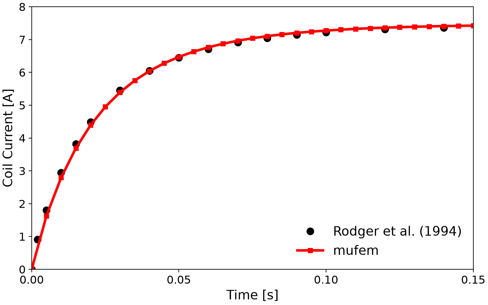
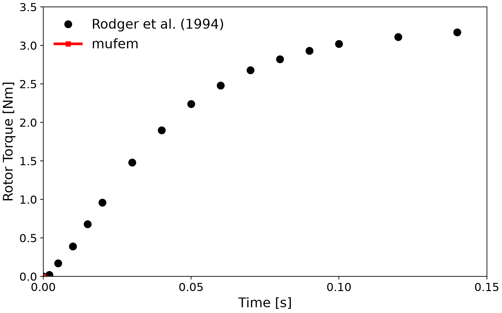

# Compumag Team 24: Nonlinear Time-Transient Rotational Test Rig

Problem 24 of the Compumag TEAM benchmark suite [1] is a transient magnetic problem combining bulk eddy currents, magnetic non-linearity, and voltage-driven coils. The geometry is a rotor locked at $`22°`$, a stator, and two coils mounted on the stator. The benchmark provides measured coil current and rotor torque [1]. It is solved using [case.py](case.py):

<div align="center">
    
    <br/>
    <em>Figure 1: Geometry of the benchmark: a stator carrying two coils and a rotor ring locked at 22°.</em>
</div>
<br/>

The [mesh](geometry.mesh) was created using Netgen and exported in MFEM v1.3 format.

The goal of the benchmark is to calculate the torque acting on the rotor.

## Setup

### Updating the B-H Curve

The *rotor* and *stator* are made of iron with a constant electrical conductivity
$`\sigma = 4.54 \times 10^6 \ \mathrm{S/m}`$ and a non-linear $`B(H)`$ curve. As pointed out by Rüberg *et al.* [2], the provided [B-H curve](data/tables/Table_1_BH_curve.csv) is too sparse between zero and the first data point, which introduces a noticeable error in the saturated regime. We fit the data with the modified Fröhlich relation

```math
B(H) = \frac{1}{a + b H} + \mu_0 H \quad,
```

where $`a`$ and $`b`$ are obtained from a least-squares fit over the full curve and used to fill in the low-$`H`$ portion. The modification ensures physical behaviour at large $`H`$ [3].

| [Original B-H Curve](data/tables/Table_1_BH_curve.csv) | [Modified B-H Curve](data/tables/Updated_BH_curve.csv) |
| ----------------- | ------------------------------- |
|  |  |


### Setting the Coils

A constant electric voltage of $`U=23.1 \, \mathrm{V}`$ is applied to the stranded coils.

We specify a stranded coil by using the [Stranded Coil](https://raiden-numerics.github.io/mufem-doc/models/electromagnetics/excitation_coil/types/stranded_coil.html) option, and the voltage excitation is set by using
[Excitation Voltage](https://raiden-numerics.github.io/mufem-doc/models/electromagnetics/excitation_coil/excitations/voltage.html) option.

```python
for coil in ["Upper", "Lower"]:

    coil_topology = CoilTopologyOpen(
        in_marker=f"{coil} Coil::In" @ Bnd, out_marker=f"{coil} Coil::Out" @ Bnd
    )

    # 0.25 factor as we have two coils to which the voltage is applied and we have a symmetry plane
    symmetry = 0.25

    coil_type = CoilTypeStranded(number_of_turns=350)

    coil_excitation = CoilExcitationVoltage.Constant(
        voltage=23.1 * symmetry, resistance=3.09 * symmetry
    )

    coil = CoilSpecification(
        name=f"{coil} Coil",
        marker=f"{coil} Coil" @ Vol,
        topology=coil_topology,
        type=coil_type,
        excitation=coil_excitation,
    )
    coil_model.add_coil_specification(coil)
```


This results in a current rise, compared against the [reference](data/tables/Table_3_Coil_Current.csv):

<div align="center">
    
    <br/>
    <em>Figure 3: Measured coil current rise under a constant applied voltage.</em>
</div>
<br/>

### Skin-Depth-Aware Boundary Layer Mesh

As the iron is conductive, eddy currents occur in the stator and rotor. To resolve them accurately, a mesh with a *prismatic boundary layer* is used.

For time-harmonic problems, the skin depth can be estimated by:

```math
\delta = \sqrt{\frac{2}{\omega \mu \sigma}} \quad,
```

where $`\omega = 2\pi f`$ and $`f`$ is the excitation frequency. In time-transient problems, there is no single frequency; instead, the behavior is governed by the excitation time scale (e.g., rise-time constant $`\tau`$), with dominant frequency $`f \approx 1/(2\pi \tau)`$.

The skin depth is resolved by a prism boundary layer of total thickness $`t_{\text{bl}} \geq 3\delta`$ (preferably $`5`$ to $`6\,\delta`$), with first-layer thickness $`t_0 \leq \delta/3`$ and a geometric progression $`t_i = t_0\, r^{i-1}`$ ($`r \in [1.2, 1.5]`$) so that

```math
\sum_{i=1}^{n} t_i = t_0\, \frac{1 - r^n}{1 - r} \approx t_{\text{bl}} \quad.
```

**Summary of recommended values**

| Parameter             | Recommendation                       |
| --------------------- | ------------------------------------ |
| Skin depth $`\delta`$ | $`\sqrt{2/(\omega \mu \sigma)}`$     |
| Total BL thickness    | $`> 3\delta`$ (better $`5`$–$`6\,\delta`$) |
| First layer $`t_0`$   | $`< \delta/3`$                       |
| Layer count           | 5–10                                 |
| Growth rate $`r`$     | 1.2 to 1.5                           |

For a linear setup with a single coil and no eddy currents, the current evolution is:

```math
I(t) = \frac{V}{R} \left( 1 - e^{-t/\tau} \right),
```

with $`\tau = L/R`$, where $`L`$ is the inductance and $`R`$ is the resistance.

These values are estimated using the [Magnetic Inductance Report](https://raiden-numerics.github.io/mufem-doc/models/electromagnetics/excitation_coil/reports/magnetic_inductance_report.html)
and the [Coil Resistance Report](https://raiden-numerics.github.io/mufem-doc/models/electromagnetics/excitation_coil/reports/coil_resistance_report.html) via:

```python
sim.initialize()

inductance_report = MagneticInductanceReport("Coil Inductance")
print("Inductance Value:\n", inductance_report.evaluate())

resistance_report = ResistanceReport("Coil Resistance")
print("Resistance Value:\n", resistance_report.evaluate())
```

Result:
```bash
>>> Inductance Value:
    [0.0117051, 0.00197861]
    [0.00197861, 0.0117273]

>>> Resistance Value:
    0.5145621732484141
```

Thus, $`\tau \approx 0.01 / 0.5 = 0.02 \ \mathrm{s}`$. Note that this is a rough estimate due to nonlinearity and eddy currents.

The eddy current penetration depth follows a diffusion law:
```math
\delta = \sqrt{D \tau} \quad, \quad \text{with} \quad D = \frac{1}{\mu \sigma} \quad.
```

<div align="center">
    
    <br/>
    <em>Figure 4: Prismatic boundary layer elements (type 6) are used to capture skin effects. The interior uses tetrahedral elements (type 4).</em>
</div>
<br/>

### Torque Calculation

The [Magnetic Torque Report](https://raiden-numerics.github.io/mufem-doc/models/electromagnetics/time_domain_magnetic/reports/magnetic_torque_report.html) is used to compute the magnetic torque on the locked rotor over time, which is then compared to the reference.

## Results

After installing `mufem`, run the simulation using:

```bash
> pymufem case.py
...
Simulation done. Thank you for using the software.
```

The script [case.py](case.py) contains post-processing routines that extract *coil current vs. time* and *torque vs. time*:

<div align="center">
    
    <br/>
    <em>Figure 5: The simulated coil current closely matches the reference.</em>
</div>
<br/>

<div align="center">
    
    <br/>
    <em>Figure 6: The rotor torque shows good agreement with the reference.</em>
</div>
<br/>

To generate the animation, ensure `output_for_animation = True` is set in `case.py`. Then run the simulation followed by `paraview_gif.py` (requires `ffmpeg`). This produces the animation:

<div align="center">
    
    <br/>
    <em>Figure 7: Animation of the electric current density over time.</em>
</div>
<br/>

## References

[1] Compumag, "Problem 24 — Nonlinear Time-Transient Rotational Test Rig",
    https://www.compumag.org/wp/wp-content/uploads/2018/06/problem24.pdf

[2] Rüberg, T., Kielhorn, L. and Zechner, J., 2021. Electromagnetic devices with moving parts — simulation with FEM/BEM coupling. *Mathematics*, 9(15), p.1804.

[3] Diez, P. and Webb, J.P., 2015. A rational approach to $`B`$–$`H`$ curve representation. *IEEE Transactions on Magnetics*, 52(3), pp.1-4.
