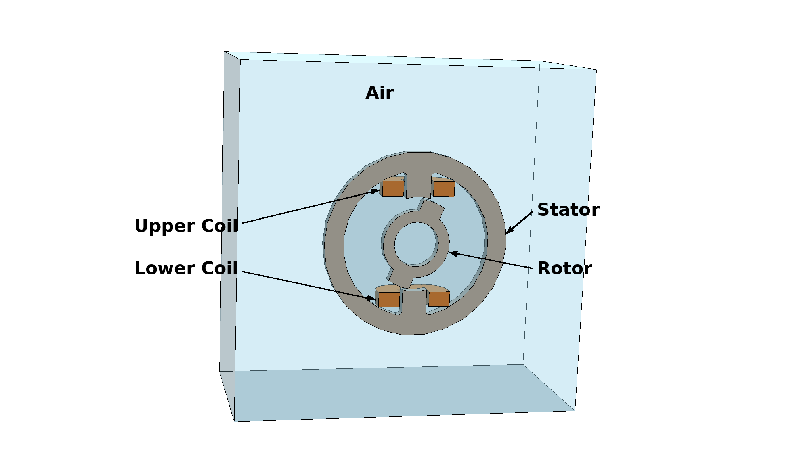
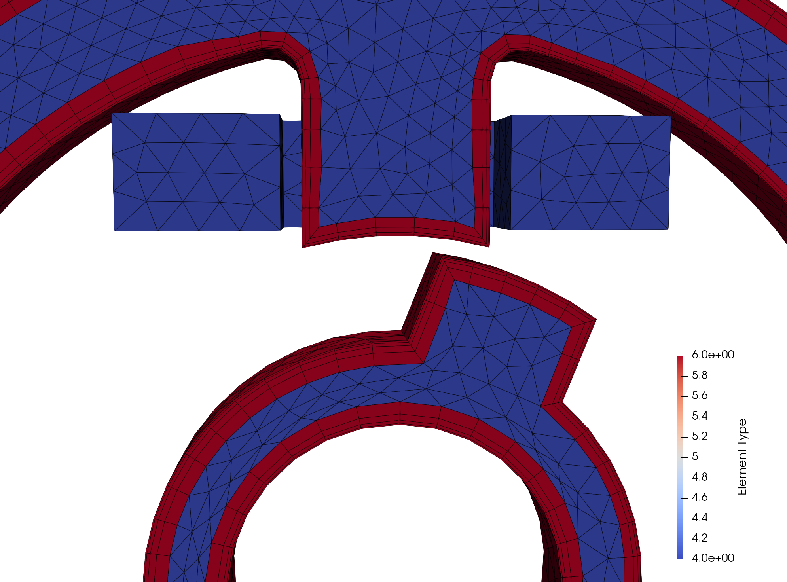
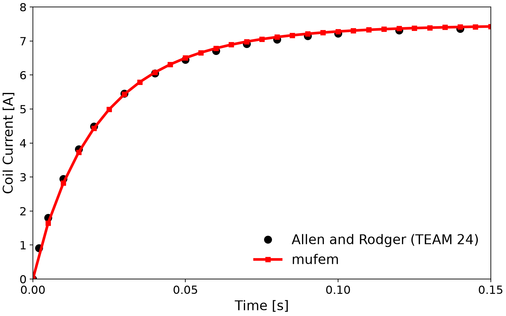
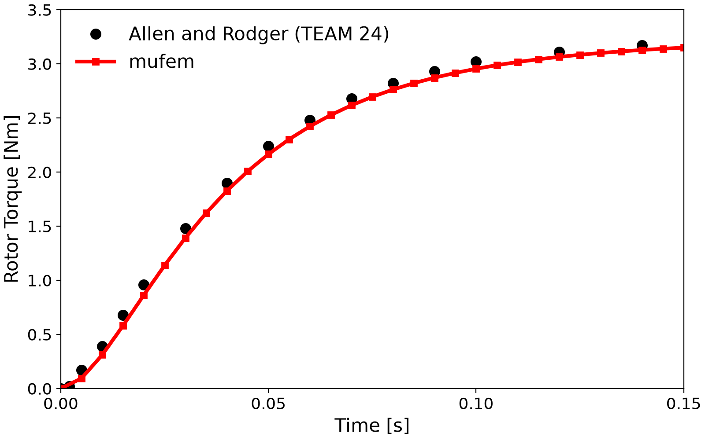
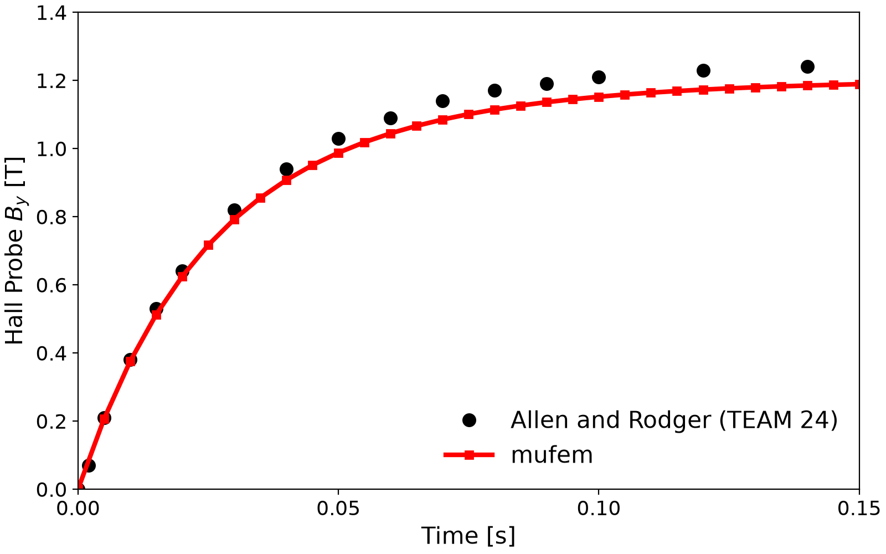
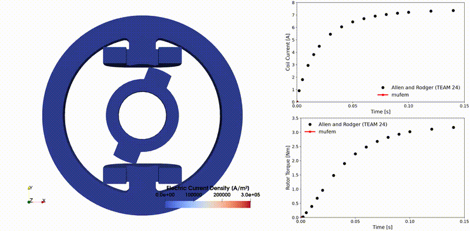

# Compumag Team 24: Nonlinear Time-Transient Rotational Test Rig

Problem 24 of the Compumag TEAM benchmark suite [1] is a transient magnetic problem combining bulk eddy
currents, magnetic nonlinearity, and voltage-driven coils. A solid steel rotor is locked at $`22°`$
to a solid steel stator carrying two coils; a voltage step drives the coils and the rotor torque rises
as the field builds up. The benchmark provides the measured coil current, rotor torque, rotor pole flux,
and the flux density at a Hall probe in the air gap [1, 2]. It is solved using [case.py](case.py):

<div align="center">
    
    <br/>
    <em>Figure 1: The modeled half (z ≤ 0) of the benchmark: a stator carrying two coils and a rotor locked at 22°.</em>
</div>
<br/>

## Setup

* The geometry follows Figs. 1 and 2 of [1], with the rotor turned clockwise by $`22°`$ as in Fig. 1.
  The midplane $`z = 0`$ of the $`25.4\,\mathrm{mm}`$ long rig is a symmetry plane, which [1] suggests
  exploiting: only the half $`z \le 0`$ is modeled (Fig. 1), with a tangential-flux condition on
  the midplane.
* The geometry is built with netgen in `build_geometry` and meshed in `generate_mesh`; both run only
  with `pymufem case.py --rebuild-mesh`. Fig. 1 is rendered from it with `netgen_geometry_image.py`.
* Rotor and stator are solid EN9 steel with $`\sigma = 4.54 \times 10^6\,\mathrm{S/m}`$ and the
  nonlinear $`B(H)`$ curve described below. The coils are stranded (350 turns each), without eddy
  currents.
* A voltage step of $`U = 23.1\,\mathrm{V}`$ drives the two coils in series, with a total resistance of
  $`3.09\,\Omega`$. As in the authors' model, the initial overshoot of about $`0.5\,\mathrm{V}`$ of the
  measured voltage (Table II of [1]) is disregarded. The applied voltage and resistance are scaled by
  $`0.25`$ per coil (two coils, half model):

```python
symmetry = 0.25

excitation = CoilExcitationVoltage(voltage=23.1 * symmetry, resistance=3.09 * symmetry)
```

* The time step is $`5\,\mathrm{ms}`$ up to $`t = 0.15\,\mathrm{s}`$.

### Updating the B-H Curve

Table I of [1] samples the measured $`B(H)`$ curve with no point between $`H = 0`$ and
$`H = 4000\,\mathrm{A/m}`$ ($`B = 1.413\,\mathrm{T}`$). As pointed out by Rüberg *et al.* [3], a straight
line over this interval noticeably changes the results. We fill the interval with the rational form
of Diez and Webb [4] (their Eq. (1) with degree 1)

```math
B(H) = \frac{H}{a + b H} + \mu_0 H \quad,
```

with $`a`$ and $`b`$ fitted to the first four points of Table I and the result scaled to pass through
the first measured point. The script [plot.py](data/tables/plot.py) writes the updated curve.

| [Original B-H Curve](data/tables/Table_1_BH_curve.csv) | [Updated B-H Curve](data/tables/Updated_BH_curve.csv) |
| ----------------- | ------------------------------- |
|  |  |

### Boundary Layer Mesh

The voltage step induces eddy currents in the solid steel. Their penetration depth grows as
$`\delta = \sqrt{\tau/(\mu \sigma)}`$ with the time scale of the current rise,
$`\tau \approx 20\,\mathrm{ms}`$ (the measured current reaches $`1 - e^{-1}`$ of its final value
after about $`22\,\mathrm{ms}`$). For $`\mu_r`$ between 300 and 800 this gives
$`\delta \approx 2`$ to $`3.5\,\mathrm{mm}`$. Prism boundary layers of $`0.25`$, $`0.5`$, $`1`$, and
$`2\,\mathrm{mm}`$ (total $`3.75\,\mathrm{mm}`$) on the rotor and stator surfaces resolve this region:

<div align="center">
    
    <br/>
    <em>Figure 2: Prism boundary layer elements (type 6) at the iron surfaces; the interior uses
    tetrahedra (type 4).</em>
</div>
<br/>

The image is rendered with `pvbatch paraview_element_type.py` after a run with
`output_for_animation = True`.

### Torque and Hall Probe

The [Magnetic Torque Report](https://raiden-numerics.github.io/mufem-doc/models/electromagnetics/time_domain_magnetic/reports/magnetic_torque_report.html)
gives the torque on the rotor half, doubled for the full rotor. The Hall probe measures $`B_y`$ in the
air gap, offset by $`(-6.5, -1.3, -7.7)\,\mathrm{mm}`$ from the stator pole corner and the pole end
(Fig. 4 of [1]), i.e. at $`(7.4, 50.62, -5.0)\,\mathrm{mm}`$ in the model.

## Results

Run the case with `pymufem case.py`. The coil current, rotor torque, and Hall probe flux density
against the measurements of [1]:

| Coil Current | Rotor Torque | Hall Probe |
| ------------ | ------------ | ---------- |
|  |  |  |

| Time | Current mufem / measured [A] | Torque mufem / measured [Nm] | Hall probe $`B_y`$ mufem / measured [T] |
| ---- | ---------------------------- | ---------------------------- | --------------------------------------- |
| 0.01 s | 2.83 / 2.95 | 0.31 / 0.39 | 0.375 / 0.38 |
| 0.02 s | 4.43 / 4.49 | 0.86 / 0.96 | 0.624 / 0.64 |
| 0.05 s | 6.50 / 6.45 | 2.17 / 2.24 | 0.988 / 1.03 |
| 0.10 s | 7.28 / 7.22 | 2.95 / 3.02 | 1.152 / 1.21 |
| 0.15 s | 7.43 / 7.37 | 3.15 / 3.18 | 1.189 / 1.245 |

The case checks the three quantities at $`t = 0.15\,\mathrm{s}`$ against the measurements (5 %
tolerance; the measured values are interpolated between 0.14 s and 0.16 s).

The rotor pole flux of [1] (Table V, a search coil around a rotor pole $`8.7\,\mathrm{mm}`$ below the
pole tip) is not checked. Integrated over the pole cross-section, mufem gives
$`4.1 \times 10^{-4}\,\mathrm{Wb}`$ at $`0.15\,\mathrm{s}`$ against the measured
$`4.7 \times 10^{-4}\,\mathrm{Wb}`$, about 13 % lower throughout the transient. This is a
discretization error of the default mesh: with the iron surface mesh refined from $`5`$ to
$`2.5\,\mathrm{mm}`$ the pole flux rises to $`4.4 \times 10^{-4}\,\mathrm{Wb}`$, and with second-order
elements to $`4.5 \times 10^{-4}\,\mathrm{Wb}`$, while current and torque change by less than 2 %. The
Hall probe, $`0.1\,\mathrm{mm}`$ above the saturated rotor pole corner, is the most mesh-sensitive
quantity: it rises to $`1.33\,\mathrm{T}`$ and $`1.41\,\mathrm{T}`$ with these refinements. The default
mesh is kept for its runtime.

To generate the animation, set `output_for_animation = True` in `case.py`, run the case, and then run
`paraview_gif.py` (requires ParaView and `ffmpeg`):

<div align="center">
    
    <br/>
    <em>Figure 3: Animation of the electric current density over time.</em>
</div>
<br/>

## References

[1] Allen N. and Rodger D. *Description of TEAM Workshop Problem 24: Nonlinear Time-Transient
    Rotational Test Rig*.
    https://www.compumag.org/wp/wp-content/uploads/2018/06/problem24.pdf

[2] Rodger D., Allen N., Lai H.C. and Leonard P.J., 1994. Calculation of transient
    3D eddy currents in nonlinear media - verification using a rotational test rig.
    *IEEE Transactions on Magnetics*, 30(5), pp. 2988-2991.

[3] Rüberg, T., Kielhorn, L. and Zechner, J., 2021. Electromagnetic devices with moving parts — simulation with FEM/BEM coupling. *Mathematics*, 9(15), p.1804.

[4] Diez, P. and Webb, J.P., 2015. A rational approach to $`B`$–$`H`$ curve representation. *IEEE Transactions on Magnetics*, 52(3), pp.1-4.
