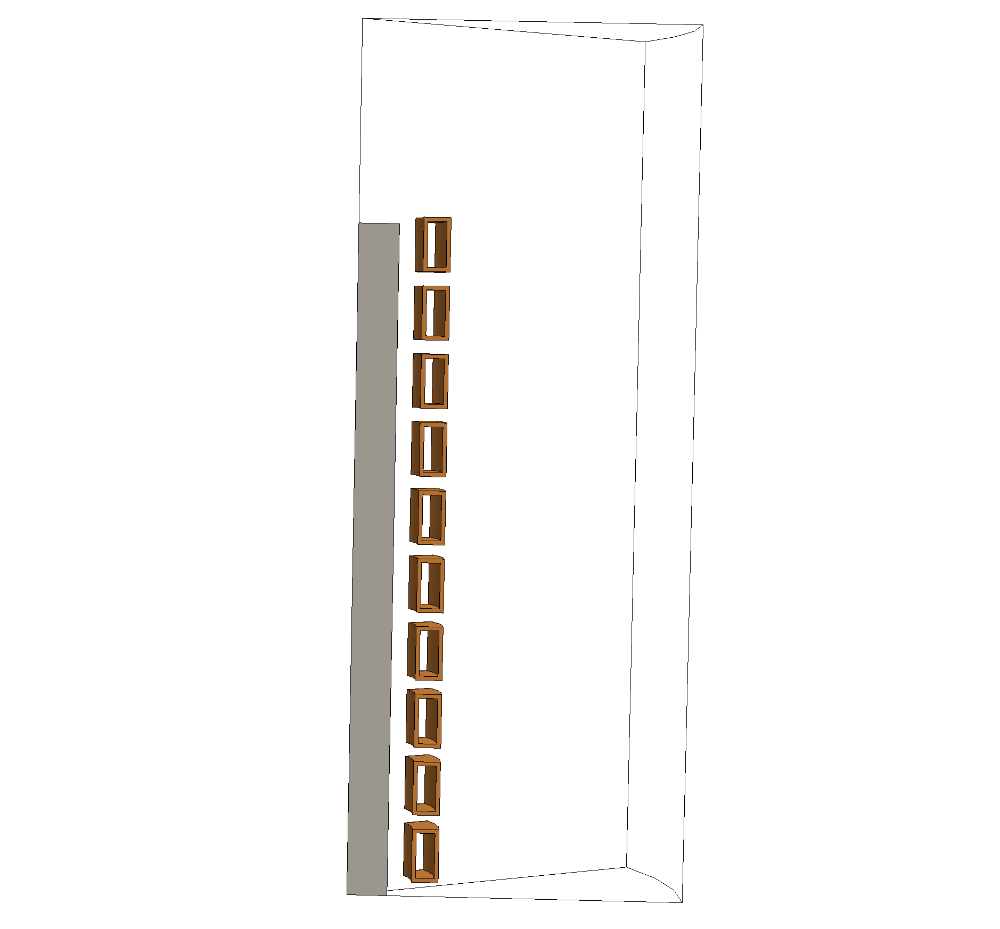
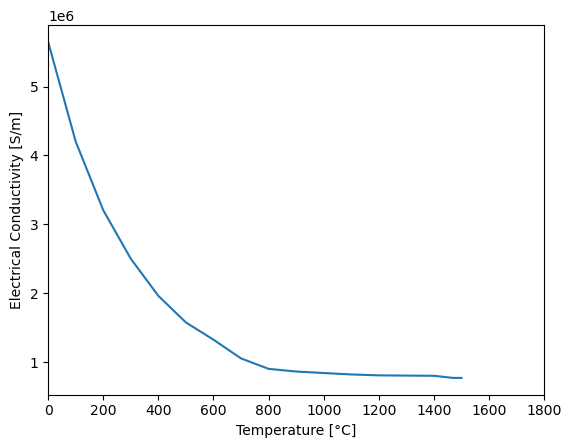
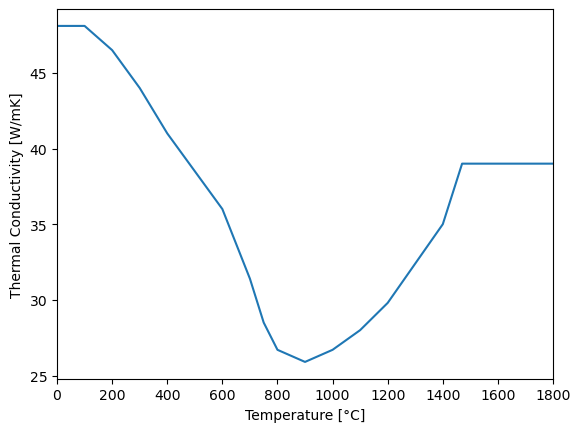
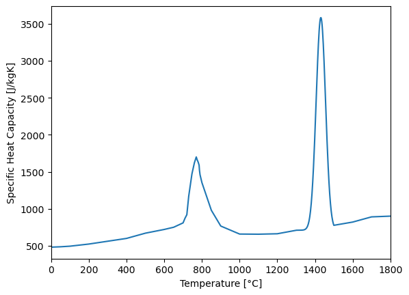
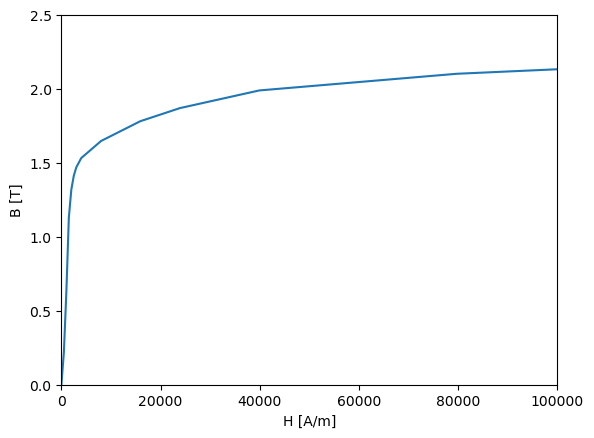
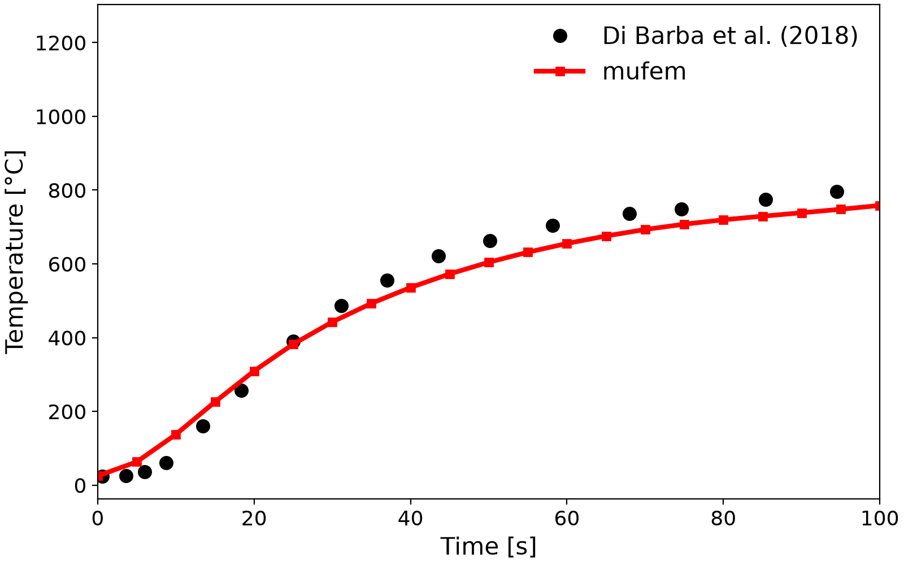
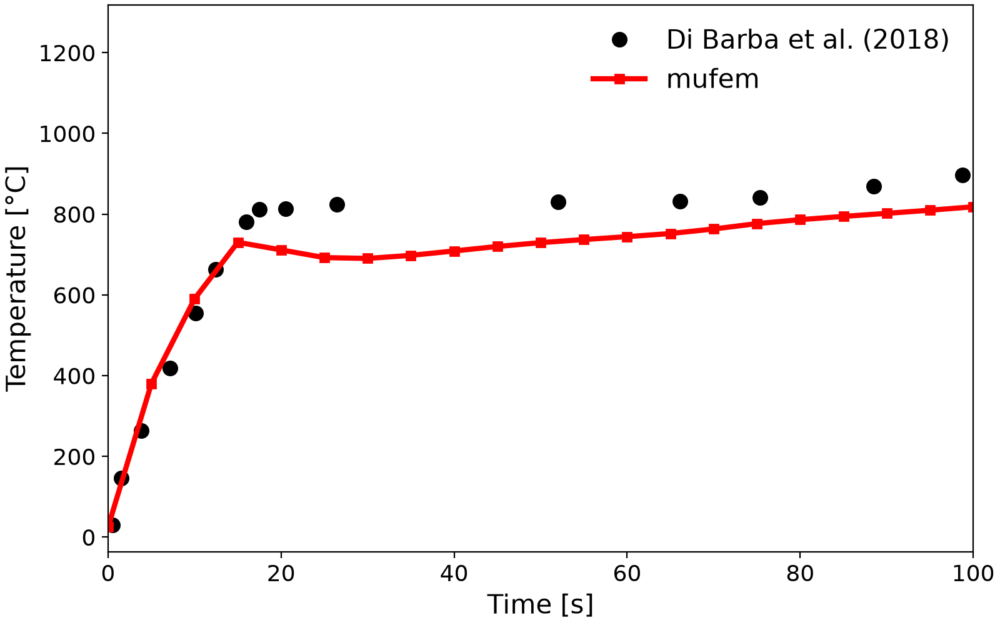
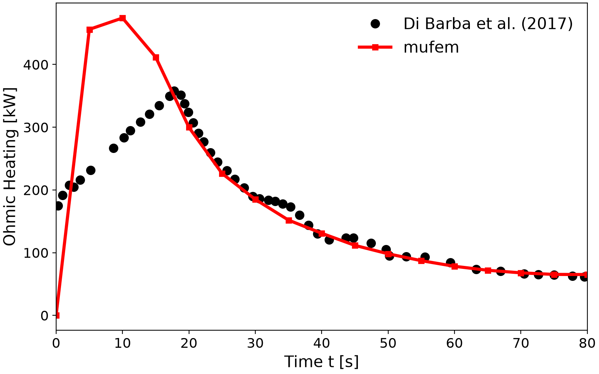

# Compumag TEAM 36: Multi-Physics Field Analysis of an Induction Heating Device

Problem 36 of the Compumag TEAM benchmark suite [3] is a **multi-physics** benchmark: a stranded coil
drives an alternating magnetic field that induces eddy currents and Joule heating in a steel
workpiece. The coupling is strong: the electrical conductivity, the magnetic permeability, the
thermal conductivity, and the heat capacity of the steel all depend on temperature, so the skin depth
changes substantially over the heating cycle [1, 2].

<em>Geometry of the benchmark: a stranded coil surrounding a cylindrical steel workpiece (billet).</em>

 

This case couples a **Time-Harmonic Magnetic** model with a **Thermal** model and is a good
illustration of μfem's multi-physics coupling on temperature-dependent materials.

## Introduction

Early in the heating cycle the skin depth is controlled by the temperature dependence of the
electrical conductivity. As the steel approaches the Curie point, the relative permeability collapses
and becomes the dominant factor.

| | |
| :---: | :---: |
|  |  |
|  |  |

(Note: the electrical-conductivity data point at $`700\,^{\circ}\mathrm{C}`$ has been changed from
$`9.50 \times 10^{-6}`$ to $`9.50 \times 10^{-7}`$, which we believe is a print error in [3].)

## Setup

* Coupled **Time-Harmonic Magnetic** ($`f = 2\,\mathrm{kHz}`$) and **Thermal** models.
* Temperature-dependent steel properties (conductivity, permeability/susceptibility, thermal
  conductivity, heat capacity) on the billet.
* A stranded excitation coil (10 turns in the periodic sector) driven at $`3500\,\mathrm{A}`$ RMS.
* Convection ($`h = 7\,\mathrm{W/m^2/K}`$) and radiation ($`\varepsilon = 0.8`$) on the billet surface,
  with $`70\,^{\circ}\mathrm{C}`$ ambient on the lateral surface and $`25\,^{\circ}\mathrm{C}`$ on the end
  surface.
* The mesh is nonconforming to allow adaptive refinement/de-refinement of the heating front.

## Validation

We compare the temperature evolution at the surface and at the centre of the workpiece, and the total
ohmic heating power, against the reference data in [1, 2].

**Temperature**

| Centre | Outer Surface |
| :---: | :---: |
|  |  |

**Ohmic Heating**

The two-way coupling is active: as the steel approaches the Curie point its permeability collapses,
which reshapes the ohmic heating (the characteristic peak near $`t \approx 10\,\mathrm{s}`$ followed by
decay) and in turn the temperature. The μfem results track the reference data, with the largest
discrepancy in the early transient (the ohmic-heating peak and the surface-temperature plateau).

## References

[1] P. Di Barba, M. E. Mognaschi, D. A. Lowther, F. Dughiero, M. Forzan, S. Lupi, and E. Sieni
    (2017). *A benchmark problem of induction heating analysis*. International Journal of Applied
    Electromagnetics and Mechanics, 53(S1), pp. S139–S149.

[2] P. Di Barba, M. E. Mognaschi, M. Bullo, F. Dughiero, M. Forzan, S. Lupi, and E. Sieni (2018).
    *Field models of induction heating for industrial applications*.

[3] Compumag, *TEAM Problem 36: Induction Heating*,
    https://www.compumag.org/wp/wp-content/uploads/2021/07/problem-36.pdf
