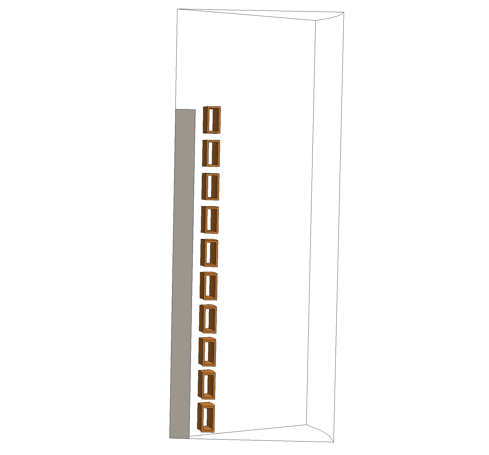
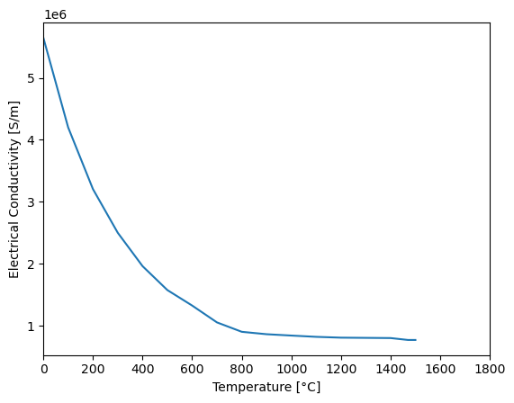
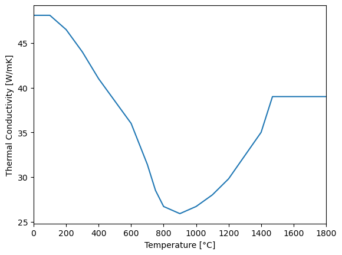
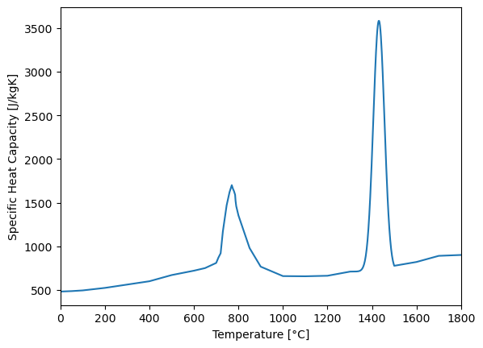
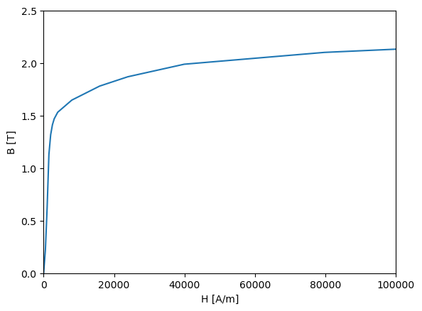
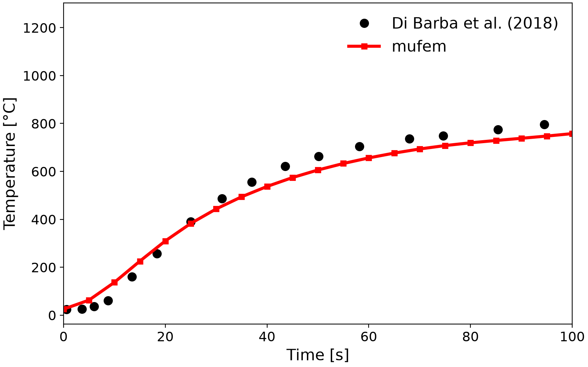
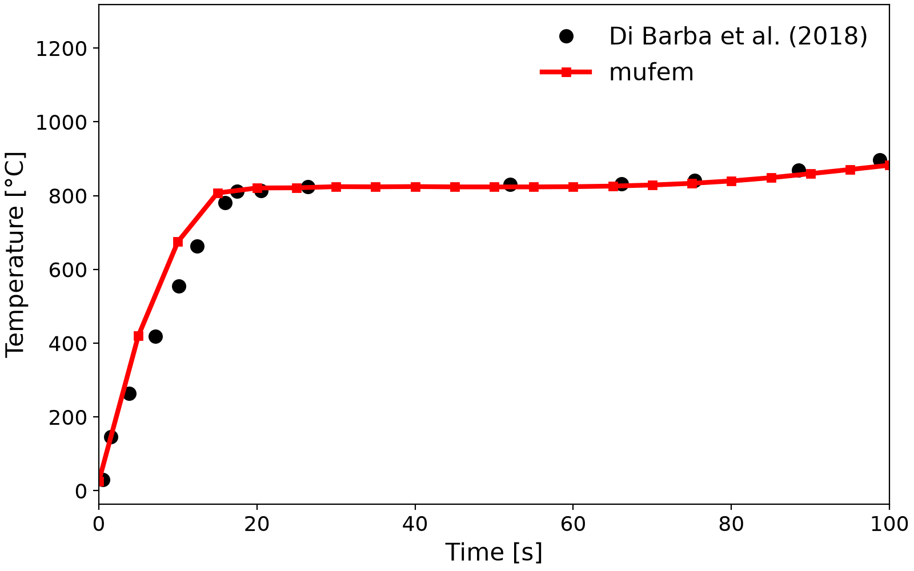
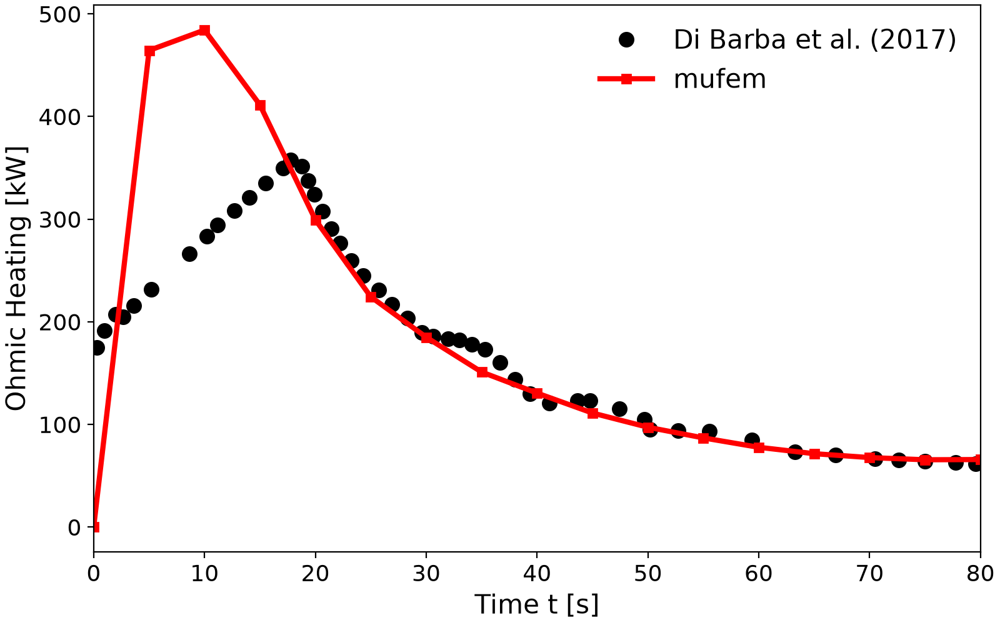

# Compumag TEAM 36: Multi-Physics Field Analysis of an Induction Heating Device

Problem 36 of the Compumag TEAM benchmark suite [3] is a **multi-physics** benchmark: an inductor coil
drives an alternating magnetic field that induces eddy currents and Joule heating in a steel
workpiece. The coupling is strong: the electrical conductivity, the magnetic permeability, the
thermal conductivity, and the heat capacity of the steel all depend on temperature, so the skin depth
changes substantially over the heating cycle [1, 2].

<em>Geometry of the benchmark: an inductor coil surrounding a cylindrical steel workpiece (billet).</em>

 

This case couples a **Time-Harmonic Magnetic** model with a **Thermal** model and is a good
illustration of mufem's multi-physics coupling on temperature-dependent materials.

## Introduction

Early in the heating cycle the skin depth is controlled by the temperature dependence of the
electrical conductivity. As the steel approaches the Curie point, the relative permeability collapses
and becomes the dominant factor.

| | |
| :---: | :---: |
|  |  |
|  |  |

(Note: the electrical-resistivity data point at $`700\,{}^{\circ}\mathrm{C}`$ has been changed from
$`9.50 \times 10^{-6}`$ to $`9.50 \times 10^{-7}`$, which we believe is a print error in Table 2 of [3].)

## Setup

* Geometry of Table 1 of [3]: a billet of radius $`3\,\mathrm{cm}`$ and length $`1\,\mathrm{m}`$ inside a
  $`1\,\mathrm{m}`$ long inductor of 20 turns ($`4 \times 2\,\mathrm{cm}`$ copper tubes, inner radius
  $`4.8\,\mathrm{cm}`$). The problem is axisymmetric; a $`30^{\circ}`$ sector of the upper half is modeled
  (results scaled by 24), with tangential flux on the sector planes and natural conditions on the
  symmetry plane $`z = 0`$.
* Coupled **Time-Harmonic Magnetic** ($`f = 2\,\mathrm{kHz}`$) and **Thermal** models.
* Temperature-dependent steel properties (resistivity, thermal conductivity, heat capacity) of Tables 2,
  4 and 5 of [3]; the relative permeability follows model A of [1, 3],
  $`\mu_r(T, H) = 1 + f(T)\, \mu_{20}(H)`$, with the room-temperature curve $`\mu_{20}(H)`$ of Table 3 of
  [3] and $`f(T)`$ of Eq. (2) of [3] ($`T_c = 770\,{}^{\circ}\mathrm{C}`$, $`C = 20\,{}^{\circ}\mathrm{C}`$).
* Each of the 10 turns of the modeled half is a separate one-turn coil carrying $`3500\,\mathrm{A}`$ RMS.
* Convection ($`h = 7\,\mathrm{W/m^2/K}`$) and radiation ($`\varepsilon = 0.8`$) on the billet surface,
  with $`70\,{}^{\circ}\mathrm{C}`$ ambient on the lateral surface and $`25\,{}^{\circ}\mathrm{C}`$ on the end
  surface; the billet starts at $`25\,{}^{\circ}\mathrm{C}`$.
* Time steps of $`5\,\mathrm{s}`$ up to $`t = 100\,\mathrm{s}`$ (the benchmark runs to $`250\,\mathrm{s}`$), with
  8 coupling iterations per step.
* The mesh is nonconforming to allow adaptive refinement of the heating front; it is refined once, at
  $`t = 45\,\mathrm{s}`$.

The geometry is built with netgen in the `build_geometry` method of [case.py](case.py) and meshed in
`generate_mesh`; both run only when the mesh is regenerated with `pymufem case.py --rebuild-mesh`. The case
itself is run with `pymufem case.py`; it exports the temperature, the magnetic flux density and the
ohmic heating to `VisualizationOutput/`.

## Validation

We compare the temperature evolution on the axis ($`\rho = 0`$) and at the surface ($`\rho = 3\,\mathrm{cm}`$)
of the billet at $`z = 0`$ with Fig. 8a of [2], and the total ohmic heating power with the curve
"FEM C = 20 °C" of Fig. 6(a) of [1], the model and parameter chosen for the benchmark.

**Temperature**

| Center | Outer Surface |
| :---: | :---: |
|  |  |

**Ohmic Heating**

The two-way coupling is active: as the steel approaches the Curie point its permeability collapses,
which reshapes the ohmic heating (a peak followed by decay) and in turn the temperature. In mufem the
peak (about $`480\,\mathrm{kW}`$ near $`t = 10\,\mathrm{s}`$) comes earlier and is higher than in the reference
($`358\,\mathrm{kW}`$ at $`t = 18\,\mathrm{s}`$); from about $`20\,\mathrm{s}`$ on the heating power agrees well.
The temperatures follow the reference closely, with the surface plateau near the Curie point at about
$`825\,{}^{\circ}\mathrm{C}`$ in both:

| Time | Temperature on the axis mufem / reference [°C] | Temperature at the surface mufem / reference [°C] |
| ---- | ---------------------------------------------- | ------------------------------------------------- |
| 100 s | 799 / 811.5                                   | 882 / 899.2                                       |

The case checks both temperatures at $`t = 100\,\mathrm{s}`$ against the reference (15 % tolerance).

## References

[1] P. Di Barba, M. E. Mognaschi, D. A. Lowther, F. Dughiero, M. Forzan, S. Lupi, and E. Sieni
    (2017). *A benchmark problem of induction heating analysis*. International Journal of Applied
    Electromagnetics and Mechanics, 53(S1), pp. S139–S149.

[2] P. Di Barba, M. E. Mognaschi, M. Bullo, F. Dughiero, M. Forzan, S. Lupi, and E. Sieni (2018).
    *Field models of induction heating for industrial applications*.

[3] Compumag, *TEAM Problem 36: Induction Heating*,
    https://www.compumag.org/wp/wp-content/uploads/2021/07/problem-36.pdf
