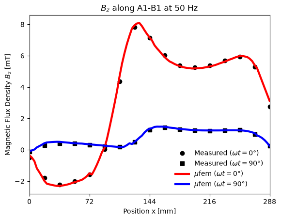
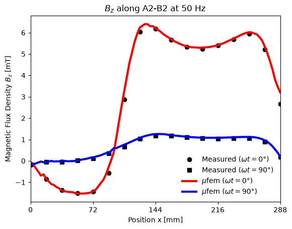
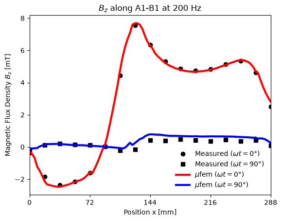
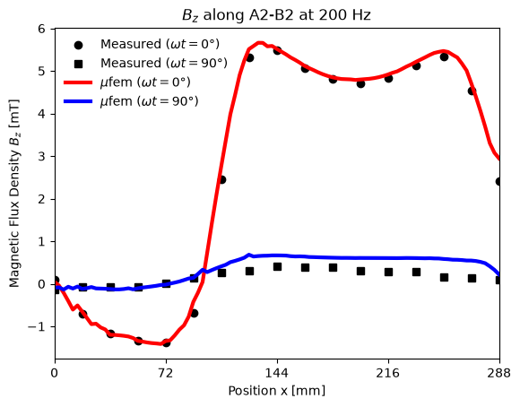
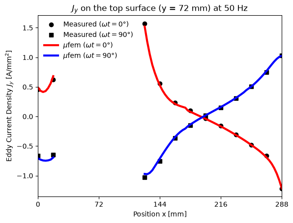
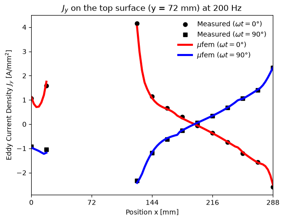
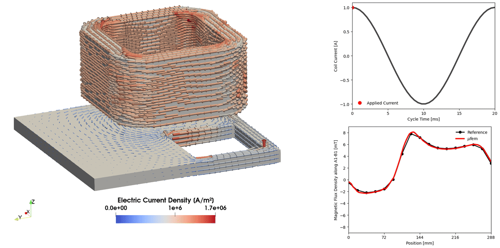

# Compumag TEAM Problem 7: Asymmetrical Conductor with a Hole

## Introduction

Problem 7 of the Compumag TEAM benchmark suite [1] is a thick aluminum plate with an
off-centered rectangular hole, placed below an excitation coil driven by a sinusoidal
current. It is a classical 3-D eddy-current validation case, with the flux density above the plate
and the eddy current density on its surfaces measured at $`50\,\mathrm{Hz}`$ and $`200\,\mathrm{Hz}`$
[2].

<div align="center">

</div>
<div align="center">
<em>Figure 1: Geometry of the benchmark. A coil is placed above an aluminum plate with an off-centered hole.</em>
</div>


## Problem Description

The $`294 \times 294 \times 19\,\mathrm{mm}`$ plate has a $`108 \times 108\,\mathrm{mm}`$ hole and an
electrical conductivity of $`\sigma = 3.526 \times 10^7\,\mathrm{S/m}`$. The coil, $`100\,\mathrm{mm}`$
high and $`30\,\mathrm{mm}`$ above the plate, is excited with 2742 ampere-turns (peak value of the
current times the number of turns), maximal at $`\omega t = 0`$ and flowing anticlockwise seen from
$`+z`$ [1, 2]. Measured are [2]:

* $`B_z`$ along the lines A1-B1 ($`y = 72\,\mathrm{mm}`$) and A2-B2 ($`y = 144\,\mathrm{mm}`$) at
  $`z = 34\,\mathrm{mm}`$, $`15\,\mathrm{mm}`$ above the plate (Table 4 of [2]),
* $`J_y`$ on the plate surfaces at $`y = 72\,\mathrm{mm}`$ (Table 5 of [2]),

each at $`\omega t = 0°`$ and $`90°`$, for both frequencies.


## Setup

The problem is linear and the coil current oscillates at a single frequency,
$`I(t) = I_0 \cos(\omega t)`$, so all fields oscillate at that frequency and the
[Time-Harmonic Magnetic Model](https://raiden-numerics.github.io/mufem-doc/models/electromagnetics/time_harmonic_magnetic/model.html)
is used with third-order elements on a second-order (curved) mesh:

```python
magnetic_model = TimeHarmonicMagneticModel(frequency=200, order=3)
```

The case solves $`200\,\mathrm{Hz}`$ first and then switches the model to $`50\,\mathrm{Hz}`$
(`set_frequency`), so the exported fields belong to $`50\,\mathrm{Hz}`$.

The geometry is built with netgen in `build_geometry` and meshed in `generate_mesh`; both run only
with `pymufem case.py --rebuild-mesh`. The [mesh](geometry.mesh) (Gmsh 2.2 format, for the curved
elements) contains the bodies **Air**, **Coil**, and **Plate**. Only the aluminum plate conducts:

```python
alu_material = TimeHarmonicMagneticGeneralMaterial(
    name="Alu",
    marker="Plate" @ Vol,
    magnetic_permeability=1.0,
    electric_conductivity=3.526e7,
    has_eddy_currents=True,
)
```

The coil uses the
[Excitation Coil Model](https://raiden-numerics.github.io/mufem-doc/models/electromagnetics/excitation_coil/model.html)
with a [stranded](https://raiden-numerics.github.io/mufem-doc/models/electromagnetics/excitation_coil/types/stranded_coil.html)
coil of 2742 turns, a [closed topology](https://raiden-numerics.github.io/mufem-doc/models/electromagnetics/excitation_coil/topologies/closed_coil.html)
and a [current excitation](https://raiden-numerics.github.io/mufem-doc/models/electromagnetics/excitation_coil/excitations/current.html)
of $`1\,\mathrm{A}`$:

```python
coil = CoilSpecification(
    name="Coil",
    marker="Coil" @ Vol,
    topology=CoilTopologyClosed(x=0.2, y=0.01, z=0.07, dx=1.0, dy=0.0, dz=0.0),
    type=CoilTypeStranded(number_of_turns=2742),
    excitation=CoilExcitationCurrent(current=(1.0, 0)),
)
```

With this direction the current flows clockwise seen from $`+z`$, opposite to [1]; the case flips
the sign of the computed fields to compensate.


## Results

Run the case with `pymufem case.py`. With the solution $`\vec{B} = \vec{B}_r + j\vec{B}_i`$, the flux
density at time $`t`$ is

```math
\vec{B}(t) = \vec{B}_r \cos(\omega t) - \vec{B}_i \sin(\omega t),
```

so the measurements at $`\omega t = 0°`$ and $`90°`$ compare with $`\vec{B}_r`$ and $`-\vec{B}_i`$.

### Magnetic Flux Density

| | A1-B1 | A2-B2 |
| - | - | - |
| 50 Hz |  |  |
| 200 Hz |  |  |

The case checks the relative $`L_2`$ error of $`B_z`$ over the 17 measured points and both phases of
each line:

| Line | Error at 50 Hz (tolerance) | Error at 200 Hz (tolerance) |
| ---- | -------------------------- | --------------------------- |
| A1-B1 | 3.3 % (6 %) | 5.9 % (10 %) |
| A2-B2 | 4.5 % (6 %) | 8.0 % (10 %) |

At $`200\,\mathrm{Hz}`$ most of the error comes from the small $`\omega t = 90°`$ component, which mufem
overestimates by about $`0.25\,\mathrm{mT}`$ above the coil.

### Eddy Current Density

| 50 Hz | 200 Hz |
| ----- | ------ |
|  |  |

The eddy current density data of [2] cannot be used as printed. Following the NGSolve TEAM-7
reference [3], $`J_y`$ just below the top surface of the plate ($`z = 19\,\mathrm{mm}`$) matches
Table 5(b) of [2], which is labeled as line A4-B4 at the bottom surface ($`z = 0`$), after a phase
shift of $`90°`$ relative to the convention of $`B_z`$ (the plots show $`j J_y`$). With this, mufem
agrees within 4.6 % ($`50\,\mathrm{Hz}`$) and 4.4 % ($`200\,\mathrm{Hz}`$), relative $`L_2`$ over the 12
measured points. Table 5(a), labeled A3-B3, matches the bottom surface the same way, but its values
are shifted by one measurement position from $`x = 18\,\mathrm{mm}`$ on. The eddy current density is
therefore shown, but not checked.


## Visualization

The periodic evolution of the magnetic flux density and the induced currents can be visualized
over one excitation cycle.

<div align="center">

</div>
<div align="center">
<em>Eddy current density in the plate (50 Hz) over one period, with the coil current and
B<sub>z</sub> along A1-B1.</em>
</div>

The animation is generated with [`create_anim.sh`](create_anim.sh), which runs
[`create_scene.py`](create_scene.py) in ParaView (`PARAVIEW_PATH` set to the ParaView installation)
on the fields exported by the case.


## References

[1] Compumag, "Problem 7 - Asymmetrical Conductor with a Hole",
    https://www.compumag.org/wp/wp-content/uploads/2018/06/problem7.pdf

[2] K. Fujiwara and T. Nakata, "Results for benchmark problem 7 (asymmetrical conductor
    with a hole)," *COMPEL - The International Journal for Computation and Mathematics
    in Electrical and Electronic Engineering*, vol. 9, no. 3, pp. 137-154, 1990.

[3] NGSolve TEAM-7 reference,
    https://ngsolve.github.io/TEAM-problems/TEAM-7/team7.html
