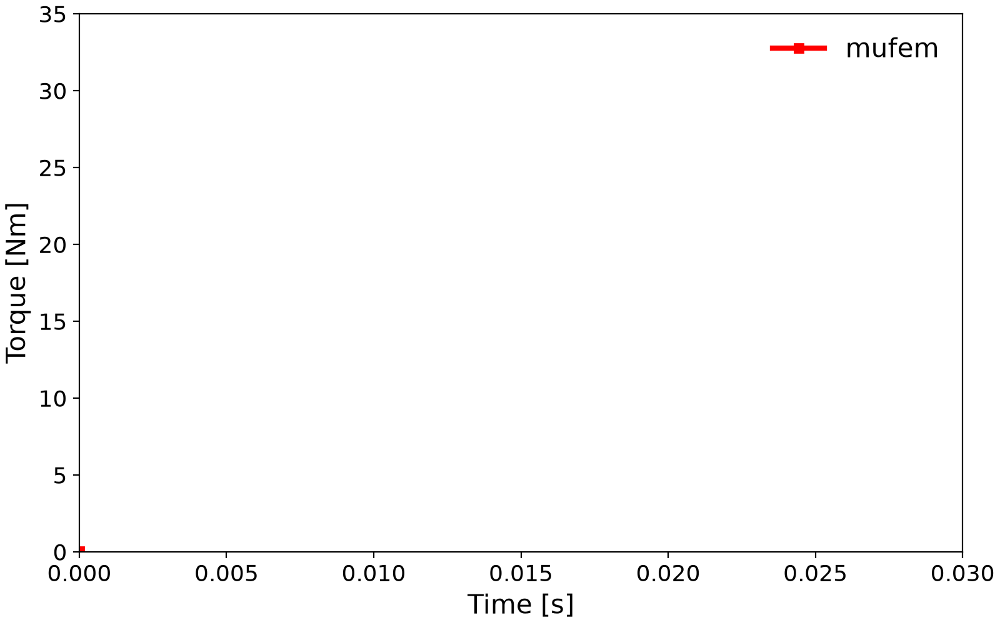
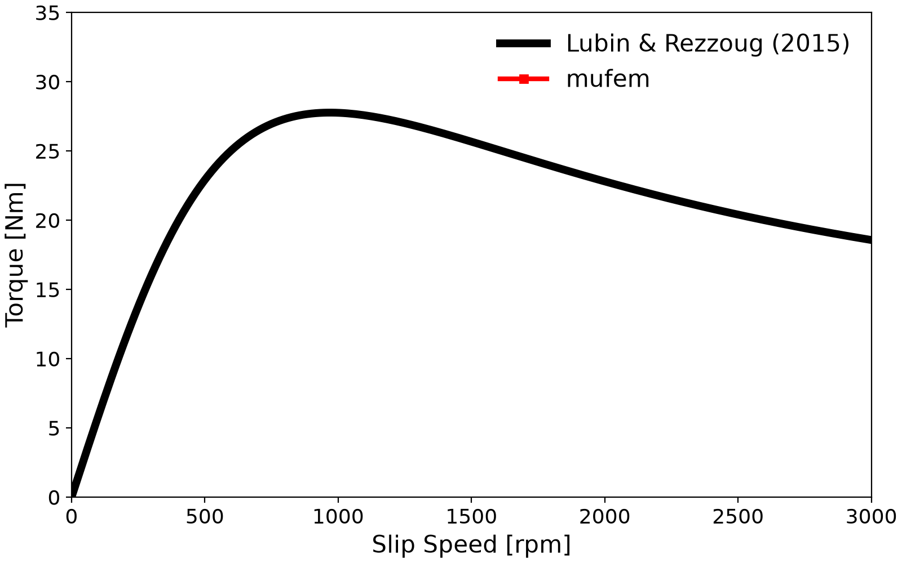

# Lubin 2015: Axial-Flux Eddy-Current Brake

A rotating copper disc placed in front of a stationary permanent-magnet rotor. The eddy currents induced in the disc interact with the magnetic field and produce a torque that opposes the rotation. The case follows Lubin and Rezzoug [1] and is the standard validation scenario for axial-flux eddy-current couplers / brakes. Here, we compare against the analytical solution of [1] using a fully transient finite-element simulation performed with **mufem**.

<figure style="text-align: center;">

<figcaption style="width: 75%; margin: 0 auto; text-align: left;">
<em>Figure 1</em>: Eddy-current brake consisting of a conductive copper plate and a magnetic plate with permanent magnets.
</figcaption>
</figure>
<br /><br />

## Introduction

The *magnet plate* carries $`p`$ pole pairs (here $`p = 5`$) of axially magnetised permanent magnets. The opposing *copper plate* is the conductor in which eddy currents are induced when relative rotation is imposed. The two plates are separated by an air gap, here $`d_g = 3\,\mathrm{mm}`$ (other values $`d_g = 5\,\mathrm{mm}`$ and $`d_g = 7\,\mathrm{mm}`$ are considered in [1]).

The copper plate has thickness $`d = 5\,\mathrm{mm}`$. The back-iron plates on both sides have $`\mu_r = 1000`$ (a linear approximation justified by the design intent of avoiding saturation). In [2] a finite conductivity $`\sigma = 5\,\mathrm{MS/m}`$ is assigned to the back iron, with little effect on the torque.

Reference [1] derives a closed-form 3-D analytical model for the braking torque and axial force as functions of the rotation rate, which is used here as the validation reference. Reference [2] improves the formula with curvature corrections for the eddy currents in the disc; reference [3] compares the eddy-current and synchronous coupler in transient startup.

## Setup

The rotational motion can be applied either to the copper plate or to the magnetic plate using the `RigidBodyMotionModel`:

```python
rbm_model = RigidBodyMotionModel(
    mesh_motion_strategy=MeshMotionPartialRemeshing("Air" @ Vol)
)

motion = RotatingMotion(
        name="Rotation",
        marker=["Copper Plate", "Back Iron::Copper Side"] @ Vol,
        origin=[0.0, 0.0, 0.0],
        axis=[0.0, 0.0, 1.0],
        rotation_rate=0,
)

rbm_model.add_motion(motion)
sim.get_model_manager().add_model(rbm_model)
```

A naive rigid transformation of the mesh nodes belonging to the copper plate and its back iron would quickly lead to severe distortion of the surrounding air elements and eventually to invalid mesh cells (e.g. negative volumes). To avoid this, the motion handling must be specified explicitly.

Here, `MeshMotionPartialRemeshing` is used to remesh the surrounding air region at every time step, maintaining mesh quality while allowing large rotational displacements.

### Time-step sizing

Two competing time scales drive the time step.

* **Electrical (pole-passage) time scale**

```math
\frac{1}{T_e} = f_e = p \cdot \frac{n}{60} \quad,
```

where $`n`$ is the mechanical speed in rpm. We use $`N = 40`$–$`80`$ steps per electrical period: $`\Delta t_e = T_e / N`$. **Dominates at high slip speeds.**

* **Magnetic-diffusion time scale**

```math
\tau_d \sim \mu\, \sigma\, L^2 \quad,
```

with $`L`$ the copper plate thickness. The diffusion-resolved step is $`\Delta t_d = \tau_d / M`$ with $`M \approx 20`$. **Dominates at low slip speeds**, where $`T_e \to \infty`$.

For our setup ($`p = 5`$, $`d = 5\,\mathrm{mm}`$ copper), with $`N = 40`$ and $`M = 20`$:

| Slip Speed [rpm] | $`T_e`$ [ms] | $`\Delta t_e`$ [ms] | $`\tau_d`$ [ms] | $`\Delta t_d`$ [ms] |
| ---------------- | ------------ | ------------------- | --------------- | ------------------- |
|                0 |     $`\infty`$ |            $`\infty`$ |            1.79 |              0.0895 |
|              500 |         24.0 |               0.600 |            1.79 |              0.0895 |
|             1000 |         12.0 |               0.300 |            1.79 |              0.0895 |
|             2000 |          6.0 |               0.150 |            1.79 |              0.0895 |
|             3000 |          4.0 |               0.100 |            1.79 |              0.0895 |

We use $`\Delta t = 0.5\,\mathrm{ms}`$ throughout — slightly under-resolved at the highest rpm. After each rotation-rate change, we advance for 20 time steps before evaluating the quasi-steady torque.

## Results

### Torque vs Time

<figure style="text-align: center;">

<figcaption style="width: 75%; margin: 0 auto; text-align: left;">
<em>Figure 2</em>: 
    Braking torque as a function of time. After each change in rotation rate, an initial transient occurs; the quasi-steady torque is obtained only after this transient has decayed.
</figcaption>
</figure>
<br /><br />

### Torque vs Slip Speed

Below is the braking torque vs the slip speed. 

<figure style="text-align: center;">

<figcaption style="width: 75%; margin: 0 auto; text-align: left;">
    <em>Figure 3.</em> Braking torque as a function of slip speed. The torque rises with increasing slip due to stronger induced eddy currents, reaches a maximum, and then decreases as skin-depth effects and magnetic shielding limit field penetration and reduce electromagnetic coupling.
</figcaption>
</figure>
<br /><br />

The braking torque initially increases with slip speed because the induced electromotive force and the resulting eddy currents grow, strengthening the Lorentz force opposing the motion. As the slip speed increases further, the torque reaches a maximum and subsequently decreases. This reduction is caused by skin-depth effects and magnetic field shielding, which limit field penetration into the conductor and reduce the effective coupling between current and magnetic flux.

## Animation

An animation is shown below (requires an installation of the *focus-viewer*) created using [create_animation.py](create_animation.py).


<figure style="text-align: center;">

<figcaption style="width: 75%; margin: 0 auto; text-align: left;">
    <em>Figure 4.</em> Time evolution of the axial-flux eddy current brake simulation. The rotating conductive plate induces eddy currents that interact with the magnetic field of the permanent magnets, producing a braking torque and axial force while transient electromagnetic diffusion and skin effects develop over time.
</figcaption>
</figure>

## Notes

- Motion is currently only supported in serial execution.
- Second-order discretisation gives a notably better match to [1, 2] at the cost of runtime.
- Dynamic time-stepping does not appear to help here.

## References

[1] Lubin, T. and Rezzoug, A., 2015. *3-D analytical model for axial-flux eddy-current couplings and brakes under steady-state conditions*. IEEE Transactions on Magnetics, 51(10), pp. 1–12.

[2] Lubin, T. and Rezzoug, A., 2017. *Improved 3-D analytical model for axial-flux eddy-current couplings with curvature effects*. IEEE Transactions on Magnetics, 53(9), pp. 1–9.

[3] Lubin, T., Fontchastagner, J., Mezani, S. and Rezzoug, A., 2016. *Comparison of transient performances for synchronous and eddy-current torque couplers*. In 2016 XXII International Conference on Electrical Machines (ICEM), pp. 695–701. IEEE.
