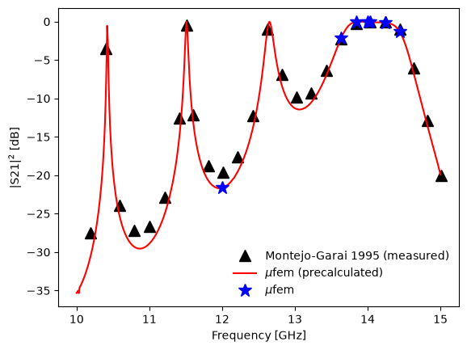

# Montejo-Garai 1995: Circular Cavity Filter

## Introduction

Waveguide filters are devices designed to pass signals only at certain
frequencies.
The main component of a waveguide filter is a cavity resonator connected to the
rest of the waveguide through small input and output irises.
An incident electromagnetic wave with a frequency matching the cavity's
resonant frequency will pass through the cavity, while other frequencies will be
reflected.
In electronics, waveguide filters are used to isolate signals and reduce noise
in devices like multiplexers, receivers, and transmitters, which serve as
essential components in satellite communication systems, radars, telephone
networks, and television broadcasting.

In this test case, we consider a microwave waveguide filter consisting of a
circular resonator connected to input and output rectangular waveguides via
thin rectangular irises.
Figure 1 shows the geometry of the filter.

<div align="center">
    
    <br/>
    <br/>
    Figure 1: Geometry of the waveguide circular cavity filter.
</div>
<br/>

The purpose of this test case is to calculate the transmission of a waveguide
filter over a given frequency range to determine the frequencies at which the
filter passes the incoming signal.
We then compare the obtained results to the measured transmission published in
Fig. 2 of [1].
We also visualize the electric field inside the filter obtained at one of the
resonant frequencies of the cavity and at one frequency outside the
resonance.


## Setup

### Dimensions

Following [1] and [2], we use the following
dimensions of the waveguide filter components.
The input and output waveguides are WR75 rectangular waveguides, with a width
of 19.05 mm and a height of 9.525 mm.
The length of the waveguide sections is 20 mm.
The circular cavity has a length of 100 mm and a radius of 12 mm.
Finally, the connecting input and output irises have a width of 9.7 mm, a
height of 3 mm, and a length of 1 mm.


### Mesh

To generate the mesh we use [Gmsh](https://gmsh.info/) mesh generator (please
note that [Gmsh](https://gmsh.info/) is not supplied with mufem; it is installed
with the shared helpers of this repository).
The geometry is built in the `build_geometry` method of [case.py](case.py) and
meshed in `generate_mesh`; both run only when the mesh is regenerated with
`pymufem case.py --rebuild-mesh`.
To improve the accuracy of modeling, we use the mesh with second-order finite
elements.
By using such a mesh, we can avoid artifacts that arise when trying to
approximate a curved surface with flat finite elements.
Figure 2 shows the resulting mesh.

<div align="center">
    
    <br/>
    <br/>
    Figure 2: The mesh created by Gmsh mesh generator.
</div>
<br/>

During the mesh generation, we assign named attributes to the waveguide input
("InputPort") and output ("OutputPort") ports, the walls of the waveguides and
cavity ("Walls"), and the entire computational domain ("Domain").


### Model

For the simulation we use
[Time-Harmonic Maxwell Model](https://raiden-numerics.github.io/mufem-doc/models/electromagnetics/time_harmonic_maxwell/model.html)
which solves the following equation for the complex amplitude
$`\tilde{\vec{E}}`$ of the electric field:

```math
    \nabla \times \left(\frac{1}{\mu} \nabla \times \tilde{\vec{E}}\right) -
    \varepsilon \omega^2 \tilde{\vec{E}} = 0,
```

where $`\mu`$ and $`\varepsilon`$ are the permeability and the permittivity of the
material filling the waveguides and the cavity, and $`\omega = 2\pi f`$ is the
angular frequency of the incoming radiation of frequency $`f`$.

As the boundary conditions we use the
[Perfect Electric Conductor Condition](https://raiden-numerics.github.io/mufem-doc/models/electromagnetics/time_harmonic_maxwell/conditions/perfect_electric_conductor.html)
for the walls of the waveguides and cavity, together with the
[Waveguide Input Port Condition](https://raiden-numerics.github.io/mufem-doc/models/electromagnetics/time_harmonic_maxwell/conditions/waveguide_input_port.html)
and the
[Waveguide Output Port Condition](https://raiden-numerics.github.io/mufem-doc/models/electromagnetics/time_harmonic_maxwell/conditions/waveguide_output_port.html)
for the input and output ports of the waveguides.

As the incident electric field we consider the field in the $`\text{TE}_{10}`$
mode, entering through the input port of the waveguide.

We also assume that the volume of the waveguides and the cavity is filled with
air, which we model using the time-harmonic Maxwell
[General Material](https://raiden-numerics.github.io/mufem-doc/models/electromagnetics/time_harmonic_maxwell/materials/general.html)
with the permeability and permittivity of free space.


### Reports

To calculate what fraction of the incident radiation passes through the filter,
we use the
[S-parameters Report](https://raiden-numerics.github.io/mufem-doc/models/electromagnetics/time_harmonic_maxwell/reports/s_parameters.html).
This report calculates scattering parameters, or S-parameters, which describe
the input-output relationships between various ports of a device.
In our case, we are interested in the $`S_{21}`$ parameter, which plays the role
of the filter transmission coefficient and is determined by the formula:

```math
    S_{21}
    = \frac{
          \int_{\Gamma_2}
          \tilde{\vec{E}} \cdot \tilde{\vec{e}}_1\, d\Gamma
      }{
          \int_{\Gamma_2}
          \tilde{\vec{e}}_1 \cdot \tilde{\vec{e}}_1\, d\Gamma
      },
```

where $`\tilde{\vec{E}}`$ is the amplitude of the electric field obtained as a
result of the simulation, $`\tilde{\vec{e}}_1`$ is the first mode of the
waveguide (the $`\text{TE}_{10}`$ mode in the case of rectangular waveguides), and
the integration is performed over the plane of the output port (arbitrarily
indexed by the number 2).
The $`S_{21}`$ parameter shows what portion of the radiation emitted from the
input port reaches the output port in the form of the
$`\text{TE}_{10}`$ mode.


## Running

To launch the simulation we use the [case.py](case.py) file using the following
terminal command:
```bash
pymufem case.py
```

Resolving the transmission spectrum of the filter requires a scan over 501
frequencies in the range of 10 to 15 GHz, which takes considerably longer than
the default run.
The spectrum is therefore supplied precalculated in
[data/S21_precalculated.csv](data/S21_precalculated.csv), and by default
[case.py](case.py) solves only the five measured passband frequencies that the
case checks and the two frequencies, 12 and 14 GHz, at which we visualize the
electric field:
```py
if self.precalculate:
    self.frequencies = numpy.linspace(10e9, 15e9, 501)  # [Hz]
else:
    self.frequencies = numpy.array(
        sorted(self.visualized_frequencies + self.checked_frequencies)
    )
```

Setting the class attribute `precalculate = True` scans the whole frequency range
instead and regenerates the precalculated spectrum, skipping the field export.

For either choice of the frequencies we then use the same loop:
```py
for i, frequency in enumerate(self.frequencies):
    self.model.set_frequency(frequency)
    self.runner.advance(1)

    if not self.precalculate and frequency in self.visualized_frequencies:
        vis.save(order=2)

    self.s21[i] = self.report_s_parameters.evaluate().to_numpy()[0, 0]
```

At each iteration, we extract the data corresponding to $`S_{21}`$ parameter and
store it in a separate array.
At the two visualized frequencies we also save the electric field in the
[VTK](https://vtk.org/) file format for subsequent visualization with
[ParaView](https://www.paraview.org/).
Please note that [ParaView](https://www.paraview.org/) is not supplied with
mufem and must be installed separately.
The scenes are rendered by [create_scene.py](create_scene.py); run it with
`pvpython create_scene.py` in the case directory after the case.


## Results

Figure 3 shows the squared magnitude of the precalculated $`S_{21}`$ parameter
as a function of frequency, with the frequencies solved by the default run
marked by stars.

<div align="center">
    
    <br/>
    Figure 3: Transmission spectrum (the squared magnitude of S21 parameter as a
              function of frequency) of the waveguide circular cavity filter.
</div>
<br/>

In Fig. 3 we can see that the transmission spectrum of the waveguide circular
filter has resonances at 10.42, 11.51, and 12.65 GHz, as well as a passband
from about 13.6 to 14.5 GHz.
Radiation at these frequencies passes through the filter with minimal loss,
while radiation at other frequencies is reflected back.

The resonances and the passband agree with the measurement of
[1]: at the five measured points between 13.64 and
14.44 GHz the computed $`|S_{21}|`$ lies within 0.35 dB of the measured one, and
the case checks these points. In the stopbands the computed transmission lies
up to 3 dB below the measurement, as does the finite element result of
[2] for the same filter (its Fig. 6).


## Scenes

To illustrate the electric field configuration inside the filter at frequencies
both within and outside the filter's bandwidth, during the simulation we export
the electric field at 12 GHz and 14 GHz to a [VTK](https://vtk.org/) file.
Figure 4 shows the distribution of the electric field inside the waveguide
filter at both frequencies.

<div align="center">
  
  
  <br/>
  <br/>
  Figure 4: Magnitude of the real part of the electric field (the field at
            $`\omega t = 0`$) inside the waveguide filter at frequency 12 GHz (left)
            and 14 GHz (right).
</div>
<br/>

We see that at 12 GHz, most of the electric field entering through the input
port is reflected back.
At the same time, the electric field at the frequency of 14 GHz passes through
the circular cavity without obstruction.
This observation is in complete agreement with Figure 3.


## References

[1] J. R. Montejo-Garai and J. Zapata (1995). *Full-wave design and realization of multicoupled dual-mode circular waveguide filters*. IEEE Transactions on Microwave Theory and Techniques, 43(6), 1290–1297. https://doi.org/10.1109/22.390185

[2] J. Liu, J.-M. Jin, E. K. N. Yung and R. S. Chen (2002). *A fast, higher order three-dimensional finite-element analysis of microwave waveguide devices*. Microwave and Optical Technology Letters, 32(5), 344–352. https://doi.org/10.1002/mop.10174
