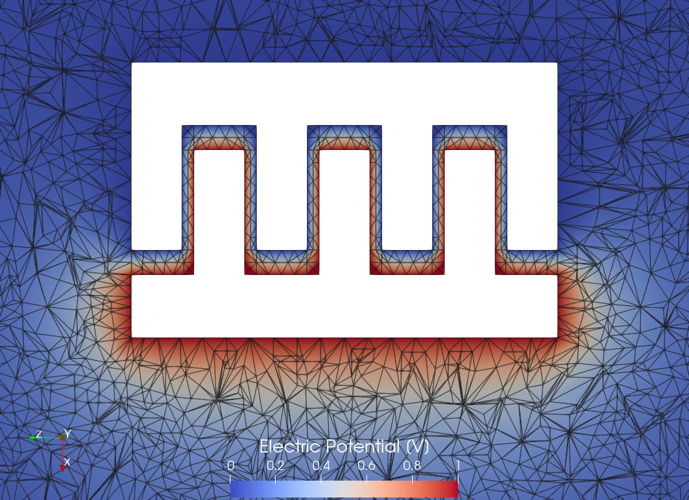
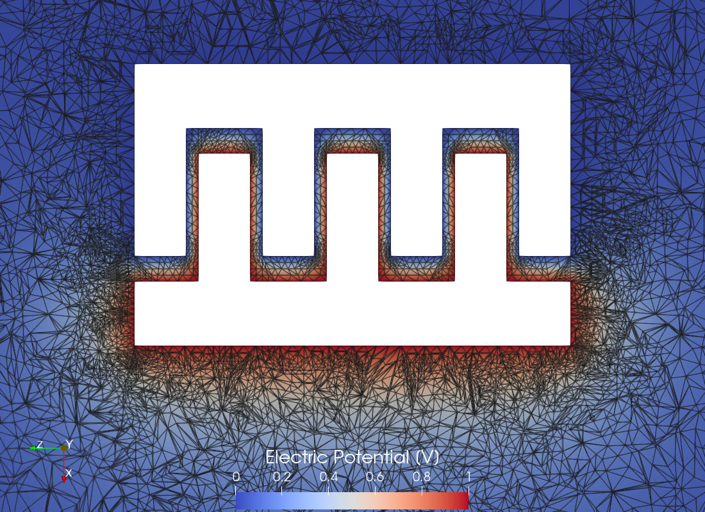
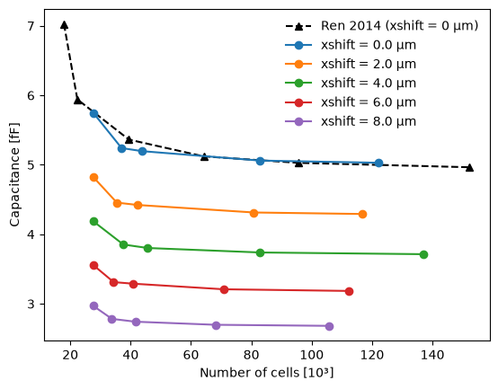
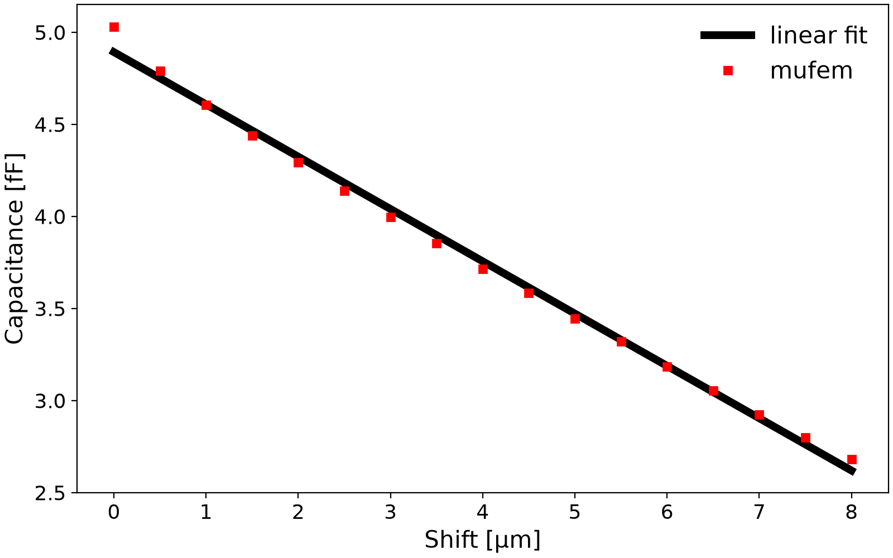
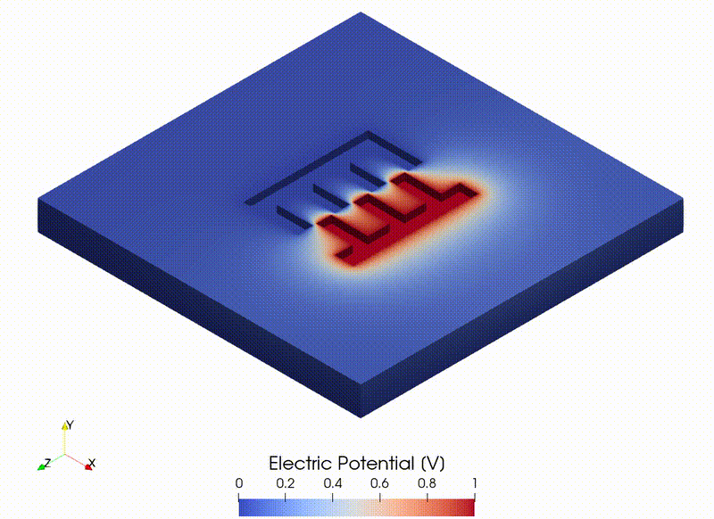

# Ren 2014: MEMS Comb Drive

## Introduction

Comb drives are capacitive actuators that utilize electrostatic forces generated between two electrically conductive combs. These actuators typically function at the micro- or nanometer scale and are among the most widely used electrostatic actuators and sensors in the micro-electromechanical systems (MEMS) industry. When a voltage is applied between the static and moving combs, attractive electrostatic forces are created, drawing them together. The force produced by the actuator is proportional to the change in capacitance between the two combs, which increases with the driving voltage.

In this test case, we monitor the capacitance of the comb drive described in [1, 2]. This comb drive consists of two comb conductors, one with four teeth and the other with three, positioned above a grounded plate. Figure 1 shows the geometry of the problem.

<div align="center">
    
    <br/>
    <br/>
    Figure 1: Electrostatic MEMS comb drive.
</div>
<br/>

By varying the distance between the combs, we can observe changes in capacitance, which enables us to estimate the force generated by the comb drive.


## Setup

### Dimensions

The dimensions follow Fig. 3 of [1]: both combs are 4 μm thick and have a 5 μm wide, 34 μm long backbone; the teeth are 15 μm long and 4 μm wide. In the unshifted position, neighboring teeth are 1 μm apart and the tooth tips are 2 μm from the opposite backbone. The ground plate is 6 μm below the combs.


### Mesh

To simulate the entire system, we enclose the comb drive within a rectangular box, with one boundary serving as the ground plate. To generate the mesh, we utilize [Gmsh](https://gmsh.info/) mesh generator. To enhance simulation speed without compromising precision, we implement the adaptive mesh refinement algorithm. Figure 2 illustrates the initial mesh configuration.

<div align="center">
    
    <br/>
    <br/>
    Figure 2: The initial mesh configuration.
</div>
<br/>

During the mesh generation process, we assign named attributes to the surfaces of each comb ("Comb1" and "Comb2"), to the boundary of the computational domain representing the ground plate ("Ground"), and to the entire computational domain itself ("Domain").

To investigate the change in capacitance as the distance between the combs increases, we prepare one mesh for each shift of the combs relative to each other. The zero shift is the geometry of [1]. The combs are then pulled apart along the teeth in increments of 0.5 μm, up to a final shift of 8 μm, at which point the teeth no longer overlap. The geometries are built in the `build_geometry` method of [case.py](case.py) and meshed in `generate_mesh`, which write the files `geometry_xshift=<shift>.step` and `geometry_xshift=<shift>.msh`; both methods run only when the meshes are built with `pymufem case.py --rebuild-mesh`.


### Model

For the simulation, we employ the [Electrostatics Model](https://raiden-numerics.github.io/mufem-doc/models/electromagnetics/electrostatics/model.html), 
which describes a static electric field $`\vec{E}`$ in terms of its scalar electric potential $`\phi`$
using the following equation:
```math
    \nabla \cdot \varepsilon \nabla\phi = -\rho,
```
where $`\varepsilon`$ is the electric permittivity, and $`\rho`$ denotes the density of free electric
charges, which is zero in our case. By solving this equation we calculate the total electric energy
$`W`$, the integral of the energy density $`\varepsilon\vec{E}^2/2`$ with $`\vec{E}=-\nabla\phi`$. Knowing
the energy $`W`$ and the voltage $`V`$ imposed between the two comb electrodes we can find the capacitance
$`C`$ of the comb drive as [3]
```math
    C = \frac{2 W}{V^2}.
```

As in [1], the potential is set to 1 V on the three-tooth electrode and to 0 V on the
four-tooth electrode and the ground plate, so $`C`$ is the total capacitance of the three-tooth comb
against the four-tooth comb and the ground. In order to implement these voltages
we use the [Electric Potential Condition](https://raiden-numerics.github.io/mufem-doc/models/electromagnetics/electrostatics/conditions/electric_potential.html).

We also assume that the computational domain is filled with air, which we model using the [Electrostatics Material](https://raiden-numerics.github.io/mufem-doc/models/electromagnetics/electrostatics/materials/electrostatics.html) with the electric permittivity of free space.


### Reports

To calculate the energy $`W`$ we use the Volume Integral Report, which integrates the Electric Energy Density over the computational domain:
```py
report = VolumeIntegralReport(
    name="Electric Energy Density Report",
    cff_name="Electric Energy Density",
)
```

## Running

Since every shift needs its own mesh for the adaptive mesh refinement, the meshes
(about 22 MB) are not shipped with the case and have to be built first. The following
command builds them:
```bash
pymufem case.py --rebuild-mesh
```
Once the meshes exist, the simulation is started with the [case.py](case.py) file
using the following terminal command:
```bash
pymufem case.py
```

Inside the `solve` method of [case.py](case.py) we have the following double loop:
```py
for xshift in self.xshifts:
    self.sim.get_domain().load_mesh(f"{self.mesh_path_for(xshift)}")
    self.sim.get_domain().get_mesh().scale(1e-6)

    for i in range(max_refinements):
        self.runner.advance(2)

        if i == 0:
            vis.save(order=2)

        ncells = self.sim.get_domain().get_mesh().get_total_number_cells()
        capacitance = 2 * self.report.evaluate() / self.voltage**2  # C = 2 W / V^2
        self.capacitances.append((xshift, ncells, capacitance))

        if ncells >= max_ncells:
            break

        self.refinement_model.refine_mesh()
    else:
        raise RuntimeError(f"No {max_ncells:.0e} cells after {max_refinements} refinements.")

    vis.save(order=2)
```
The external `for` loop iterates through all inter-comb shifts. At the start of each iteration, we load
the mesh of the corresponding shift. Meanwhile, the internal `for` loop refines the mesh according to the
established mesh refinement algorithm. This loop continues until the number of mesh elements surpasses the
empirically determined limit of `max_ncells`, which is set at 100,000. For each mesh file, we save the electric potential 
  obtained from both the initial and final meshes in the [VTK](https://vtk.org/) file format, allowing for 
  subsequent visualization using [ParaView](https://www.paraview.org/).


## Results

### The effect of adaptive mesh refinement

In this test case, we utilize adaptive mesh refinement (AMR) to improve the simulation's efficiency. AMR 
employs a specific algorithm that calculates local error based on the current solution and subdivides only 
the elements with the highest error. Consequently, AMR allows for local refinement of the mesh in areas 
where it is essential to enhance the solution, while leaving the mesh in other regions of the computational 
domain unaffected. The parameters of the mesh refinement algorithm can be adjusted using the model-specific 
Mesh Refiner:
```py
mesh_refiner = model.get_mesh_refiner()
mesh_refiner.set_refinement_fraction(0.3)
```
For instance, in the code above, we set the mesh refinement fraction to 0.3, indicating that the top 30% of 
elements with the highest error will be refined.

As an example, Figure 3 illustrates the calculated electric field potential along with the mesh edges for 
both the initial mesh and the mesh after several cycles of adaptive mesh refinement. Notably, the mesh 
becomes denser near the edges of the combs, where the electric potential changes most significantly.

<div align="center">
  
  
  <br/>
  <br/>
  Figure 3: A slice of the computational domain displaying the calculated electric field potential along 
  with the mesh edges for two different meshes: (left) the initial mesh and (right) the mesh after several 
  cycles of adaptive mesh refinement. The images are obtained using <a href="paraview_mesh.py">paraview_mesh.py</a> file.
</div>
<br/>


With each refinement cycle, the number of cells increases. Figure 4 illustrates how the calculated
capacitance changes as the number of cells grows. The capacitance on the initial mesh is overestimated;
with each refinement cycle it decreases and then stabilizes.

For the zero shift, it is compared with Fig. 4 of [1], which gives the capacitance versus the
number of elements for two complementary formulations on meshes refined around the conductors (not
adaptively): the primal FEM (scalar potential) converges from above and the dual FEM (vector potential)
from below, so the exact value lies between them. On the finest mesh of [1], 152k elements, the bounds are
4.55 fF and 4.96 fF. mufem converges to 4.73 fF, and the case checks that it lies between these bounds.

<div align="center">
    
    <br/>
    <br/>
    Figure 4: The relationship between capacitance and the number of cells for various inter-comb shifts. 
    The plot is created in the <code>postprocess</code> method of <a href="case.py">case.py</a>.
</div>
<br/>

The final value of the capacitance is taken as the value calculated at the largest number of degrees of 
freedom.


### The developed force

The force $`F`$ generated by the comb drive can be estimated using the following
expression [3]:
```math
F = \frac{1}{2} \frac{\partial C}{\partial x} V^2,
```
where $`\partial C/\partial x`$ represents the change in capacitance with respect to distance between
the combs, and $`V`$ is the applied voltage.

To calculate the derivative $`\partial C/\partial x`$ in Figure 5, we plot the capacitance against 
the shift distance. As observed, the capacitance decreases almost linearly as the distance between the 
combs increases (within 3 % of the linear fit). From the fit, $`\partial C/\partial x = -2.78\times10^{-10}`$
F/m. Using this value in the formula provided earlier, we can estimate that the comb drive generates a
force $`F`$ with an amplitude of 0.139 nN.

<div align="center">
    
    <br/>
    <br/>
    Figure 5: Dependence of the comb drive capacitance on the distance between the combs, along with its 
    linear fit. The plot is created in the <code>postprocess</code> method of <a href="case.py">case.py</a>.
</div>
<br/>


## Scenes

Figure 6 illustrates how the distribution of electric potential changes as the shift between the combs 
increases. This movement mimics the action of a real comb drive, where the combs tend to move apart when 
voltage is applied.

<div align="center">
    
    <br/>
    <br/>
    Figure 6: The distribution of electric potential for various shifts between the combs. The GIF 
    animation is obtained using <a href="paraview_gif.py">paraview_gif.py</a> file.
</div>
<br/>


## References

[1] Z. Ren and X. Xu (2014). *Dual Discrete Geometric Methods in Terms of Scalar Potential on Unstructured Mesh in Electrostatics*. IEEE Transactions on Magnetics, 50(2), 7000704. https://doi.org/10.1109/TMAG.2013.2280452

[2] D. A. Di Pietro and R. Specogna (2016). *An a posteriori-driven adaptive Mixed High-Order method with application to electrostatics*. Journal of Computational Physics, 326, 35. https://doi.org/10.1016/j.jcp.2016.08.041

[3] Wikipedia. *Comb drive*. https://en.wikipedia.org/wiki/Comb_drive
