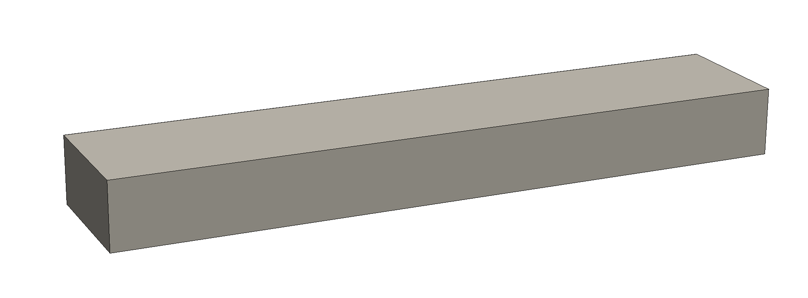
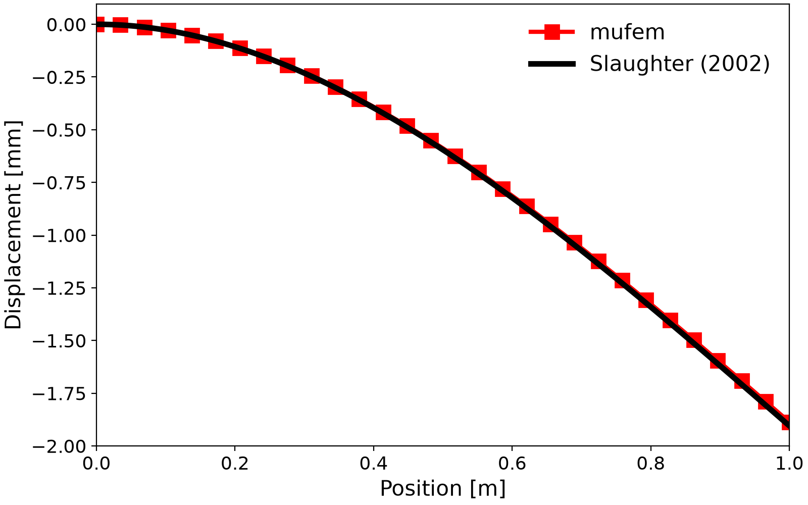
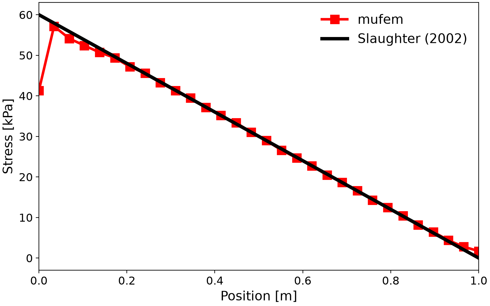
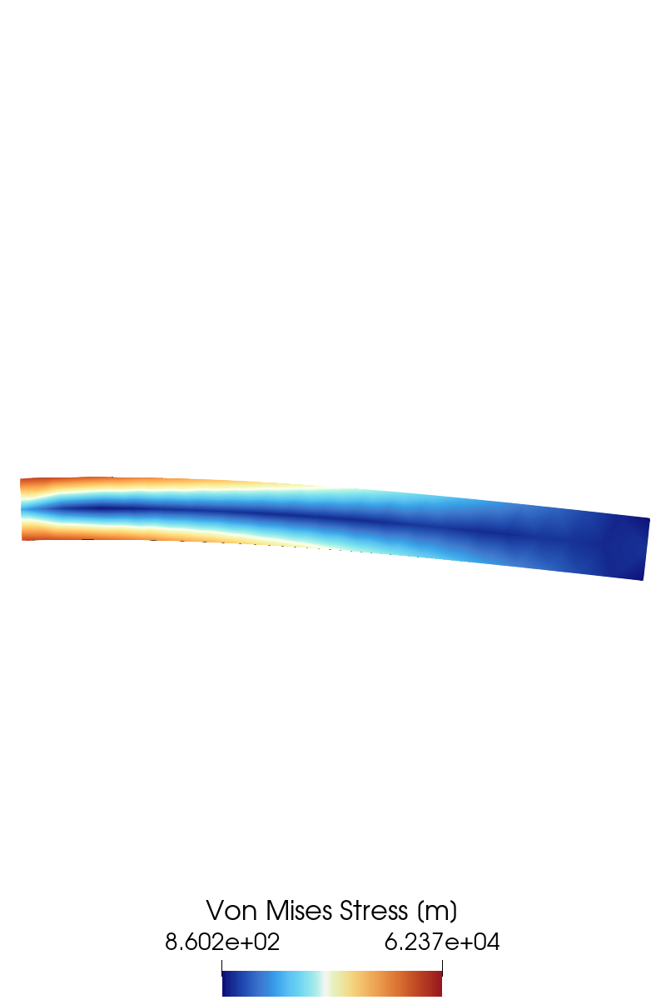

# Slaughter 2002: Linear Cantilever Beam

We model a linear elastic cantilever beam under an end load, following [1] and [2].

<div align="center">

</div>
<div align="center">
<em>3D cantilever beam geometry with a clamped end and end-face loading.</em>
</div>
<br />

## Introduction

This validation case considers a **3D linear elastic cantilever beam** subjected to a transverse
load at its free end. The problem is fully linear (small deformations, linear material law) and
admits a well-known analytical solution based on **Euler–Bernoulli beam theory**.

The beam has length $`l = 1\,\mathrm{m}`$, width $`w = 0.1\,\mathrm{m}`$, and height
$`h = 0.1\,\mathrm{m}`$, with Young's modulus $`E = 210\,\mathrm{GPa}`$ and Poisson's ratio
$`\nu = 0.30`$.

With the second moment of area $`I = w h^3 / 12`$, the reference **displacement** field is

```math
\begin{aligned}
u_x(x,y) &= -\frac{P y}{6 E I}\left(3(x^2 - L^2) - (2 + \nu) y^2 + 6(1+\nu)\frac{D^2}{4}\right), \\
u_y(x,y) &= \frac{P}{6 E I}\left(3 \nu x y^2 + x^3 - 3 L^2 x + 2 L^3\right),
\end{aligned}
```

and the **stress** field is

```math
\sigma_{xx} = -\frac{P x y}{I}, \qquad
\sigma_{yy} = 0, \qquad
\sigma_{xy} = -\frac{P}{2 I}\left(\frac{D^2}{4} - y^2\right).
```

## Setup

The beam is fixed with a `FixedDisplacementBoundaryCondition` and loaded with a
`TractionBoundaryCondition` of $`P = 1000\,\mathrm{N/m^2}`$. A second-order field solution is used to
obtain a smooth stress field. Because the problem is linear, the solver converges in a single
iteration.

## Results

**Displacement**



**Von Mises Stress**



The μfem solution matches the analytical result. The small deviation in the stress near the
clamped end ($`x = 0`$) is the expected Saint-Venant boundary effect.

## Scene



## References

[1] Medusa project, *Cantilever beam*, https://e6.ijs.si/medusa/wiki/index.php/Cantilever_beam

[2] W. S. Slaughter (2002). *The Linearized Theory of Elasticity*, pp. 285–289. Springer, New York.
