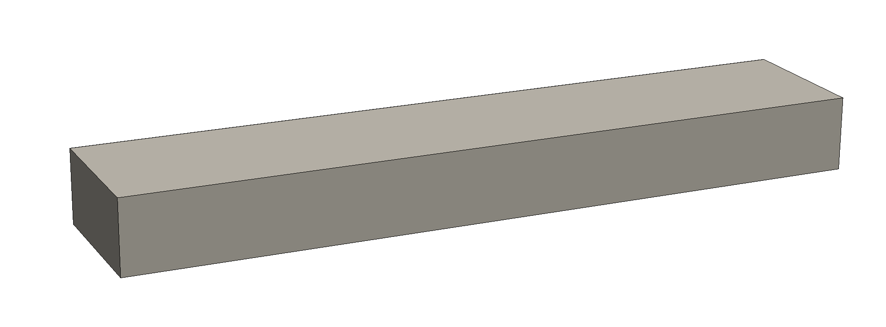
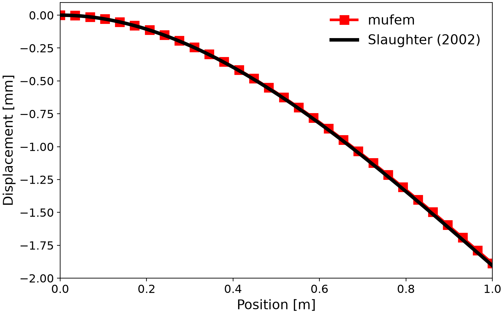
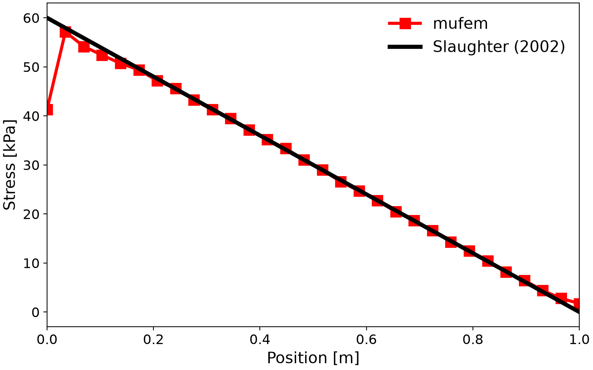
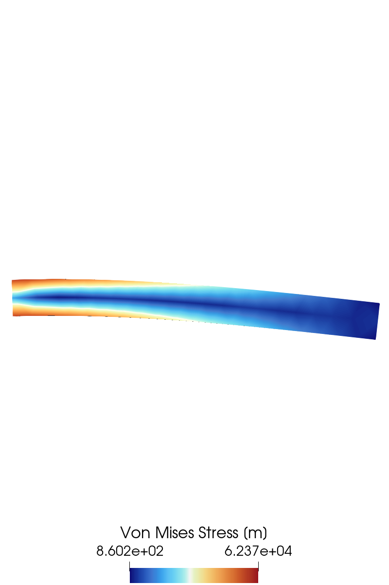

# Slaughter 2002: Linear Cantilever Beam

## Introduction

We model a linear elastic cantilever beam under an end load, following [1] and [2].

<div align="center">

</div>
<div align="center">
<em>3D cantilever beam geometry.</em>
</div>
<br />

This validation case considers a **3D linear elastic cantilever beam** subjected to a transverse
load at its free end. The problem is fully linear (small deformations, linear material law) and
admits a well-known analytical solution based on **Euler–Bernoulli beam theory**.

## Setup

The beam has length $`L = 1\,\mathrm{m}`$, height $`h = 0.1\,\mathrm{m}`$ (along $`y`$) and width
$`w = 0.2\,\mathrm{m}`$ (along $`z`$), with Young's modulus $`E = 210\,\mathrm{MPa}`$ and Poisson's
ratio $`\nu = 0.30`$. The end face carries a traction of $`1000\,\mathrm{N/m^2}`$ in $`-y`$, i.e. a
total tip force $`P = 1000\,\mathrm{N/m^2} \cdot w h = 20\,\mathrm{N}`$.

The face at $`x = 0`$ (`Beam::Clamped`) is fixed with a `FixedDisplacementBoundaryCondition`, and the
face at $`x = L`$ (`Beam::Loaded`) is loaded with a `TractionBoundaryCondition` of
$`(0, -1000, 0)\,\mathrm{N/m^2}`$. A second-order field solution is used to obtain a smooth stress
field. Because the problem is linear, a single iteration suffices.

The geometry is built with netgen in the `build_geometry` method of [case.py](case.py) and meshed in
`generate_mesh`; both run only when the mesh is regenerated with `pymufem case.py --rebuild-mesh`.

## Running

Run the case with `pymufem case.py`.

## Results

### Analytical Solution

With the second moment of area $`I = w h^3 / 12 = 1/60000\,\mathrm{m^4}`$ and the distance
$`\xi = L - x`$ from the loaded end, the reference **displacement** field for the clamp at
$`x = 0`$ and the load $`P`$ in $`-y`$ is

```math
\begin{aligned}
u_x(x,y) &= -\frac{P y}{6 E I}\left(3(\xi^2 - L^2) - (2 + \nu) y^2 + 6(1+\nu)\frac{D^2}{4}\right), \\
u_y(x,y) &= -\frac{P}{6 E I}\left(3 \nu \xi y^2 + \xi^3 - 3 L^2 \xi + 2 L^3\right),
\end{aligned}
```

and the **stress** field is

```math
\sigma_{xx} = \frac{P \xi y}{I}, \qquad
\sigma_{yy} = 0, \qquad
\sigma_{xy} = -\frac{P}{2 I}\left(\frac{D^2}{4} - y^2\right),
```

where $`D = h`$ is the beam height. The tip deflection is
$`u_y(L) = -P L^3 / (3 E I) = -1.905\,\mathrm{mm}`$ and the bending stress at the top fiber is
$`|\sigma_{xx}| = P (L - x)\,(h/2) / I`$, i.e. $`60\,\mathrm{kPa}`$ at the clamped end.

### Comparison

**Displacement** $`u_y`$ along the beam axis ($`y = 0`$):



**Von Mises Stress** along the top fiber ($`y \approx h/2`$):



The mufem solution matches the analytical result. The small deviation in the stress near the
clamped end ($`x = 0`$) is the expected Saint-Venant boundary effect.

The case checks the tip deflection against $`-1.905\,\mathrm{mm}`$ (the 3D solid is
about 1 % stiffer than beam theory) and the von Mises stress at $`x \approx 0.52\,\mathrm{m}`$ on the
top fiber against $`60\,\mathrm{kPa} \cdot (1 - x/L)`$.

## Scenes

The displacement and von Mises stress fields are exported to `VisualizationOutput/` for ParaView:



## References

[1] Medusa project. *Cantilever beam*. https://e6.ijs.si/medusa/wiki/index.php/Cantilever_beam

[2] W. S. Slaughter (2002). *The Linearized Theory of Elasticity*. Birkhäuser, Boston, pp. 285–289.
