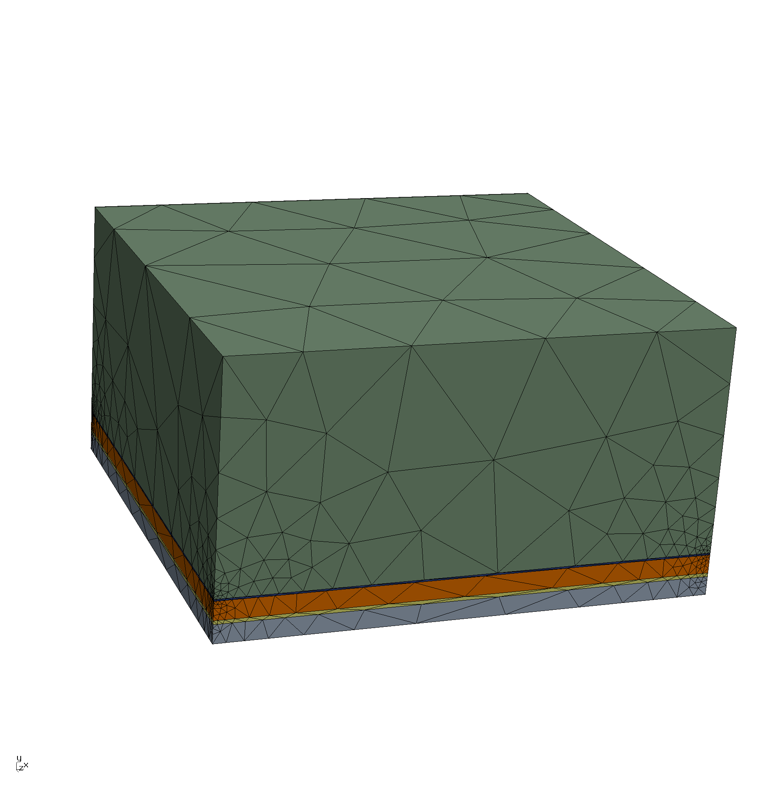
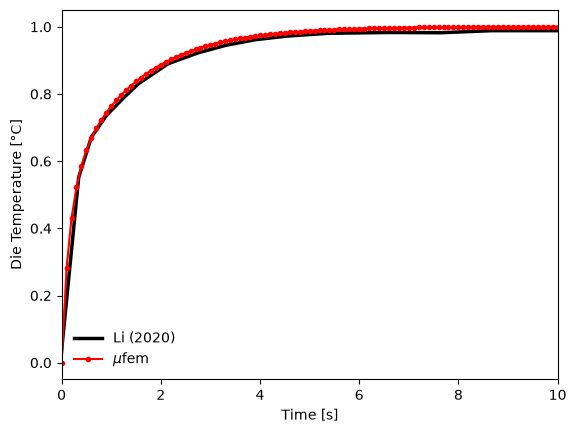
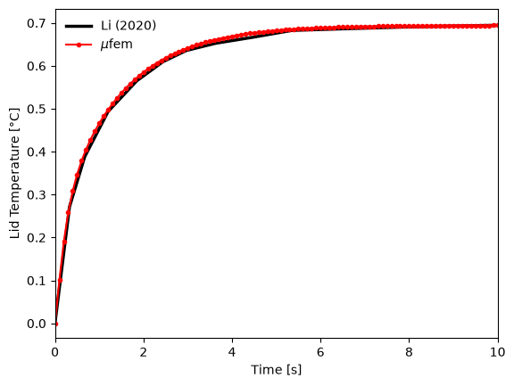
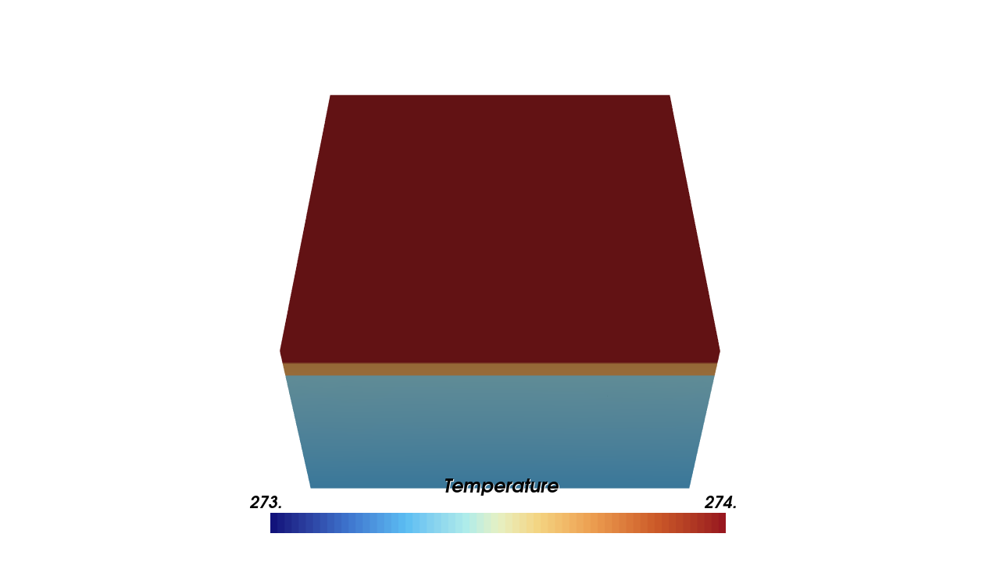
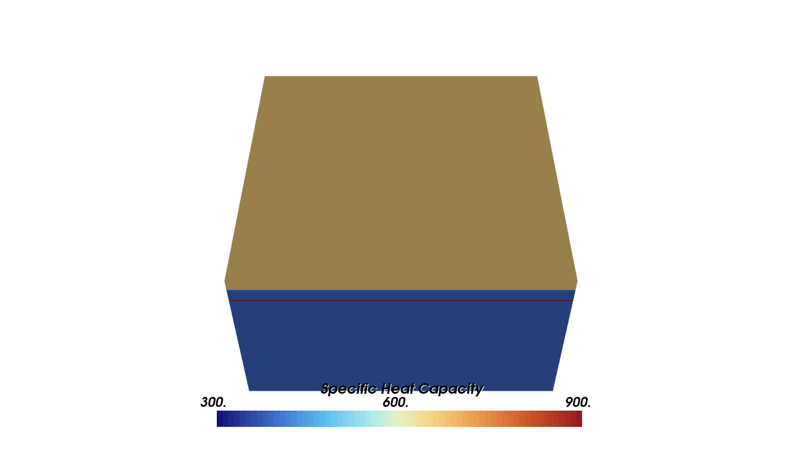
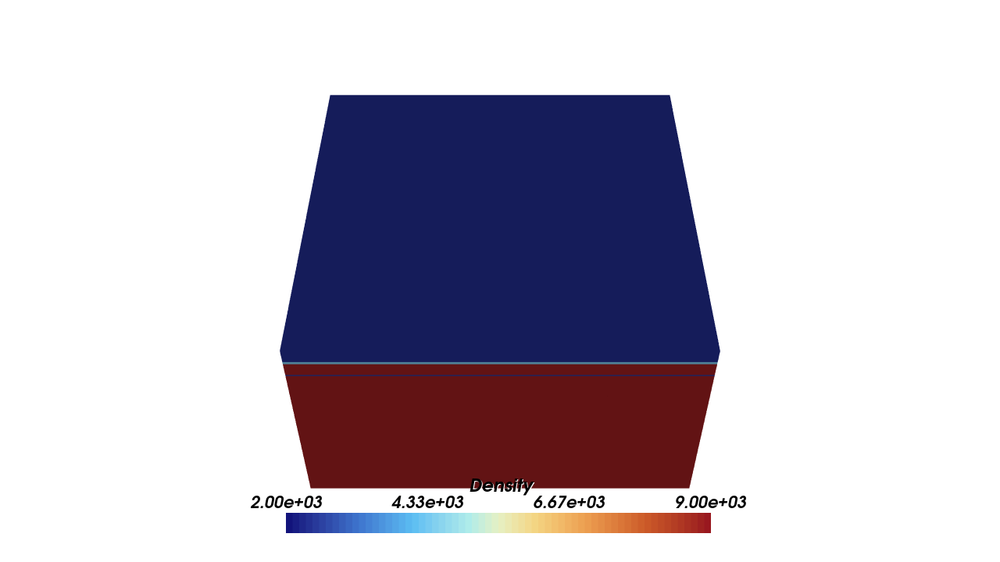
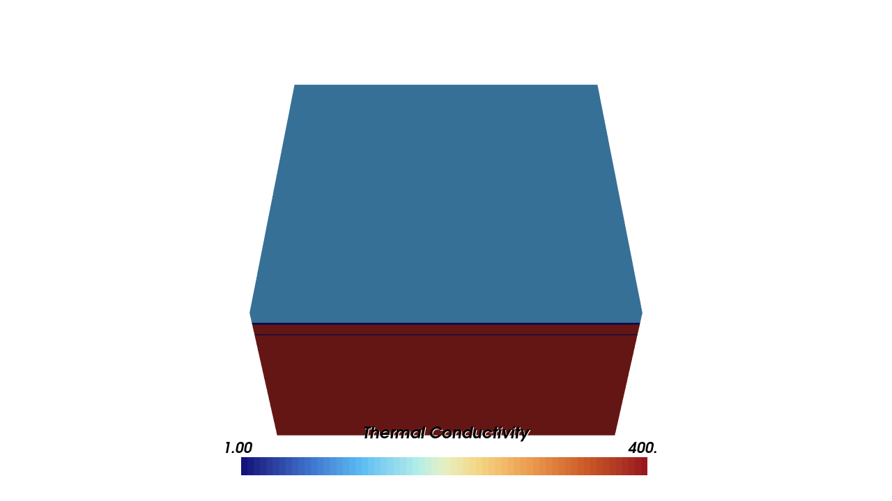

# Bruce 2012: Heat Transfer in Electronic Design

We model the transient cooling of a stacked electronic (PCB) package: a silicon die dissipates heat
through a thermal-interface material, a copper lid, a second interface layer, and a copper heat sink
cooled by convection.

&nbsp;&nbsp;&nbsp;

<em>Geometry of the layered package (left) and the corresponding mesh (right).</em>

 

## Setup

The package is a stack of five layers, each $13 \times 13\,\mathrm{mm}$:

| Component | Material | Thickness [mm] | $k$ [W/m/K] | $\rho$ [kg/m³] | $c_p$ [J/kg/K] |
| - | - | - | - | - | - |
| Die | Silicon | 0.50 | 111 | 2330 | 668 |
| TIM 1 | Ag-Epoxy | 0.10 | 2.0 | 4400 | 400 |
| Lid | Copper | 0.50 | 390 | 8890 | 385 |
| TIM 2 | Grease (Al filler) | 0.05 | 1.0 | 2500 | 900 |
| Heat sink base | Copper | 6.00 | 390 | 8890 | 385 |

Starting from a uniform $T = 273.15\,\mathrm{K}$, the die dissipation is modelled as a surface heat
flux of $5917\,\mathrm{W/m^2}$ between the die and TIM 1, and the heat-sink base is cooled by a
convective flux with coefficient $20000\,\mathrm{W/m^2/K}$. The transient is run to $10\,\mathrm{s}$.

## Results

Temperature evolution at the die and lid probe points, compared against the reference [2]:

| Die | Lid |
| :---: | :---: |
|  |  |

The μfem results match the reference curves.

## Scenes

| Temperature | Heat Capacity |
| :---: | :---: |
|  |  |
| **Density** | **Thermal Conductivity** |
|  |  |

## References

[1] SimScale, *Heat Transfer in Electronic Design*,
    https://www.simscale.com/docs/validation-cases/heat-transfer-electronic-design/

[2] H. Li (2020). *Nonlinear electromagnetic-thermal modeling using the time-domain finite element
    method in machinery design*. PhD thesis, University of Illinois at Urbana-Champaign, Section 3.4.1.
