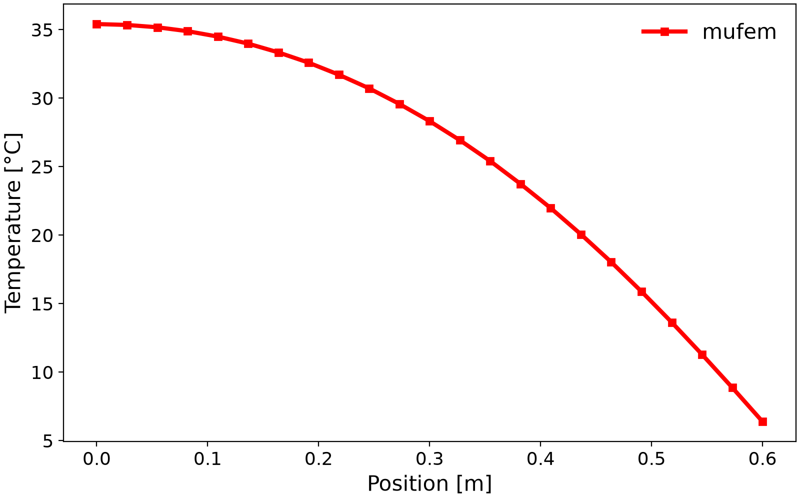

# Cameron 1986: Heat Transfer With Convection

## Introduction

This test case reproduces the NAFEMS benchmark T4 [1].
It considers steady-state heat transfer in a rectangular domain of uniform
thickness with mixed boundary conditions: prescribed temperature, adiabatic,
and convective.
The objective is to verify the temperature at a specified location.

&nbsp;&nbsp;&nbsp;

<em>The geometry of the computational domain and the corresponding mesh.</em>

 

## Setup

The computational domain is a rectangle of width 0.6 m and height 1 m with a thermal conductivity of
$`k = 52`$ W/(m K). The two-dimensional benchmark is modeled as a 10 mm thick plate whose front and back
faces are adiabatic.
The bottom edge is held at a prescribed temperature of $`100^\circ`$ C (modeled by
[TemperatureCondition](https://raiden-numerics.github.io/mufem-doc/models/mechanical/solid_temperature/conditions/temperature.html)).
The left edge is adiabatic (modeled by
[AdiabaticBoundaryCondition](https://raiden-numerics.github.io/mufem-doc/models/mechanical/solid_temperature/conditions/adiabatic.html)).
The top and right edges are subject to convection to an ambient temperature of
$`0^\circ`$ C with a surface heat transfer coefficient
$`h = 750`$ W/($`\text{m}^2`$ K) (modeled by
[ConvectionBoundaryCondition](https://raiden-numerics.github.io/mufem-doc/models/mechanical/solid_temperature/conditions/convection.html)).
No internal heat generation is present.

## Running

Run the case with `pymufem case.py`.

## Results

**Temperature**

The temperature is evaluated at point E of the benchmark, on the right edge, 0.2 m above the bottom
edge. mufem gives $`18.24^\circ`$ C against the NAFEMS target of $`18.3^\circ`$ C, and the case checks
this value.

The figure below presents the temperature profile along the x-axis at a fixed
height of $`y = 0.5`$ m.

## Scenes

The figure below shows the temperature distribution over the computational
domain.

## References

[1] A. D. Cameron, J. A. Casey and G. B. Simpson (1986). *Benchmark Tests for Thermal Analysis (Summary)*. NAFEMS.
