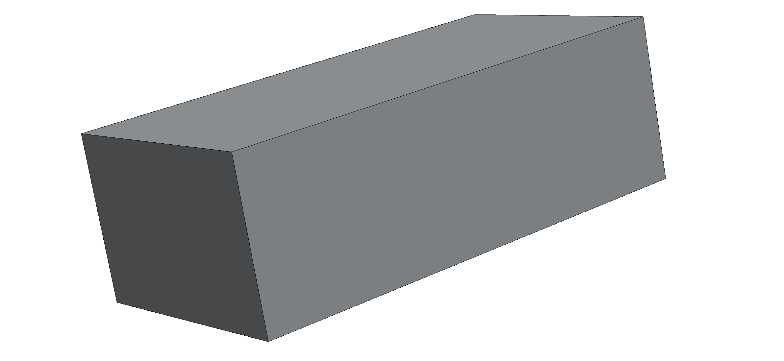
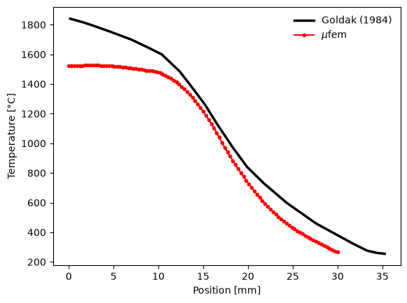
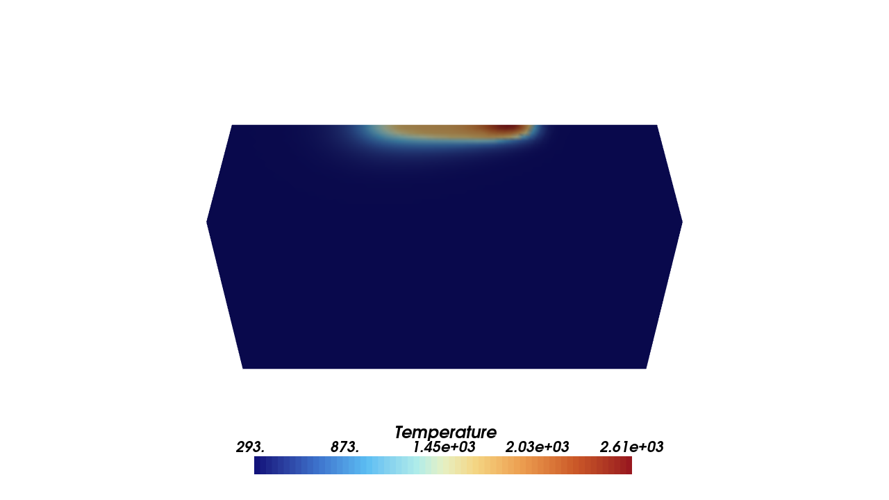
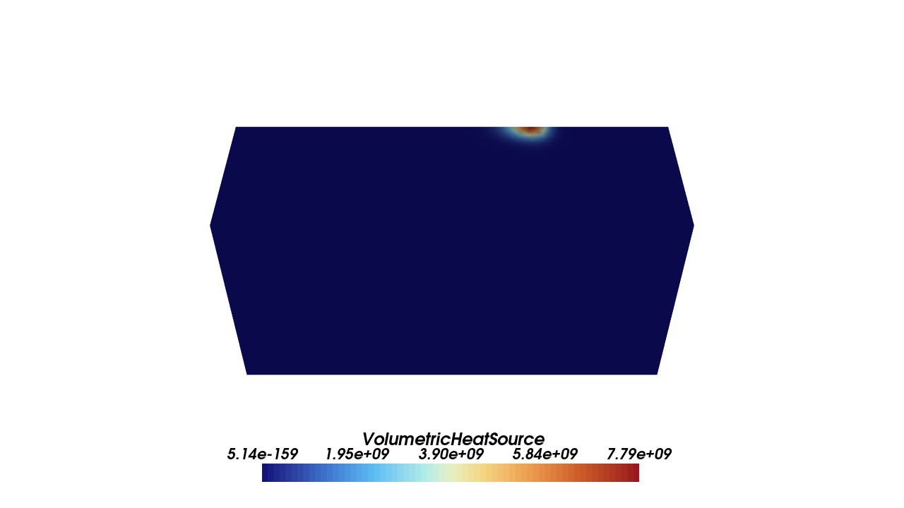

# Goldak 1984: Welding Heat Source

The *Goldak (1984) double-ellipsoidal welding heat source* is a classical benchmark for validating
transient heat-conduction solvers with a **moving, highly localized volumetric heat input**. It is
widely used in arc-welding simulation because it reproduces realistic fusion-zone (FZ) and
heat-affected-zone (HAZ) shapes while remaining computationally tractable.

<div align="center">

</div>
<div align="center">
<em>Thick-plate weld geometry with the moving heat source and the measuring line.</em>
</div>
<br />

## Introduction

The governing equation is the transient heat equation with a moving volumetric source:

```math
\rho c(T)\,\frac{\partial T}{\partial t}
- \nabla \cdot \big(k(T)\nabla T\big)
= Q(\mathbf{x}-\mathbf{x}_s(t))
```

where $T$ is the temperature, $k(T)$ the thermal conductivity, $c(T)$ the volumetric heat capacity,
and $Q$ the welding heat source traveling along the weld path.

The Goldak model splits the source into **front and rear ellipsoids** ($Q_f$ and $Q_r$):

```math
\begin{aligned}
Q_f(x,y,z) &=
\frac{6\sqrt{3}\, f_f Q}{a\, b\, c_f\, \pi \sqrt{\pi}}
\exp\!\left(-3\frac{x^2}{a^2}-3\frac{y^2}{b^2}-3\frac{z^2}{c_f^2}\right), \\
Q_r(x,y,z) &=
\frac{6\sqrt{3}\, f_r Q}{a\, b\, c_r\, \pi \sqrt{\pi}}
\exp\!\left(-3\frac{x^2}{a^2}-3\frac{y^2}{b^2}-3\frac{z^2}{c_r^2}\right),
\end{aligned}
```

with total power $Q = \eta V I$, ellipsoid semi-axes $a, b, c_f, c_r$, and front/rear power fractions
$f_f + f_r = 2$. The source moves with welding speed $v$ via $z \rightarrow z - v t$.

## Setup

We reproduce the *thick-plate weld* configuration of Goldak (1984): a submerged-arc weld on
low-carbon steel, plate thickness **10 cm**.

| Parameter | Value |
| - | - |
| Voltage | 32.9 V |
| Current | 1170 A |
| Welding speed | 0.005 m/s |
| Efficiency | 0.95 |
| Ellipsoid semi-axes | $a = b = 2.0$ cm, $c_f = 1.5$ cm, $c_r = 3.0$ cm |
| Power fractions | $f_f = 0.6$, $f_r = 1.4$ |

The source starts at $z_0 = 0.1\,\mathrm{m}$, reaches the measuring line at $z = 0.15\,\mathrm{m}$ after
**10 s**, and the simulation continues to **21.5 s** (11.5 s of cooling). Temperature-dependent
$k(T)$ and $c_p(T)$ are used; the melting temperature is $T = 1480\,^{\circ}\mathrm{C}$.

**Phase change** is captured with a *mushy-zone* enthalpy formulation over a solidus–liquidus interval
$\Delta T = T_l - T_s$, adding the latent heat of fusion to the effective heat capacity:

```math
c_{\mathrm{eff}}(T) = \rho\, c_s(T) + \frac{\rho L}{T_l - T_s}.
```

Surface losses use a nonlinear radiative/convective heat flux with emissivity $\varepsilon = 0.9$.

## Results

**Temperature vs. Position** (across the weld at $z = 0.15\,\mathrm{m}$):



The μfem solution follows the reference; the peak is bounded by the latent-heat plateau of the
mushy-zone model.

## Scenes

| Temperature | Goldak Heat Source |
| :---: | :---: |
|  |  |

## References

[1] J. Goldak, A. Chakravarti, and M. Bibby (1984). *A new finite element model for welding heat
    sources*. Metallurgical Transactions B, 15(2), pp. 299–305.

[2] A. Anca, A. Cardona, J. Risso, and V. D. Fachinotti (2011). *Finite element modeling of welding
    processes*. Applied Mathematical Modelling, 35(2), pp. 688–707.
