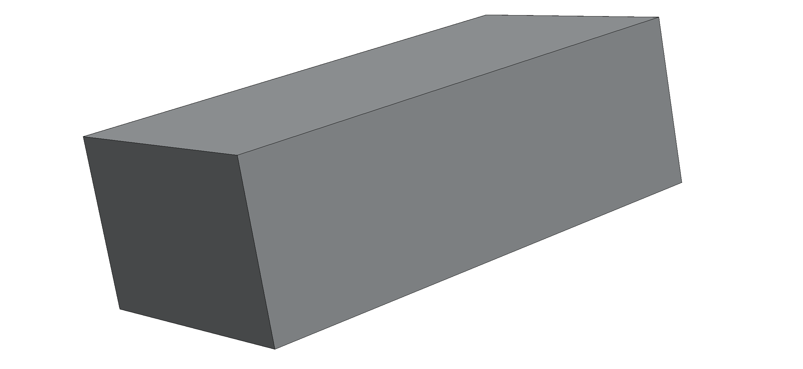
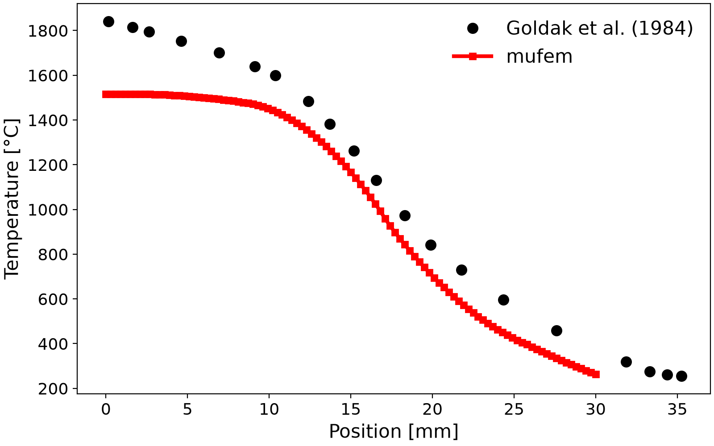
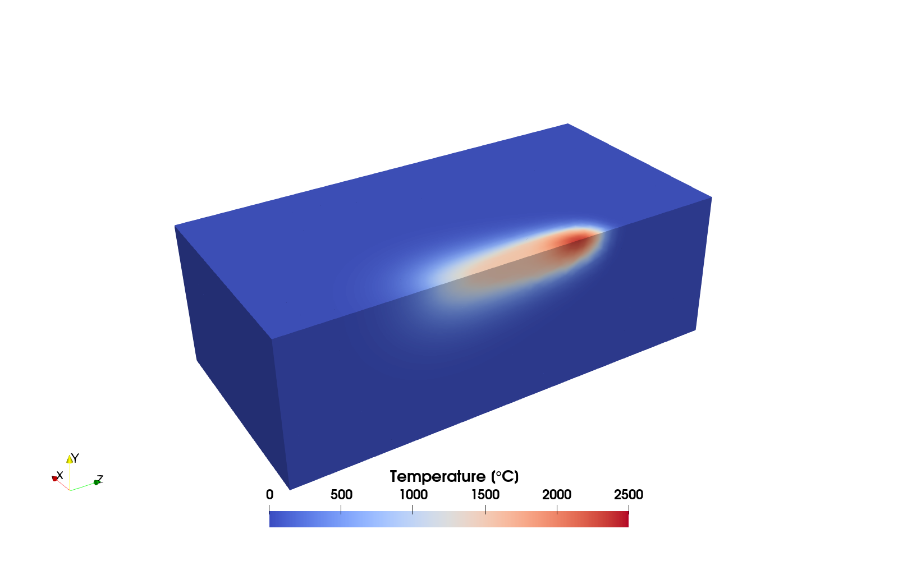
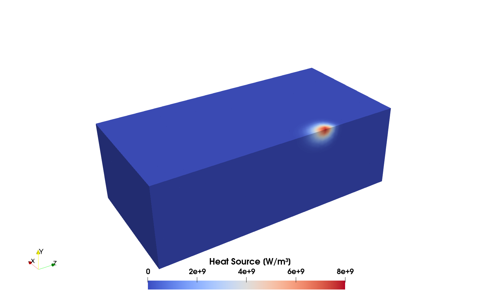

# Goldak 1984: Welding Heat Source

The *Goldak (1984) double-ellipsoidal welding heat source* is a classical benchmark for validating
transient heat-conduction solvers with a **moving, highly localized volumetric heat input**. It is
widely used in arc-welding simulation because it reproduces realistic fusion-zone (FZ) and
heat-affected-zone (HAZ) shapes while remaining computationally tractable.

<div align="center">

</div>
<div align="center">
<em>Thick-plate weld geometry with the moving heat source and the measuring line.</em>
</div>
<br />

## Introduction

The governing equation is the transient heat equation with a moving volumetric source:

```math
\rho c(T)\,\frac{\partial T}{\partial t}
- \nabla \cdot \big(k(T)\nabla T\big)
= Q(\mathbf{x}-\mathbf{x}_s(t))
```

where $`T`$ is the temperature, $`k(T)`$ the thermal conductivity, $`c(T)`$ the volumetric heat capacity,
and $`Q`$ the welding heat source traveling along the weld path.

The Goldak model splits the source into **front and rear ellipsoids** ($`Q_f`$ and $`Q_r`$):

```math
\begin{aligned}
Q_f(x,y,z) &=
\frac{6\sqrt{3}\, f_f Q}{a\, b\, c_f\, \pi \sqrt{\pi}}
\exp\!\left(-3\frac{x^2}{a^2}-3\frac{y^2}{b^2}-3\frac{z^2}{c_f^2}\right), \\
Q_r(x,y,z) &=
\frac{6\sqrt{3}\, f_r Q}{a\, b\, c_r\, \pi \sqrt{\pi}}
\exp\!\left(-3\frac{x^2}{a^2}-3\frac{y^2}{b^2}-3\frac{z^2}{c_r^2}\right),
\end{aligned}
```

with total power $`Q = \eta V I`$, ellipsoid semi-axes $`a, b, c_f, c_r`$, and front/rear power fractions
$`f_f + f_r = 2`$. The source moves with welding speed $`v`$ via $`z \rightarrow z - v t`$.

## Setup

We reproduce the *thick-plate weld* of Goldak et al. [1] (their Fig. 4, after the experiments of
Christensen et al.): a submerged-arc bead-on-plate weld on low-carbon steel (0.23 % C), plate
thickness **10 cm**. The plate is $`0.3\,\mathrm{m}`$ wide and
$`0.3\,\mathrm{m}`$ long; only the half $`x \ge 0`$ is modelled, with the weld path on the symmetry
plane $`x = 0`$ (`Piece::Symmetry`, adiabatic) and the source on the top surface $`y = 0`$
(`Piece::Top`).

| Parameter | Value |
| - | - |
| Voltage | 32.9 V |
| Current | 1170 A |
| Welding speed | 0.005 m/s |
| Efficiency | 0.95 |
| Heat input $`Q`$ | 36.54 kW (30 W below $`\eta V I = 36.57`$ kW, see below) |
| Ellipsoid semi-axes | $`a = b = 2.0`$ cm, $`c_f = 1.5`$ cm, $`c_r = 3.0`$ cm |
| Power fractions | $`f_f = 0.6`$, $`f_r = 1.4`$ |

The source starts at $`z_0 = 0.1\,\mathrm{m}`$, reaches the measuring line at $`z = 0.15\,\mathrm{m}`$ after
**10 s**, and the simulation continues to **21.5 s** (11.5 s of cooling) with a time step of
$`0.25\,\mathrm{s}`$, second-order elements and an initial temperature of $`20\,{}^{\circ}\mathrm{C}`$.
The thermal conductivity $`k(T)`$ and the volumetric heat capacity $`c(T)`$ of low-carbon steel
(BISRA data, Figs. 6 and 7 of [1]; in the liquid, $`k = 120\,\mathrm{W/(m\,K)}`$ mimics the
stirring in the weld pool, as in [1]) are tabulated in
[Thermal_Conductivity.csv](data/Thermal_Conductivity.csv) and
[Volumetric_Heat_Capacity.csv](data/Volumetric_Heat_Capacity.csv); the density is
$`\rho = 7850\,\mathrm{kg/m^3}`$.

The heat input is 30 W (0.08 %) below the nominal $`\eta V I`$: with the exact value the nonlinear
temperature solve diverges, so the case stays at the value that converges until the solver
robustness is improved.

**Phase change** is captured with a *mushy-zone* enthalpy formulation between the solidus
$`T_s = 1430\,{}^{\circ}\mathrm{C}`$ and the liquidus $`T_l = 1530\,{}^{\circ}\mathrm{C}`$ (around the melting
temperature of $`1480\,{}^{\circ}\mathrm{C}`$), adding the latent heat of fusion
$`\rho L = 2.1 \cdot 10^9\,\mathrm{J/m^3}`$ to the effective heat capacity:

```math
c_{\mathrm{eff}}(T) = \rho\, c_s(T) + \frac{\rho L}{T_l - T_s}.
```

The top surface loses heat by a combined radiative/convective flux, after Eq. [18] of [1], with
emissivity $`\varepsilon = 0.9`$,

```math
q = 24.1 \cdot 10^{-4}\, \varepsilon\, (T - T_0)^{1.61}\ \mathrm{W/m^2}, \qquad T_0 = 20\,{}^{\circ}\mathrm{C}.
```

The geometry is built with netgen in the `build_geometry` method of [case.py](case.py) and meshed in
`generate_mesh`; both run only when the mesh is regenerated with `pymufem case.py --rebuild-mesh`.
The case itself is run with `pymufem case.py`.

## Results

**Temperature vs. Position** at $`t = 21.5\,\mathrm{s}`$, on the top surface across the weld at
$`z = 0.15\,\mathrm{m}`$ ($`x`$ from 0 to 30 mm), compared with the reference data of [1]
([Temperature_vs_Position.csv](data/Temperature_vs_Position.csv)):



The reference is digitized from Fig. 8 of [1]. Outside the weld pool ($`x \gtrsim 12\,\mathrm{mm}`$)
the mufem solution follows it closely. Inside the pool the mufem temperature stays at the liquidus
($`\approx 1525\,{}^{\circ}\mathrm{C}`$), bounded by the latent-heat plateau of the mushy-zone model,
while the reference reaches about $`1840\,{}^{\circ}\mathrm{C}`$ on the centerline.

Differences from [1]: [1] solves a 2D cross-section (no heat flow along the weld) and also
includes a heat of transformation of $`5.5 \cdot 10^7\,\mathrm{J/m^3}`$; the mufem case is fully 3D
and does not model the transformation.

The case checks the temperature on the weld centerline ($`x = 0`$) against
$`1527.5\,{}^{\circ}\mathrm{C}`$ (1 % tolerance).

## Scenes

The temperature and the heat source are exported to `VisualizationOutput/` for ParaView:

| Temperature | Goldak Heat Source |
| :---: | :---: |
|  |  |

## References

[1] J. Goldak, A. Chakravarti, and M. Bibby (1984). *A new finite element model for welding heat
    sources*. Metallurgical Transactions B, 15(2), pp. 299–305.

[2] A. Anca, A. Cardona, J. Risso, and V. D. Fachinotti (2011). *Finite element modeling of welding
    processes*. Applied Mathematical Modelling, 35(2), pp. 688–707.
