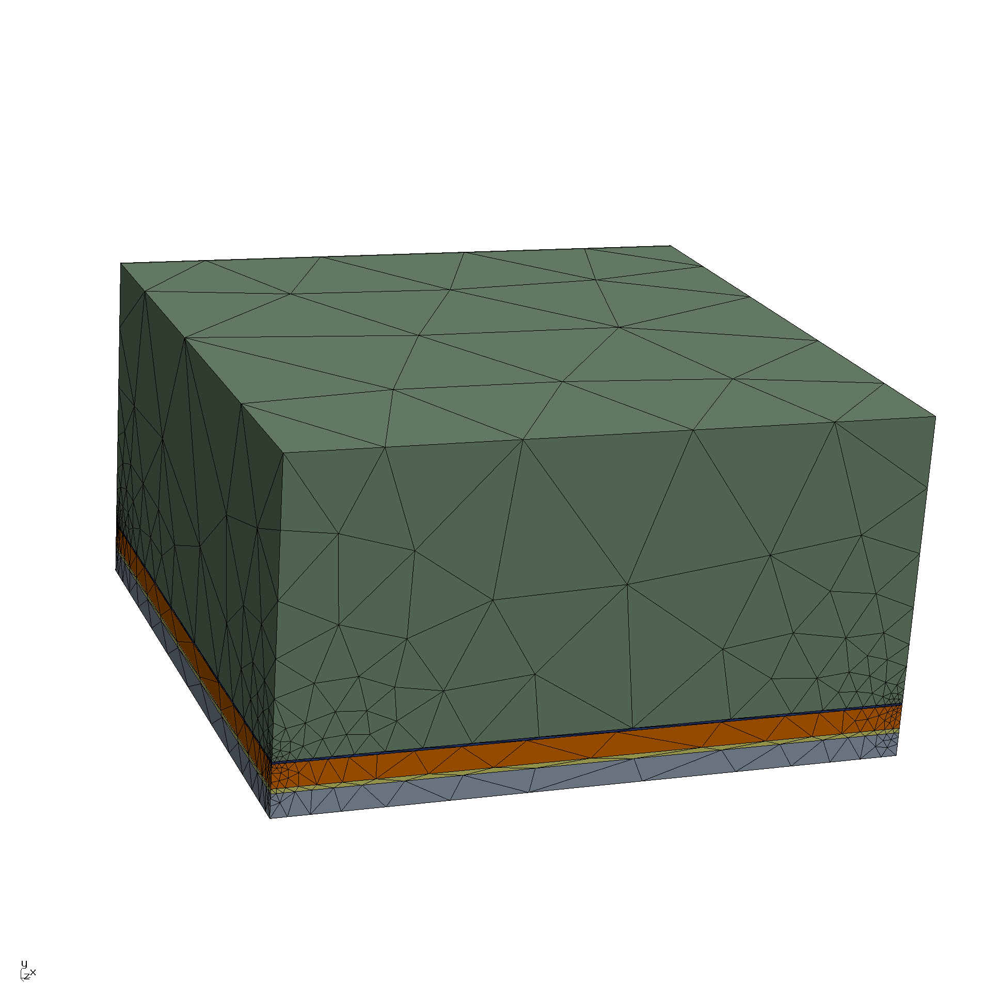
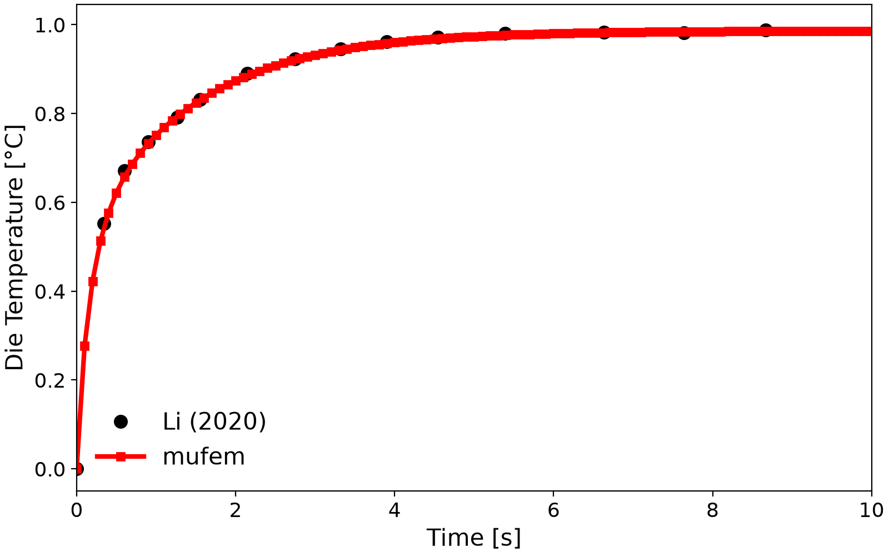
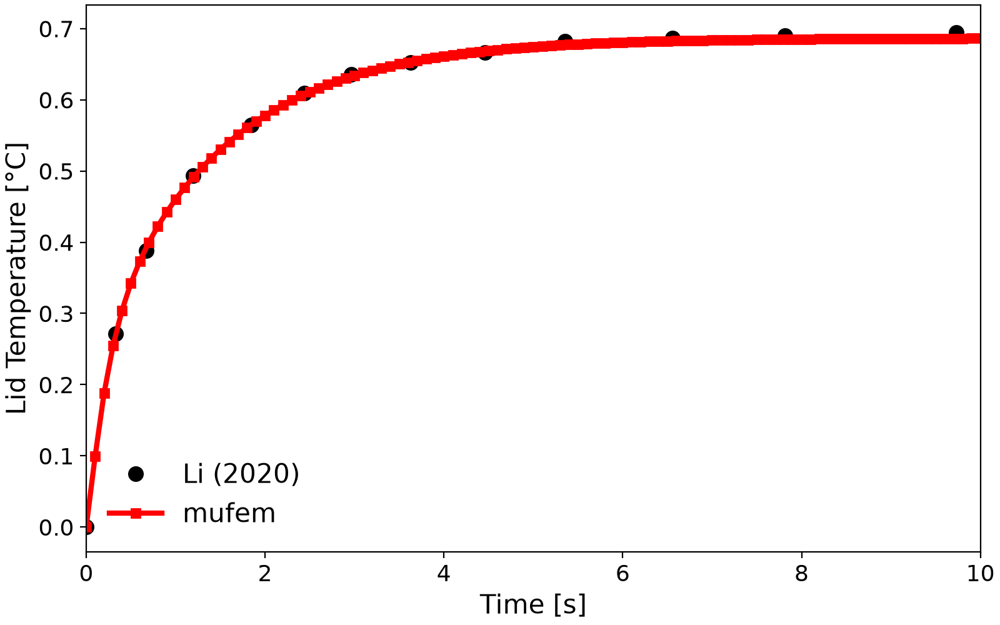
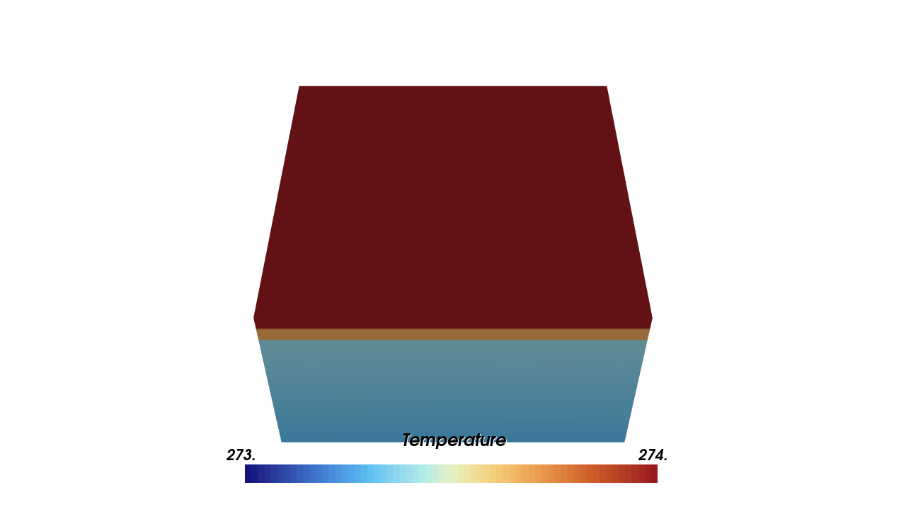
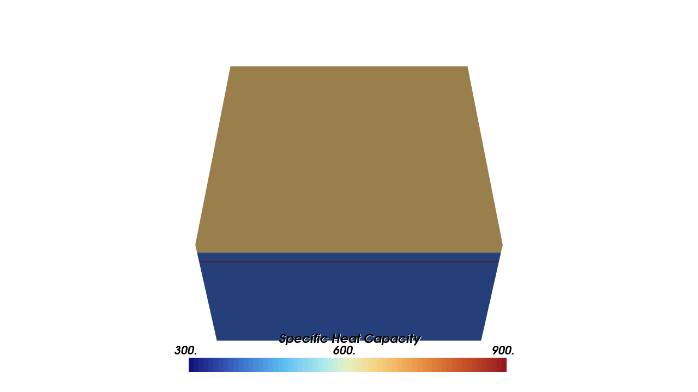
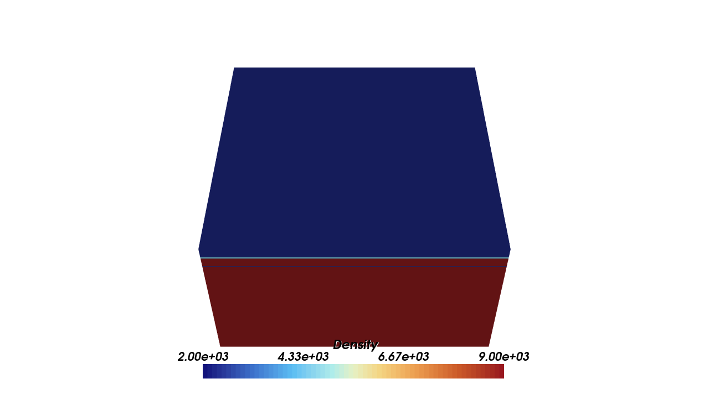
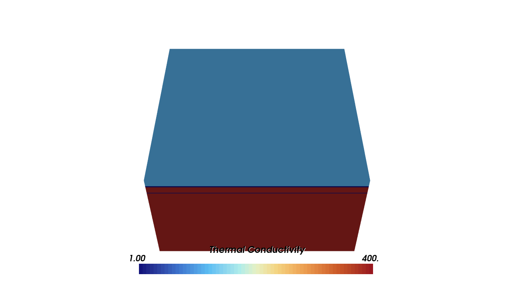

# Guenin 2011: Heat Transfer in Electronic Design

## Introduction

We model the transient heating of a high-power IC package after a 1 W power step: a silicon die
dissipates heat through a thermal-interface material, a copper lid, a second interface layer, and a
copper heat sink cooled by convection. The problem was posed by B. Guenin in an *Electronics Cooling*
column [1] and set up as a validation case by SimScale [2]; we follow the setup of Li (2020) [3].

<div align="center">

&nbsp;&nbsp;&nbsp;

</div>
<div align="center">
<em>Geometry of the layered package (left) and the corresponding mesh (right).</em>
</div>
<br />

## Setup

The package is a stack of five layers, each $`13 \times 13\,\mathrm{mm}`$:

| Component | Material | Thickness [mm] | $`k`$ [W/m/K] | $`\rho`$ [kg/m³] | $`c_p`$ [J/kg/K] |
| - | - | - | - | - | - |
| Die | Silicon | 0.50 | 111 | 2330 | 668 |
| TIM 1 | Ag-Epoxy | 0.10 | 2.0 | 4400 | 400 |
| Lid | Copper | 0.50 | 390 | 8890 | 385 |
| TIM 2 | Grease (Al filler) | 0.05 | 1.0 | 2500 | 900 |
| Heat sink base | Copper | 6.00 | 390 | 8890 | 385 |

Starting from a uniform $`T = 273.15\,\mathrm{K}`$, the die dissipation of 1 W is modeled as a surface
heat flux of $`5917\,\mathrm{W/m^2}`$ between the die and TIM 1, and the heat-sink base is cooled by a
convective flux with coefficient $`20000\,\mathrm{W/m^2/K}`$ to an ambient of $`273.15\,\mathrm{K}`$.
The transient is run to $`10\,\mathrm{s}`$. The temperature is probed at the center of the die and of the
lid.

## Running

Run the case with `pymufem case.py`.

## Results

Temperature rise at the die and lid probe points, compared against Fig. 3.3 of Li (2020) [3]:

| Die | Lid |
| :---: | :---: |
|  |  |

Since the heat flux covers the whole cross-section $`A`$ and the sides are adiabatic, the heat flows in
one dimension, and the steady-state temperature rise follows from the thermal resistances
$`t / (k A)`$ of the layers and $`1 / (h A)`$ of the convection. The die is isothermal at steady
state, as no heat flows into it:

```math
\Delta T_\mathrm{die} = P \left( R_\mathrm{TIM1} + R_\mathrm{lid} + R_\mathrm{TIM2} + R_\mathrm{sink} + R_\mathrm{conv} \right),
\qquad
\Delta T_\mathrm{lid} = P \left( \tfrac{1}{2} R_\mathrm{lid} + R_\mathrm{TIM2} + R_\mathrm{sink} + R_\mathrm{conv} \right).
```

| Probe | Rise mufem / reference [K] at t = 1 s (Li (2020)) | Rise mufem / analytical [K] at t = 10 s (steady state) |
| ----- | ------------------------------------------------- | ------------------------------------------------------ |
| Die | 0.751 / 0.751 | 0.986 / 0.986 |
| Lid | 0.460 / 0.454 | 0.686 / 0.687 |

The case checks all four values; at $`t = 10\,\mathrm{s}`$ the package is within 0.1 % of its steady
state.

## Scenes

| Temperature | Heat Capacity |
| :---: | :---: |
|  |  |
| **Density** | **Thermal Conductivity** |
|  |  |

## References

[1] B. Guenin (2011). *Calculation Corner: Transient Thermal Modeling of a High-Power IC Package, Part 1*. Electronics Cooling, 17(4). https://www.electronics-cooling.com/2011/12/transient-modelling-of-a-high-power-ic-package-part-1/

[2] SimScale. *Heat Transfer in Electronic Design*. https://www.simscale.com/docs/validation-cases/heat-transfer-electronic-design/

[3] H. Li (2020). *Nonlinear electromagnetic-thermal modeling using the time-domain finite element method in machinery design*. PhD thesis, University of Illinois at Urbana-Champaign, Section 3.4.1.
